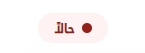

# Badge




## Implementation

```html
@model object
@{
var (Color, BgColor, Content, Dot, Radius) = Model switch
{
(string c, string b, string t, bool d, int r) => (c, b, t, d, r),
(string c, string b, string t, bool d) => (c, b, t, d, 4),
(string c, string b, string t) => (c, b, t, true, 4),
_ => throw new ArgumentException("Invalid model type provided to _CustomBadge")
};
}

<span class="badge d-flex align-items-center gap-2 px-3 py-2 rounded-@Radius"
	style="background-color: @BgColor; color: @Color; font-size: 14px; width: fit-content;">
	@if (Dot)
	{
	<span style="width: 10px; height: 10px; background-color: @Color; border-radius: 50%;"></span>
	}
	@Content
</span>
```

## Usage

```html
default values:
dot = true
radius = 4

<!-- Badge with dot -->
<partial name="_CustomBadge" model='("#912018", "#fef2f2", "حالا")' />

<!-- Badge without dot -->
<partial name="_CustomBadge" model='("#026b66", "#f2f2f2", "عاجل", false)' />

<!-- Badge with custom radius -->
<partial name="_CustomBadge" model='("#026b66", "#f2f2f2", "عاجل", false, 3)' />
```

| Parameter | Type | Description | Default Value |
| --- | --- | --- | --- |
| Color | string | The color of the badge | "" |
| BgColor | string | The background color of the badge | "" |
| Content | string | The content of the badge | "" |
| Dot | bool | Whether the badge has a dot or not | true |
| Radius | int | The radius of the badge | 4 |
