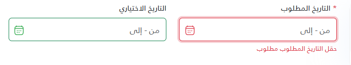
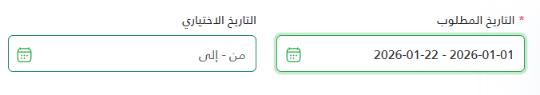

# DateRange Component



The `_DateRange` partial view provides a user-friendly date picker that supports selecting a range of dates. It includes support for both Umm Al-Qura and Gregorian calendar systems.

## Usage

To use the component, render the `UI/_DateRange` partial view and pass the required parameters as a tuple.

### Basic Example

```razor
@{
    await Html.RenderPartialAsync("UI/_DateRange",
        ("Start & End Date", true, "projectPeriod", "Select Period", "ummalqura")
    );
}
```
========================== or ==========================
```
<partial name="UI/_DateRange"
				model='@("التاريخ الاختياري", false, "DateRangeId3", "من - إلى", "ummalqura","handleDateRangeSelection")' />
```

## Parameters

The model for this partial view is a `ValueTuple`. The parameters must be passed in the specific order listed below:

| Name | Type | Required | Default | Description |
|:--------:|:------------|:---------|:--------:|:--------------|
| Label | `string` | **Yes** | - | The text label to display above the input field.                            |
| Required | `bool` | **Yes** | - | Specifies if the field is mandatory. Adds validation styles and logic.      |
| Id | `string` | **Yes** | - | The unique ID attribute for the input element.                              |
| Placeholder | `string` | **Yes** | - | Text to display when the input is empty.                                    |
| DateType    | `string` | No       | "ummalqura"   | The type of calendar to use. Values: `"ummalqura"` or `"gregorian"`.        |
| OnSelect    | `string` | No       | `null`        | Name of a callback function to trigger on selection (Reserved).             |

## Client-Side Features

### Validation
The component includes built-in validation. If `Required` is set to `true`:
- A red asterisk (*) is appended to the label.
- The input border turns red and an error message appears if left empty upon form submission or user interaction.
- The calendar icon changes color to reflect validation state (Red for error, Green for valid).

### JavaScript Helper
A global helper function is available to easily retrieve the selected values from the input.

#### `getDateRangeValue(inputId)`

Extracts the selected dates as an array.

**Example:**
```javascript
// Function signature
// window.getDateRangeValue = function (inputId) { ... }

// Usage
var props = window.getDateRangeValue('projectPeriod');

// Output examples:
// []                  -> No date selected
// ["1446-01-01"]      -> Single date selected
// ["1446-01-01", "1446-01-10"] -> Date range selected
```
