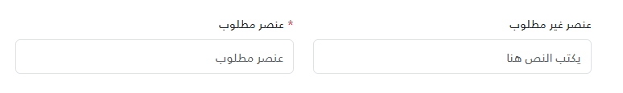
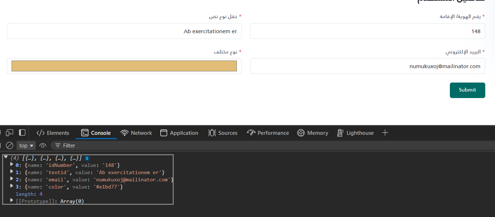

# _InputField




```html
@using System.Runtime.CompilerServices
@model ITuple
@{
var label = (string)Model[0];
var required = (bool)Model[1];
var id = (string)Model[2];
var rawPlaceholder = (string)Model[3];
var placeholder = string.IsNullOrEmpty(rawPlaceholder) ? "يكتب النص هنا" : rawPlaceholder;
// Safely handle optional 5th parameter for Type
var type = (Model.Length > 4 && Model[4] != null) ? (string)Model[4] : "text";
if (string.IsNullOrEmpty(type))
{
type = "text";
}
}
<style>
	input[type=number]::-webkit-outer-spin-button,
	input[type=number]::-webkit-inner-spin-button {
		-webkit-appearance: none;
		margin: 0;
	}

	input {
		-moz-appearance: textfield;
		appearance: textfield;
		direction: rtl;
		text-align: right;
	}
</style>
<div class="mb-4">
	<label class="form-label text-gray-700" for="@id">
		@if (required)
		{
		<span class="text-danger">*</span>
		}
		@label
	</label>
	<input type="@type" id="@id" name="@id" class="form-control" placeholder="@placeholder" @(required ? "required" : ""
		) />
</div>
```

### How to use

```cshtml
<partial name="_InputField" model='("اسم الحقل الاختياري", false, "field-id2", "")' />
<partial name="_InputField" model='("رقم الهوية/ الإقامة", true, "idNumber", " رقم الهوية/ الإقامة", "number")' />
<partial name="_InputField" model='("حقل نوع نص", true, "textid", " نص تجريبي")' />
<partial name="_InputField" model='("البريد الإلكتروني", true, "email", " البريد الإلكتروني", "email")' />
```
