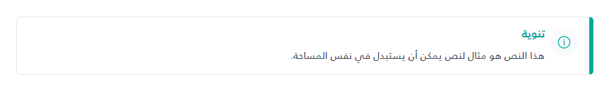

# Notification Component Usage

The `_Notification.cshtml` component is a reusable notification/alert box component that displays an icon, title, and content message.



## Parameters
The component accepts a tuple with the following parameters:

1. **Icon** (string?, optional): SVG HTML string for the icon. If not provided, a default info icon will be displayed.
2. **Title** (string, required): The title text displayed in bold.
3. **Content** (string, required): The main content/message text.
4. **TitleColor** (string?, optional): Color for the title text. Defaults to `#00A79D` (teal).
5. **BorderColor** (string?, optional): Color for the right border accent. Defaults to `#00A79D` (teal).

## Usage Examples

### Basic Usage (Required Parameters Only)
```csharp
@await Html.PartialAsync("UI/_Notification", (
    Icon: (string?)null,
    Title: "تنوية",
    Content: "هذا النص هو مثال لنص يمكن أن يستبدل في نفس المساحة.",
    TitleColor: (string?)null,
    BorderColor: (string?)null
))
```

### With Custom Icon
```csharp
@{
    var customIcon = @"<svg width=""40"" height=""40"" viewBox=""0 0 40 40"" fill=""none"" xmlns=""http://www.w3.org/2000/svg"">
        <path d=""M0 20C0 8.95431 8.95431 0 20 0C31.0457 0 40 8.95431 40 20C40 31.0457 31.0457 40 20 40C8.95431 40 0 31.0457 0 20Z"" fill=""#F9FAFB"" />
        <!-- Add your SVG paths here -->
    </svg>";
}

@await Html.PartialAsync("UI/_Notification", (
    Icon: customIcon,
    Title: "تنوية",
    Content: "هذا النص هو مثال لنص يمكن أن يستبدل في نفس المساحة.",
    TitleColor: (string?)null,
    BorderColor: (string?)null
))
```

### With Custom Colors
```csharp
@await Html.PartialAsync("UI/_Notification", (
    Icon: (string?)null,
    Title: "تحذير",
    Content: "هذا تحذير مهم يجب الانتباه إليه.",
    TitleColor: "#DC2626", // Red color
    BorderColor: "#DC2626"  // Red border
))
```

### Complete Example (All Parameters)
```csharp
@{
    var warningIcon = @"<svg width=""40"" height=""40"" viewBox=""0 0 40 40"" fill=""none"" xmlns=""http://www.w3.org/2000/svg"">
        <path d=""M0 20C0 8.95431 8.95431 0 20 0C31.0457 0 40 8.95431 40 20C40 31.0457 31.0457 40 20 40C8.95431 40 0 31.0457 0 20Z"" fill=""#FEF3C7"" />
        <!-- Warning icon paths -->
    </svg>";
}

@await Html.PartialAsync("UI/_Notification", (
    Icon: warningIcon,
    Title: "تنبيه مهم",
    Content: "هذا النص هو مثال لنص يمكن أن يستبدل في نفس المساحة، لقد تم توليد هذا النص من مولّد النص العربي.",
    TitleColor: "#D97706", // Orange color
    BorderColor: "#D97706"  // Orange border
))
```

## Styling
The component uses inline styles and Bootstrap classes:
- Background: White (`bg-white`)
- Border: 1px solid `#e4e7ea` with a 6px right border accent
- Padding: `p-3`
- Border radius: `rounded`
- Flexbox layout with gap between icon and content

## Notes
- If `Icon` is null or empty, a default info icon will be displayed
- The default icon color matches the `TitleColor` parameter
- The component is RTL-friendly (right-to-left layout)
- All text colors default to `#00A79D` (teal) if not specified

