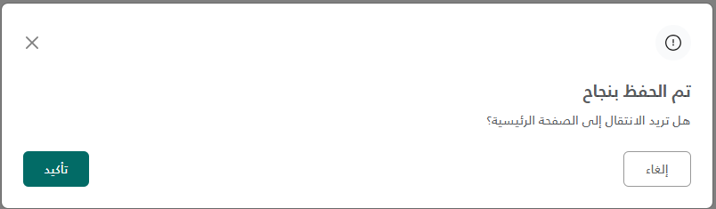

# Status Modal - Usage Guide

## How to Use

### 1. Include the Partial in Your View

Add this line anywhere in your view (typically at the bottom before closing tags):

```cshtml
@await Html.PartialAsync("_StatusModal")
```

Or using the shorter syntax:

```cshtml
<partial name="_StatusModal" />
```

### 2. Call the Modal from JavaScript

Use the `showStatusModal()` function with your desired options:

#### With Action Button

```javascript
showStatusModal({
  type: "success",
  title: "تم الحفظ بنجاح",
  titleColor: '#212529bf',
  message: "هل تريد الانتقال إلى الصفحة الرئيسية؟",
  messageStyle: {},
  showActionButton: true,
  actionButtonText: "تأكيد",
  onConfirm: function () {
    // Handle action logic
  },
  onCancel: function () {
    // Handle cancel action if needed
  },
});
```

## Available Options

| Option             | Type     | Default   | Description                                     |
| ------------------ | -------- | --------- | ----------------------------------------------- |
| `type`             | string   | 'success' | Modal type: 'success', 'info', 'error'|
| `title`            | string   | 'empty string'| Main title text [bold text]|
| `titleColor`       | string   | '#212529bf'| Title color|
| `message`          | string   | 'empty string'| Optional message below title|
| `messageStyle`     | object   | {}        | Optional message style|
| `showActionButton` | boolean  | false     | Show/hide the action button|
| `actionButtonText` | string   | 'تأكيد'   | Text for action button|
| `onConfirm`        | function | null      | Callback when confirm button is clicked|
| `onCancel`         | function | null      | Callback when [cancel, close] button is clicked|

## Complete Example in a View

```cshtml

<div class="container">
    <h1>My Page Content</h1>

    <button onclick="handleStatusModal()"
    class="btn btn-primary">Test Success</button>
</div>

@* Include the modal partial *@
<partial name="_GenericStatusModal" />

@section Scripts {

    <script>
        function handleStatusModal() {
            showStatusModal({
                type: "info",
                title: "تم الحفظ بنجاح",
                titleColor: '#212529bf',
                message: "هل تريد الانتقال إلى الصفحة الرئيسية؟",
                messageStyle: {},
                showActionButton: true,
                actionButtonText: "تأكيد",
                onConfirm: function () {
                    console.log('onConfirm triggered!');
                },
                onCancel: function () {
                    console.log('onCancel triggered!');
                },
            });
        }
    </script>

}
```

| Parameter | Type | Description | Default Value |
| --- | --- | --- | --- |
| type | string | The type of the modal | 'success' |
| title | string | The title of the modal | 'empty string' |
| message | string | The message of the modal | 'empty string' |
| showActionButton | boolean | Whether to show the action button or not | false |
| actionButtonText | string | The text of the action button | 'تأكيد' |
| onConfirm | function | The callback function when the confirm button is clicked | null |
| onCancel | function | The callback function when the cancel button is clicked | null |

## Screenshots




