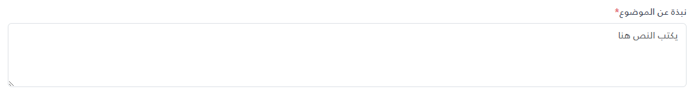

# _TextArea



```html
@model (string Label, bool Required, string Id, string Placeholder)
@{
var placeholder = string.IsNullOrEmpty(Model.Placeholder) ? "يكتب النص هنا" : Model.Placeholder;
}
<div class="mb-4">
	<label class="form-label text-gray-700" for="@Model.Id">
		@if (Model.Required)
		{
		<span class="text-danger">*</span>
		}
		@Model.Label
	</label>
	<textarea id="@Model.Id" class="form-control" style="height: 100px;" rows="3" placeholder="@placeholder"
		@(Model.Required ? "required" : "" )></textarea>
</div>
```

### How to use
```cshtml
<partial name="_TextAreaField" model='("عنصر مطلوب بقيمة توضيحيه", true, "my-custom-id-1", "عنصر مطلوب بقيمة توضيحيه")' />
<partial name="_TextAreaField" model='("عنصر غير مطلوب بقيمة توضيحيه افتراضية", false, "my-custom-id-2", "")' />
```

