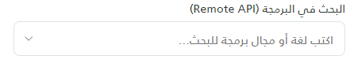
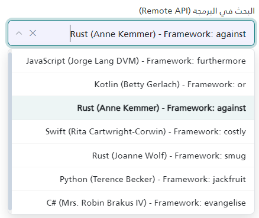

# AutoComplete Component Documentation

Enterprise-grade, accessible, flexible AutoComplete & Search Select component for ASP.NET Core MVC. Fully self-contained single-file Razor Partial View (`_AutoComplete.cshtml`).

---
## UI Preview

| State     | Preview                       |
| --------- | ----------------------------- |
| Default |  |
| Selected Value     |      |

---

## 1. Setup Requirements

To use `_AutoComplete.cshtml`, ensure your project includes:

1. **Bootstrap 5 CSS & JS** (Required for dropdown styling, responsive layout, and tooltips).
2. **Bootstrap Icons (`bi`)** (Required for action buttons: clear `bi-x-lg`, caret `bi-chevron-down`, prompt `bi-info-circle`).
3. **Partial Location**: Store the partial view in `Views/Shared/UI/_AutoComplete.cshtml`.

> [!NOTE]
> The component automatically injects its required CSS styles and JS engine **only once per HTTP request** via ASP.NET Core `Context.Items`. No external `.js` or `.css` files need to be referenced in your `_Layout.cshtml`.

---

## 2. Quick Usage Examples

### Local Data Source Example
```razor
<partial name="UI/_AutoComplete" model='new {
    id          = "lawyerSelect",
    name        = "LawyerId",
    label       = "المحامي المسؤول",
    required    = true,
    placeholder = "اختر المحامي...",
    items = new[] {
        new { value = "1", label = "أحمد محمود الإبراهيم" },
        new { value = "2", label = "خالد عبدالله الفهد" },
        new { value = "3", label = "سارة محمد العتيبي" }
    }
}' />
```

### Pre-Selected Initial Value Example
```razor
<partial name="UI/_AutoComplete" model='new {
    id            = "statusSelect",
    name          = "StatusId",
    label         = "حالة الملف",
    selectedValue = "101",
    selectedText  = "قضية قيد التداول",
    items = new[] {
        new { value = "101", label = "قضية قيد التداول" },
        new { value = "102", label = "مغلقة" }
    }
}' />
```

---

## 3. Remote Search — Step-by-Step Setup Guide

> [!IMPORTANT]
> Remote mode works in 2 steps: **(A)** add the Razor partial in the View with `remoteUrl` pointing to your controller action, **(B)** create an `[HttpGet]` action in your controller that accepts `q` and returns JSON.

### Step 1 — Add Partial in the Razor View

```razor
<partial name="UI/_AutoComplete" model='new {

    id                  = "caseSearch",
    // ^ Unique ID. Used to access the JS instance via AutoComplete.getInstance("caseSearch").
    // Also becomes the hidden input ID. Must be unique per page.

    name                = "CaseId",
    // ^ The form field name. ASP.NET Core binds this on POST.
    // Example: public IActionResult Save(string CaseId) { ... }

    label               = "البحث في القضايا",
    // ^ Text label displayed above the input. Leave empty to hide label.

    required            = true,
    // ^ If true: shows red asterisk *, adds aria-required, blocks form submit if empty.

    placeholder         = "اكتب رقم القضية أو اسم الطرف...",
    // ^ Placeholder text inside the empty input field.

    remoteUrl           = "/Cases/Search",
    // ^ Your controller endpoint path. The component will call:
    //   GET /Cases/Search?q={typedText}
    // Set this and the component automatically enables remote search mode.

    minimumSearchLength = 2,
    // ^ User must type at least 2 characters before a search fires.
    // Set to 0 to load default results immediately on focus.

    debounceDelay       = 400,
    // ^ Milliseconds to wait after user stops typing before sending request.
    // For remote mode, the component automatically uses 400ms if you don't set this.
    // For local mode the default is 250ms. Override explicitly to use any custom value.

    searchPrompt        = "يرجى إدخال حرفين على الأقل...",
    // ^ Message shown in dropdown when typed length < minimumSearchLength.
    // Only visible when minimumSearchLength > 0.

    allowClear          = true,
    // ^ Shows an × button inside the input when a value is selected.
    // Clicking it clears the selection AND immediately re-runs search with empty
    // query — so the dropdown re-opens with default results instead of staying empty.

    cacheResults        = true,
    // ^ Caches server responses by query string in browser memory.
    // Same query won't re-fire until cache cleared or page reloads.
    // Set to false during development to always get fresh results.

    maxVisibleItems     = 10,
    // ^ Limits how many items appear in the dropdown list at once.
    // Filtering/slicing happens client-side after receiving server response.

    showTooltip         = true
    // ^ Shows Bootstrap tooltip on item hover with the item label as content.
    // Useful when label text is long and truncated in the dropdown.

    // NOTE — Refocus behavior:
    // If an item is already selected and the user clicks back into the input,
    // the component re-opens the dropdown instantly using cached results.
    // It does NOT fire a new API request in this case.

}' />
```

---

### Step 2 — Create the Controller Action

Create an `[HttpGet]` action in your controller. The component always sends the search text as the `q` query parameter:
`GET /Cases/Search?q={typedText}`

#### Basic Controller Example (Database)
```csharp
// Controller: CasesController.cs

[HttpGet]
public async Task<IActionResult> Search(string q)
{
    // q = whatever the user typed. Empty string "" means no filter (show defaults).

    var results = await _db.Cases
        .Where(c =>
            string.IsNullOrEmpty(q) ||         // empty q = return all/default
            c.CaseNumber.Contains(q) ||        // match by case number
            c.Title.Contains(q)                // match by title
        )
        .Take(20)                              // always limit results for performance
        .Select(c => new {
            value   = c.Id.ToString(),         // REQUIRED: value stored in hidden input on select
            label   = c.CaseNumber + " - " + c.Title,  // REQUIRED: text shown in dropdown + input
            tooltip = c.SubjectSummary         // OPTIONAL: hover tooltip content
        })
        .ToListAsync();

    return Json(results);
    // Response MUST be a JSON array: [{ value, label }, ...]
}
```

#### Controller Example (External API Proxy)

Use this pattern when data comes from an external REST API (avoids browser CORS issues):

```csharp
[HttpGet]
public async Task<IActionResult> Search(string q)
{
    const string apiUrl = "https://external-api.example.com/data";

    // local helper: safely read a JSON property as string
    string str(System.Text.Json.JsonElement el, string key)
        => el.TryGetProperty(key, out var p) ? p.ToString() : "";

    try
    {
        using var client = new System.Net.Http.HttpClient { Timeout = System.TimeSpan.FromSeconds(5) };

        var response = await client.GetAsync(apiUrl);
        if (!response.IsSuccessStatusCode) return Json(Array.Empty<object>());

        var json  = await response.Content.ReadAsStringAsync();
        var items = System.Text.Json.JsonDocument.Parse(json).RootElement.EnumerateArray();

        var result = items
            .Select(item => new
            {
                value = str(item, "id"),
                label = str(item, "name") is { Length: > 0 } n ? n : str(item, "title")
            })
            .Where(x => string.IsNullOrWhiteSpace(q)
                     || x.label.Contains(q, System.StringComparison.OrdinalIgnoreCase))
            .ToList();

        return Json(result);
    }
    catch
    {
        return Json(Array.Empty<object>()); // return empty on error — don't crash
    }
}
```

> [!NOTE]
> The JSON response **must** be an array of objects containing at minimum `value` and `label` keys.
> The component also accepts: `id` as alternative for `value`, and `name`/`title`/`text` as alternatives for `label`.

---

### Step 3 — Verify It Works

1. Run the app and open the page containing the AutoComplete.
2. Open **Browser DevTools → Network tab**.
3. Click the AutoComplete input or type something.
4. Look for a `GET` request to `/Cases/Search?q=yourText`.
5. Confirm response is a JSON array: `[{"value":"1","label":"..."}]`.
6. Items should appear in dropdown.

> [!TIP]
> If dropdown shows empty/no results: check the Network tab response body. If `[]` is returned, your filter is too strict or the `q` parameter isn't matching. If the request isn't being made, check `remoteUrl` path matches your controller route exactly.

---

## 4. Configuration Properties Reference

| Property | Type | Status | Default | Description |
| :--- | :--- | :--- | :--- | :--- |
| `id` | `string` | Optional (Recommended) | `ac_` + 8 GUID chars | Unique HTML ID. Used for JS instance access. |
| `name` | `string` | Optional | Same as `id` | Form POST field name for hidden input. |
| `label` | `string` | Optional | `""` | Label text above input. |
| `required` | `bool` | Optional | `false` | Asterisk + validation on form submit. |
| `placeholder` | `string` | Optional | `"ابحث هنا..."` | Input placeholder text. |
| `selectedValue` | `string` | Optional | `""` | Pre-selected item value on load. |
| `selectedText` | `string` | Optional | `""` | Pre-selected item display text on load. |
| `items` / `options` | `IEnumerable` | Local Mode | `[]` | Static data array. |
| `remoteUrl` | `string` | Remote Mode | `""` | `GET ?q=` endpoint. Enables remote mode. |
| `enableRemoteSearch` | `bool` | Optional | `false` | Force remote mode without `remoteUrl`. |
| `minimumSearchLength` | `int` | Optional | `0` | Min chars before search fires. |
| `debounceDelay` | `int` | Optional | `250` local / **`400` remote** | Ms wait after typing stops. Remote auto-bumps to 400 unless overridden. |
| `maxVisibleItems` | `int` | Optional | `100` | Max dropdown items shown. |
| `dropdownMaxHeight` | `string` | Optional | `"280px"` | CSS max-height of dropdown. |
| `allowClear` | `bool` | Optional | `true` | Show × button. On click: clears selection **and** re-runs empty search so dropdown shows defaults. |
| `disabled` | `bool` | Optional | `false` | Disable input. |
| `readonly` | `bool` | Optional | `false` | Read-only input. |
| `autoFocus` | `bool` | Optional | `false` | Focus input on page load. |
| `showTooltip` | `bool` | Optional | `false` | Hover tooltip on items. |
| `cacheResults` | `bool` | Optional | `true` | Cache AJAX responses in memory. |
| `searchCaseSensitive` | `bool` | Optional | `false` | Case-sensitive local filter. |
| `searchMode` | `string` | Optional | `"contains"` | `contains` / `startsWith` / `exact`. |
| `searchPrompt` | `string` | Optional | `"عليك كتابة نص..."` | Prompt when query too short. |

---

## 5. Item Object Schema

Items returned by the controller (or passed in `items`) are normalized automatically:

| Property | Alternative Keys | Type | Status | Description |
| :--- | :--- | :--- | :--- | :--- |
| `value` | `Value`, `id`, `Id` | `string` / `int` | **Required** | Stored in hidden input on select. |
| `label` | `Label`, `name`, `Name`, `title`, `Title`, `text`, `Text` | `string` | **Required** | Displayed in dropdown and input. |
| `tooltip` | `title`, `Title` | `string` | Optional | Hover tooltip content. |
| `disabled` | `Disabled` | `bool` | Optional | Greys out + prevents selection. |

---

## 6. JavaScript API & Helper Functions

### Built-in Helper Function to Get Selected Value
`getAutoComplete(id)` is a built-in global helper function available on `window`. It returns `{ value, label }` of the selected item, or `null` if nothing is selected.

```javascript
// Global built-in helper function
const selected = getAutoComplete("caseSearch");

if (selected) {
    console.log("Selected Value:", selected.value); // e.g. "101"
    console.log("Selected Label:", selected.label); // e.g. "قضية قيد التداول"
} else {
    console.log("No item selected");
}
```

### Instance Methods for Reading Values
You can also retrieve the instance using `AutoComplete.getInstance(id)` and call getter methods directly:

```javascript
const ac = AutoComplete.getInstance("caseSearch");

// 1. Get raw value string (hidden input value)
const val = ac.getValue();          // returns "101" or ""

// 2. Get simplified selected object { value, label }
const item = ac.getSelectedItem();  // returns { value: "101", label: "..." } or null

// 3. Get full raw item object (including custom properties)
const fullItem = ac.getItem();      // returns { value: "101", label: "...", tooltip: "..." } or null
```

ac.setValue("5", "Cairo"); // programmatically select
ac.clear();                 // clear selection (fires default search)
ac.setData([...]);          // replace local dataset
ac.reload();                // re-run last remote query
ac.clearCache();            // clear cached responses

ac.enable();  ac.disable();
ac.open();    ac.close();
ac.focus();   ac.blur();
ac.validate();              // → bool, marks invalid if required + empty
ac.destroy();               // cleanup all events + instance
```

### Events
```javascript
// Via callbacks
initAutoComplete('ac-container-caseSearch', {
    onSelect: ({ item })        => console.log(item),
    onChange: ({ value, item }) => console.log(value),
    onClear:  ()                => console.log('cleared'),
    onError:  ({ error })       => console.warn(error)
});

// Via DOM events
document.getElementById('ac-container-caseSearch')
    .addEventListener('autocomplete:select', e => console.log(e.detail.item));
```

---

## 7. Form POST & Model Binding

The component renders a hidden input `<input type="hidden" name="{name}" value="{selectedValue}" />`.

On form submit, ASP.NET Core auto-binds by field name:

```csharp
[HttpPost]
public IActionResult Save(string CaseId, string LawyerId)
{
    // CaseId / LawyerId = the selected values from AutoComplete inputs
    return RedirectToAction("Index");
}
```

---

## 8. Keyboard Shortcuts

| Key | Action |
| :--- | :--- |
| `↓` / `↑` | Open dropdown / navigate items |
| `Enter` | Select highlighted item |
| `Tab` | Commit highlighted item + move focus |
| `Escape` | Close dropdown |
| `Home` / `End` | Jump to first / last item |
