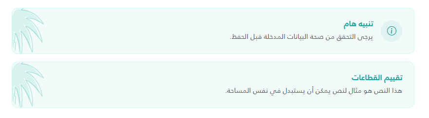

The Banner component is used to display important information or notifications with an optional icon and title in a stylized container.

## UI Preview

| State   | Preview               |
| ------- | --------------------- |
| Default |  |

---

## Usage

To use the banner, include the partial view in your page and provide the required model properties using a C# Tuple.

### Basic Example
```cshtml
<partial name="UI/_Banner" model='(Icon: "bi-info-circle", Title: "Notice", Content: "This is a banner message.", TitleColor: null, IsSmall: false)' />
```

### Advanced Example (with Raw HTML Icon)
```cshtml
<partial name="UI/_Banner" model='(
    Icon: "",
    Title: "System Update",
    Content: "The system will undergo maintenance at midnight.",
    TitleColor: "#d9534f",
    IsSmall: true
)' />

or

@await Html.PartialAsync("UI/_Banner", (
    Icon: "",
    Title: "تقييم القطاعات",
    Content: "هذا النص هو مثال لنص يمكن أن يستبدل في نفس المساحة.",
    TitleColor: "#00A79E",
    IsSmall: false
))
```

## Properties

| Property Name | Type | Description | Default Value |
| :--- | :--- | :--- | :--- |
| `Icon` | `string?` | The icon to display. Supports Bootstrap Icon classes (e.g., `bi-gear`) or raw HTML (e.g., `` or `<svg>`). If raw HTML contains `~/`, it will be automatically resolved to the root path. | `null` (No icon shown) |
| `Title` | `string` | The bold heading text displayed at the top of the banner. | `null` / Empty (Row hidden if empty) |
| `Content` | `string` | The main body text/description of the banner. | **Required** |
| `TitleColor` | `string?` | A custom hex color code for the title and primary icon. | `"#1F2937"` |
| `IsSmall` | `bool` | If set to `true`, applies a `small` utility class to the content text. | `false` |

## Visual Features
- **Background**: Soft teal background (`#00A79D0D`) with a matching border.
- **Decorative Element**: Includes a palm tree background image (`palm.svg`) positioned on the left side of the banner.
- **Icon Styling**: Icons are automatically wrapped in a circular teal background.
- **Responsive**: Flex-based layout that aligns items centrally with a gap.

## Dependencies
- **Bootstrap Icons**: Required for class-based icons (e.g., `bi-info-circle`).
- **Bootstrap 5**: Uses utility classes like `mb-3`, `d-flex`, `align-items-center`, `gap-3`, and `fw-bold`.
- **Assets**: requires `~/assets/images/palm.svg` for the background decoration.
