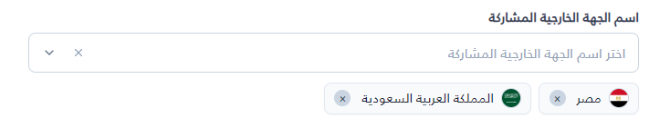
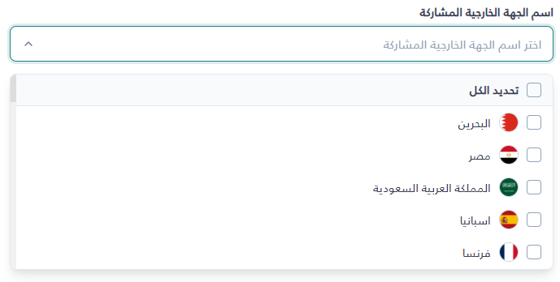

# ChipSelect

A searchable multi-select dropdown component for ASP.NET Core Razor that displays selections as dismissible chips and synchronizes with hidden form inputs for standard form submission.

## UI Preview

| State | Preview |
|---|---|
| **Selected (Chips)** |  |
| **Dropdown Open** |  |

---

Render the partial view passing an anonymous object or model dictionary:

```cshtml
@await Html.PartialAsync("UI/_ChipSelect", new {
    id = "lawyersSelect",
    name = "AssignedLawyerIds",
    label = "المحامون المكلفون",
    placeholder = "اختر المحامين...",
    items = new[] {
        new { id = 1, text = "أحمد محمود", secondaryText = "قضايا عمالية", image = "/img/user1.png" },
        new { id = 2, text = "سارة علي", secondaryText = "قضايا تجارية", image = "/img/user2.png" },
        new { id = 3, text = "خالد حسن", secondaryText = "قضايا جنائية" }
    },
    selectedValues = new[] { 1, 2 }
})
```

---

## Props

### Razor Helper Props (`Model`)

| Prop | Type | Default | Description |
|---|---|---|---|
| `id` | `string` | Auto-generated GUID | Container element ID. Required for JavaScript instance lookup. |
| `name` | `string` | `"SelectedIds"` | Form field `name` used for generated hidden inputs. |
| `label` | `string` | `""` | Top label displayed above the control. |
| `placeholder` | `string` | `"اختر عناصر..."` | Text displayed in the control when empty. |
| `searchPlaceholder` | `string` | `"بحث..."` | Watermark text inside the search input. |
| `searchAriaLabel` | `string` | `""` | Accessibility label for the search input. |
| `selectAllText` | `string` | `"تحديد الكل"` | Display text for the Select All dropdown option. |
| `showImages` | `bool` | `true` | Show or hide circular avatar/icons in chips and options. |
| `allowSearch` / `searchable` | `bool` | `true` | Show or hide the search input. |
| `allowSelectAll` | `bool` | `true` | Show or hide the Select All option. |
| `allowClear` / `clearable` | `bool` | `true` | Show or hide the Clear All (×) button inside the control. |
| `closeOnSelect` | `bool` | `false` | Close dropdown immediately upon selecting/unselecting. |
| `maxSelections` | `int?` | `null` | Maximum allowed selections (`null` = unlimited). |
| `items` | `IEnumerable` | `[]` | List of items: `{ id, text, secondaryText?, image? }`. |
| `selectedValues` | `IEnumerable` | `[]` | Initial selected IDs (`int` or `string`). |

### JavaScript-only Options

*These options are available in `instance.config` or when instantiating via JS:*

| Option | Type | Default | Description |
|---|---|---|---|
| `multiple` | `boolean` | `true` | Set to `false` for single-select mode. |
| `onChange` | `Function` | `null` | Callback: `(selectedItems, selectedValues) => void`. |
| `normalizeArabic` | `boolean` | `true` | Normalizes Arabic diacritics and Alef/Yaa variants in search. |
| `noResultsText` | `string` | `"لا توجد نتائج"` | Empty state text when search yields no matches. |

---

## Common Examples

### 1. Basic Multi-Select
```cshtml
@await Html.PartialAsync("UI/_ChipSelect", new {
    id = "caseCategories",
    name = "CategoryIds",
    label = "التصنيفات",
    items = ViewBag.Categories
})
```

### 2. Pre-selected Values
```cshtml
@await Html.PartialAsync("UI/_ChipSelect", new {
    id = "tagsSelect",
    name = "TagIds",
    items = Model.AllTags,
    selectedValues = new[] { "tag-1", "tag-3" }
})
```

### 3. Search Disabled
```cshtml
@await Html.PartialAsync("UI/_ChipSelect", new {
    id = "prioritySelect",
    name = "Priorities",
    allowSearch = false,
    items = Model.Priorities
})
```

### 4. Custom Actions & Auto-Close
```cshtml
@await Html.PartialAsync("UI/_ChipSelect", new {
    id = "officesSelect",
    name = "OfficeIds",
    allowSelectAll = false,
    allowClear = true,
    closeOnSelect = true,
    items = Model.Offices
})
```

### 5. Maximum Selections
```cshtml
@await Html.PartialAsync("UI/_ChipSelect", new {
    id = "committeeSelect",
    name = "MemberIds",
    label = "أعضاء اللجنة (حد أقصى 3)",
    maxSelections = 3,
    items = Model.Users
})
```

### 6. Single-Select (via JavaScript)
```javascript
const cs = window.ChipSelect.getInstance('userSelect');
cs.config.multiple = false;
cs.config.closeOnSelect = true;
```

---

## Built-in Functions

Get an instance using `window.ChipSelect.getInstance(id)` or `window.getChipSelectInstance(id)`:

```javascript
const cs = window.ChipSelect.getInstance('lawyersSelect');
```

### `getSelectedValues()`
Returns an array of selected ID strings.
- **Returns**: `string[]`
```javascript
const ids = cs.getSelectedValues(); // ["1", "2"]
```

### `getSelectedItems()`
Returns an array of full item objects that are currently selected.
- **Returns**: `object[]`
```javascript
const items = cs.getSelectedItems(); // [{ id: 1, text: "أحمد محمود", ... }]
```

### `setSelectedValues(values)`
Replaces current selections with the provided ID list.
- **Parameters**: `values: Array<string|number>`
- **Returns**: `void`
```javascript
cs.setSelectedValues([2, 3]);
```

### `select(id)`
Selects an individual item by its ID.
- **Parameters**: `id: string|number`
- **Returns**: `void`
```javascript
cs.select(3);
```

### `unselect(id)`
Unselects an individual item by its ID.
- **Parameters**: `id: string|number`
- **Returns**: `void`
```javascript
cs.unselect(1);
```

### `selectAll()`
Selects all items currently loaded into the component.
- **Returns**: `void`
```javascript
cs.selectAll();
```

### `clear()` / `deselectAll()`
Clears all selected values.
- **Returns**: `void`
```javascript
cs.clear();
```

### `setItems(items, options)`
Replaces the component items list (or merges if `options.merge = true`).
- **Parameters**: `items: object[]`, `options?: { merge?: boolean }`
- **Returns**: `void`
```javascript
cs.setItems([
    { id: 10, text: "جديد 1" },
    { id: 11, text: "جديد 2" }
]);
```

### `addItems(items)`
Appends new items to the existing item list.
- **Parameters**: `items: object[]`
- **Returns**: `void`
```javascript
cs.addItems([{ id: 12, text: "مضاف جديد" }]);
```

### `destroy()`
Cleans up event listeners, timers, and DOM elements.
- **Returns**: `void`
```javascript
cs.destroy();
```

---

## Quick Reference

```cshtml
@* Razor *@
@await Html.PartialAsync("UI/_ChipSelect", new {
    id = "mySelect",
    name = "SelectedIds",
    items = Model.Options,
    selectedValues = Model.SelectedIds
})
```

```javascript
// Access Instance
const cs = window.ChipSelect.getInstance('mySelect');

// Read Values
const values = cs.getSelectedValues(); // ['1', '2']
const items  = cs.getSelectedItems();  // [{ id: 1, text: '...' }]

// Global Quick Helpers
const values = window.getChipSelectValues('mySelect');
const items  = window.getChipSelect('mySelect');

// Modify Selections
cs.setSelectedValues([3, 4]);
cs.select(5);
cs.unselect(3);
cs.clear();

// Update Data (AJAX)
cs.setItems([{ id: 20, text: 'عنصر جديد' }]);

// Listen to Changes
cs.config.onChange = (selectedItems, selectedValues) => {
    console.log('Changed:', selectedValues);
};

// Teardown
cs.destroy();
```
