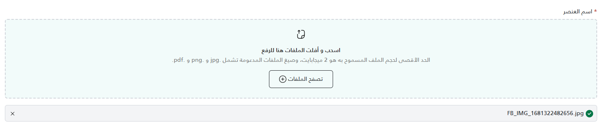

A reusable file upload component that supports drag-and-drop, client-side validation (file size, type, max count), and managing a list of uploaded files.

## UI Preview

| State     | Preview                         |
| --------- | ------------------------------- |
| Default   |  |
| File List |         |

---

## Usage

### 1. Render the Component
Use the `partial` tag to include the component in your Razor view.

```cshtml
<!-- Minimal usage -->
<partial name="UI/_FileUpload/_FileUpload"
         model='("Document Label", true, "my-uploader-id")' />

<!-- Full usage with constraints -->
<partial name="UI/_FileUpload/_FileUpload"
         model='("Profile Picture", true, "avatar-uploader", 1, new string[] { "image/png", "image/jpeg" })' />

<!-- Full usage with all parameters -->
<partial name="UI/_FileUpload/_FileUpload" model='(@Label, @Required, @Id, @MaxFiles, @AllowedFileTypes, @MaxFileSize)' />

```

### 2. Handle Files via JavaScript
The component registers itself in a global object `window.fileUploads`. You can access the specific instance using the **Id** you provided.

```javascript
document.getElementById('myForm').addEventListener('submit', function(e) {
    e.preventDefault();

    // Access the uploader instance by ID
    var uploader = window.fileUploads["my-uploader-id"];

    // Get the array of native File objects
    var files = uploader ? uploader.getFiles() : [];

    // process files (e.g., add to FormData)
    var formData = new FormData();
    files.forEach(file => {
        formData.append("Documents", file);
    });

    // submit formData...
});
```

## Properties

The model is a `ValueTuple` requiring specific order.

| Position | Name | Type | Description | Example / Note |
| :---: | :--- | :--- | :--- | :--- |
| **1** | `Label` | `string` | The text label displayed above the upload area. | `"Personal Photo"` |
| **2** | `Required` | `bool` | Toggles the required asterisk (*) and hidden input validation. | `true` or `false` |
| **3** | `Id` | `string` | **Unique** identifier for this uploader instance. Used for JS access. | `"user-docs-1"` |
| **4** | `MaxFiles` | `int?` | (Optional) Maximum number of files allowed. | `1` (single mode) or `5` (limit) |
| **5** | `AllowedFileTypes` | `string[]` | (Optional) Array of allowed MIME types. Null allows all. | `new[] { "application/pdf" }` |
| **6** | `MaxFileSize` | `double` | (Optional) Maximum file size in MB. Default is 5 MB. | `10` or `2.5` |
