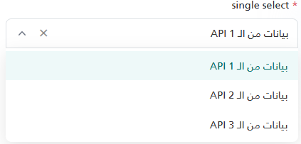
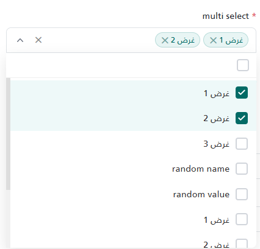
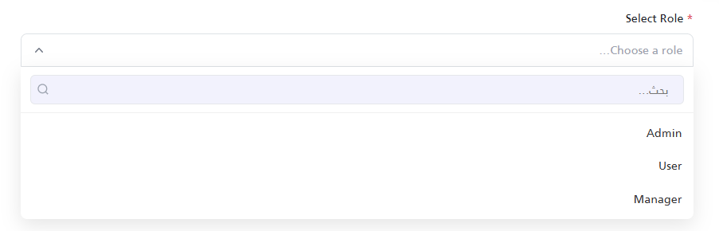
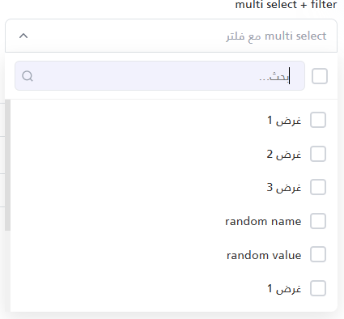

The `_MomahSelect.cshtml` is a custom, reusable dropdown component designed to replace the standard HTML `<select>`. It supports both single and multiple selections, searching/filtering, progressive enhancement, programmatic updates, and custom callbacks.

## UI Preview

| State         | Preview                         |
| ------------- | ------------------------------- |
| Single Select |            |
| Multi Select  |              |
| Single Filter | |
| Multi Filter  |   |

---

## Properties

The component accepts properties ideally via an `anonymous object`. It also provides backward compatibility for Tuples.

### Configuration Properties

| Property | Type | Default Value | Description |
| :--- | :--- | :--- | :--- |
| `Id` | `string` | `""` | **Required.** A unique identifier for the component. Used to generate element IDs. |
| `Options` | `List<(string Value, string Text)>`| `null` | The list of options to display in the dropdown. |
| `Label` | `string` | `""` | The label text displayed above the input. If empty, the `<label>` element is omitted. |
| `Required`| `bool` | `false` | Marks the input as required. Displays a `*` next to the label and enables validation logic. |
| `Placeholder`| `string` | `""` | The placeholder text to display when no option is chosen. |
| `Type` | `string` | `"single"` | Determines the selection mode. Accepts `"single"` or `"multiple"`. |
| `Filter` | `string` | `null` | Enables the search/filter input. Any non-null value activates it. *Note: Multi-select ALWAYS has search enabled.*|
| `Clear` | `string` | `null` | Enables a clear ('✕') button upon selection. Any non-null value enables it. |
| `OnChange`| `string` | `null` | The name of a global JavaScript function to call when the selection changes. Receives `(selectedValue, id)`. |

*(Note: If passing a Tuple instead of an anonymous object, use this exact order: `(Label, Required, Id, Placeholder, Options, Type, Filter, Clear, OnChange)`)*

---

## Usage Examples

### 1. Basic Single Select
A standard single-select dropdown without search or clearing.

```html
@await Html.PartialAsync("UI/_MomahSelect", new
{
    Id = "UserRole",
    Label = "Select Role",
    Required = true,
    Placeholder = "Choose a role...",
    Options = new List<(string, string)>
    {
        ("1", "Admin"),
        ("2", "User"),
        ("3", "Manager")
    }
})
```

### 2. Multi-Select with Search & Clear Button
Use `Type = "multiple"` to show a multiple layout with checkboxes and tag chips. Multiselect handles internal searching automatically.

```html
@await Html.PartialAsync("UI/_MomahSelect", new
{
    Id = "AssignedServices",
    Label = "Assign Services",
    Required = false,
    Placeholder = "Select services",
    Type = "multiple",
    Clear = "true", // Allows clearing the entire selection
    Options = new List<(string, string)>
    {
        ("srv1", "Service 1"),
        ("srv2", "Service 2"),
        ("srv3", "Service 3")
    }
})
<!-- or -->

<partial name="UI/_MomahSelect"
	model='new { Label = "multi select + filter", Required = false, Id = "my-multi-select-2", Placeholder = "multi select مع فلتر", Options = selectFieldOptions, Type = "multiple", Filter = "filter", Clear = "clear" }' />

```

### 3. Single Select with Filter & OnChange Callback
Activating the search bar for a single selection and reacting via a Javascript callback.

```html
@await Html.PartialAsync("UI/_MomahSelect", new
{
    Id = "CitySelect",
    Label = "City",
    Placeholder = "Search city...",
    Filter = "true",
    OnChange = "onCityChanged",
    Options = new List<(string, string)>
    {
        ("c1", "Cairo"),
        ("c2", "Alexandria")
    }
})

<script>
    function onCityChanged(selectedValue, inputId) {
        console.log("The component " + inputId + " changed value to: " + selectedValue);
    }
</script>
```

---

## JavaScript API

The component exposes a global JavaScript API for fetching data and programmatic control.

### Getting the Selected Value
```javascript
// Returns a string (or null/empty) for 'single'
// Returns an array of strings for 'multiple'
var roleVal = window.getSelectedValue("UserRole");
```

### Setting the Selected Value
```javascript
// For single select (use the value of the option)
window.setSelectValue("UserRole", "2");

// For multi-select (accepts an array of string values)
window.setSelectValue("AssignedServices", ["srv1", "srv2"]);
```

### Updating Options Dynamically (e.g., via AJAX)
```javascript
// Replaces the entire list of options and clears the ongoing selection
var newOptions = [
    { value: "4", text: "Editor" },
    { value: "5", text: "Viewer" }
];
window.setSelectOption("UserRole", newOptions);
```

### Programmatic Validation
```javascript
// Manually triggers validation checks
// Returns true if valid, false if invalid. Displays error state UI automatically.
var isValid = window.validateSelect_UserRole();
```
