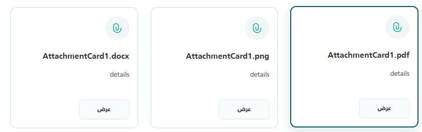

import Tabs from '@theme/Tabs';
import TabItem from '@theme/TabItem';

<Tabs>
<TabItem value="guide" label="Guide" default>

# Attachment Card `_AttachmentCard`



A UI component used to display a standardized card for a file attachment, showing its details and providing a built-in "preview" (عرض) button. It integrates directly with the generic `_FilePreview` modal for seamless viewing of supported document types (PDFs, Images, Word, Excel, etc.).

## Location
`Views/Shared/UI/_AttachmentCard.cshtml`

## Usage Examples

### Basic Usage
The simplest way to use the component is by passing the minimal required fields, `FileName` and `FileId`. The component will infer the file type from the extension in the `FileName` (or `FileId` if provided as a URL).

```html
@await Html.PartialAsync("UI/_AttachmentCard", new {
    FileName = "Contract.pdf",
    Details = "Signed copy of the main contract.",
    FileId = "15243"
})
```

### Advanced Usage
You can optionally provide a hardcoded `Id` for the DOM element and override the backend endpoint that fetches the file using `ActionUrl`.

```html
@await Html.PartialAsync("UI/_AttachmentCard", new {
    Id = "custom-contract-card",
    FileName = "Project_Requirements.docx",
    Details = "Initial drafted requirements.",
    FileId = "99824",
    ActionUrl = "/CustomController/DownloadAttachment" // Overrides default API
})
```

## Properties

The component accepts an anonymous object with the following properties.

| Property    | Type   | Default Value                    | Description |
| :---------- | :----- | :------------------------------- | :---------- |
| `Id`        | string | Auto-generated (`attachCard-&#123;Guid&#125;`) | The internal DOM ID for the outermost container div. If not provided, a unique ID is automatically generated. |
| `FileName`  | string | Inferred from `FileId`           | The main title of the file displayed in the card. Used to infer the preview `FileType`. If omitted, it will try to extract the file name from `FileId`. |
| `Details`   | string | `""`                             | The subtitle or brief description shown right below the file name. |
| `FileId`    | string | `""`                             | The unique identifier used to fetch the file from the backend, appended to the `ActionUrl`. It can also be a full direct URL to a file. |
| `ActionUrl` | string | `"/Common/PreviewAttachment"`    | The base endpoint called to fetch the file stream for the preview modal. By default, relies on the `PreviewAttachment` endpoint in the `Common` controller, but it can be overridden. |

## Dependencies
This component relies on two other standard partial views to render previews and handle errors gracefully:
1. `UI/_FilePreview`: Handles displaying the preview overlay over the page.
2. `UI/_StatusModal`: Triggers an info/warning popup if the requested file is missing.

*(Both are automatically included at the bottom of the partial block).*


</TabItem>
<TabItem value="_AttachmentCard.cshtml" label="_AttachmentCard.cshtml">

```cshtml
@using Microsoft.AspNetCore.Routing
@model dynamic
@{
string Id = "";
string FileName = "";
string Details = "";
string FileId = "";
string actionUrl = "/Common/PreviewAttachment";

if (Model != null)
{
    var props = new RouteValueDictionary(Model);
    if (props.TryGetValue("Id", out var idProp)) Id = idProp?.ToString() ?? "";
    if (props.TryGetValue("FileName", out var titleProp)) FileName = titleProp?.ToString() ?? "";
    if (props.TryGetValue("Details", out var dProp)) Details = dProp?.ToString() ?? "";
    if (props.TryGetValue("FileId", out var fProp)) FileId = fProp?.ToString() ?? "";
    if (props.TryGetValue("ActionUrl", out var auProp) && !string.IsNullOrWhiteSpace(auProp?.ToString()))
        actionUrl = auProp.ToString()!;
}

// Display name fallback (used to compute FileName as well)
if (string.IsNullOrWhiteSpace(FileName))
{
    FileName = System.IO.Path.GetFileName(FileId ?? "").Split('?')[0];
}

// Infer type from file extension when FileType is not supplied
string GetExtensionType(string name, string url)
{
    var src = !string.IsNullOrEmpty(name) ? name : url ?? "";
    var ext = System.IO.Path.GetExtension(src).ToLowerInvariant().TrimStart('.');
    return ext switch
    {
        "pdf"                          => "pdf",
        "jpg" or "jpeg" or "png"
            or "gif" or "bmp"
            or "webp" or "svg"         => "image",
        "doc" or "docx"               => "word",
        "xls" or "xlsx" or "csv"      => "excel",
        _                              => "other"
    };
}

string FileType = GetExtensionType(FileName, FileId).ToLowerInvariant();

// Auto-generate a unique id when none is provided
if (string.IsNullOrWhiteSpace(Id))
Id = "attachCard-" + Guid.NewGuid().ToString("N").Substring(0, 8);
}

@if (!Html.ViewData.ContainsKey("AttachmentCardStyleRendered"))
{
Html.ViewData["AttachmentCardStyleRendered"] = true;
<style>
    .attachment-card {
        transition: all 0.3s ease;
        padding: 1rem;
        margin-bottom: 1rem;
        display: flex;
        gap: 1rem;
        flex-direction: column;
        justify-content: space-between;
        margin: 1rem 0;
    }

    .attachment-card:hover {
        transform: translateY(-2px);
        box-shadow: 0 8px 25px rgba(4, 88, 89, 0.15);
        border-color: #045859 !important;
    }

    .attachment-icon {
        display: flex;
        align-items: center;
    }

    .attachment-title {
        font-size: 1rem;
        line-height: 1.4;
    }

    .attachment-preview,
    .attachment-preview:hover,
    .attachment-preview:active,
    .attachment-preview:focus {
        background-color: #F9FAFB;
        border-color: #f9fafb;
        font-weight: bold;
        width: 100px;
        border: 1px solid #E2ECF9;
    }
</style>
}

<div id="@Id" class="attachment-card" style="border: 2px solid #E2ECF9; border-radius: 12px; background: white;">

    <svg xmlns="http://www.w3.org/2000/svg" width="48" height="48" fill="none" viewBox="0 0 48 48">
        <path fill="#045859" fill-opacity=".05"
            d="M0 24C0 10.745 10.745 0 24 0s24 10.745 24 24-10.745 24-24 24S0 37.255 0 24" />
        <path fill="#00a79d" fill-rule="evenodd"
            d="M21.5 15.75A4.25 4.25 0 0 0 17.25 20v5.5a6.75 6.75 0 0 0 13.5 0V24a.75.75 0 0 1 1.5 0v1.5a8.25 8.25 0 0 1-16.5 0V20a5.75 5.75 0 0 1 11.5 0v5.5a3.25 3.25 0 0 1-6.5 0v-4a.75.75 0 0 1 1.5 0v4a1.75 1.75 0 1 0 3.5 0V20a4.25 4.25 0 0 0-4.25-4.25"
            clip-rule="evenodd" />
    </svg>

    <div class="my-2 d-flex flex-column gap-2">
        <h6 class="text-dark fw-bold">@FileName</h6>
        <p class="text-muted small">@Details</p>
    </div>

    <button type="button" class="btn btn-sm attachment-preview"
            data-file-url="@FileId"
            data-file-type="@FileType"
            data-file-name="@FileName"
            onclick="openAttachmentFromUrl('@FileId', '@FileName', '@FileType')">
        عرض
    </button>
</div>

@await Html.PartialAsync("UI/_FilePreview")
@await Html.PartialAsync("UI/_StatusModal")

<script>
    function openAttachmentFromUrl(id, fileName, fileType) {
        if (!id) {
             showStatusModal({
                type: 'info',
                title: 'الملف غير متاح',
            });
            return;
        }

        let url = `@actionUrl/${ id }`;

        // Use the shared file viewer modal
        if (typeof showFilePreview === 'function') {
            showFilePreview(url, fileName, fileType);
        } else if (window.openPdfViewer) {
            window.openPdfViewer(url, fileName);
        } else {
            // Fallback: open in new tab
            window.open(url, '_blank');
        }
    }
</script>
```

</TabItem>
</Tabs>
