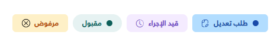

import Tabs from '@theme/Tabs';
import TabItem from '@theme/TabItem';

<Tabs>
<TabItem value="guide" label="Guide" default>

# `_Badge` Partial View Usage Guide




The `_Badge.cshtml` partial view is a reusable UI component that displays a colored badge with optional text, a status dot, an icon, and customizable typography.

## Location
`Views/Shared/UI/_Badge.cshtml`

## Properties

You pass properties to the Badge using a C# anonymous object.

| Property     | Type     | Required | Default Value | Description |
| :---         | :---     | :---     | :---          | :---        |
| `label`      | `string` | **Yes**  | `""`          | The text content displayed inside the badge. |
| `labelColor` | `string` | **Yes**  | `""`          | The text/foreground color (e.g., `"#0d5f59"`, `"red"`). |
| `bgColor`    | `string` | **Yes**  | `""`          | The background color of the badge (e.g., `"#e6f2f2"`). |
| `dot`        | `bool`   | No       | `true`        | If `true`, a small colored circular dot is prepended to the text. The dot inherits `labelColor`. |
| `radius`     | `int`    | No       | `4`           | Controls the border-radius applied to the badge container (e.g. `2`, `4`). Maps to Bootstrap's `rounded-*` classes. |
| `icon`       | `string` | No       | `null`        | Raw HTML string for an icon appended to the end of the badge. Can be an SVG, `<i>`, or `` tag. |
| `style`      | `object` | No       | `null`        | An anonymous object to override default typography. See the inner `style` properties below. |

### `style` Object Properties
Use this parameter to override typography when the default doesn't quite fit your needs.
It supports standard CSS values (like `14px`, `bold`, etc.).

| Property | Type     | Required | Default Value    | Description |
| :------- | :------- | :------- | :--------------- | :---------- |
| `fs`     | `string` | No       | `"12px"`         | Specifies `font-size`. E.g., `"14px"`, `"0.8rem"`. |
| `fw`     | `string` | No       | `null` (Inherit) | Specifies `font-weight`. E.g., `"600"`, `"bold"`. |


## Usage Examples

### 1. Basic Usage
Default styling with a dot indicator.

```csharp
@await Html.PartialAsync("UI/_Badge", new {
    labelColor = "#0d5f59",
    bgColor = "#e6f2f2",
    label = "مقبول"
})
```

### 2. Badge with an Icon and Custom Typography (`style`)
Using an SVG icon and overriding the default font size and weight. Disabled the dot indicator and reduced the border radius.

```csharp
@await Html.PartialAsync("UI/_Badge", new {
    labelColor = "#1849A9",
    bgColor = "#B2DDFF",
    label = "طلب تعديل",
    dot = false,
    radius = 2,
    style = new { fs = "14px", fw = "600" },
    icon = @"<svg xmlns='http://www.w3.org/2000/svg' width='12' height='13' fill='none' viewBox='0 0 12 13'>...</svg>"
})
```

### 3. Badge with a Bootstrap Icon
Using an `<i>` tag for the icon.

```csharp
@await Html.PartialAsync("UI/_Badge", new {
    labelColor = "#6941C6",
    bgColor = "#F4EBFF",
    label = "قيد الإجراء",
    dot = false,
    radius = 2,
    icon = @"<i class='bi bi-clock-history' style='font-size:13px;'></i>"
})
```


</TabItem>
<TabItem value="_Badge.cshtml" label="_Badge.cshtml">

```cshtml
@using Microsoft.AspNetCore.Routing
@model dynamic
@{
    string Color = "";
    string BgColor = "";
    string Content = "";
    bool Dot = true;
    int Radius = 4;
    string? Icon = null;
    string? Fs = "12px";
    string? Fw = null;

    if (Model != null)
    {
        var props = new RouteValueDictionary(Model);

        if (props.TryGetValue("labelColor", out var cProp)) Color = cProp?.ToString() ?? "";
        if (props.TryGetValue("bgColor", out var bProp)) BgColor = bProp?.ToString() ?? "";
        if (props.TryGetValue("label", out var tProp)) Content = tProp?.ToString() ?? "";
        if (props.TryGetValue("dot", out var dProp) && dProp != null)
        {
            if (bool.TryParse(dProp.ToString(), out bool dVal)) Dot = dVal;
        }
        if (props.TryGetValue("radius", out var rProp) && rProp != null)
        {
            if (int.TryParse(rProp.ToString(), out int rVal)) Radius = rVal;
        }
        if (props.TryGetValue("icon", out var icProp)) Icon = icProp?.ToString();

        if (props.TryGetValue("style", out var styleProp) && styleProp != null)
        {
            var styleDict = new RouteValueDictionary(styleProp);
            if (styleDict.TryGetValue("fs", out var fsProp) && fsProp != null)
                Fs = fsProp.ToString();
            if (styleDict.TryGetValue("fw", out var fwProp) && fwProp != null)
                Fw = fwProp.ToString();
        }
    }

    var fontWeight = !string.IsNullOrEmpty(Fw) ? $"font-weight: {Fw};" : "";
    var fontSize = !string.IsNullOrEmpty(Fs) ? $"font-size: {Fs};" : "font-size: 12px;";
}

<span class="badge d-flex align-items-center gap-2 px-3 py-2 rounded-@Radius"
      style="background-color: @BgColor; color: @Color; @fontSize @fontWeight width: fit-content;">
    @if (Dot)
    {
        <span style="width: 10px; height: 10px; background-color: @Color; border-radius: 50%;"></span>
    }
    @Content
    @if (!string.IsNullOrEmpty(Icon))
    {
        @Html.Raw(Icon)
    }
</span>
```

</TabItem>
</Tabs>
