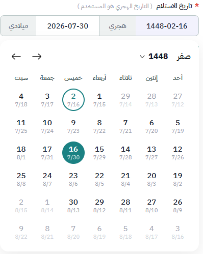

import Tabs from '@theme/Tabs';
import TabItem from '@theme/TabItem';

<Tabs>
<TabItem value="guide" label="Guide" default>

# \_DualDate Partial View Documentation

Dual-segment date picker. Displays Hijri and Gregorian dates side by side. Supports optional date range limits.

## UI Preview

| State            | Preview                  |
| ---------------- | ------------------------ |
| Default          |    |
| Calendar Popover |  |

---

## Usage

### Option 1: Tuple Model (Classic)

```cshtml
<partial name="UI/_DualDate" model='("Label Text", isRequired, "uniqueId")' />
```

### Option 2: Anonymous Object Model (Recommended)

```cshtml
<partial name="UI/_DualDate" model='new {
    id          = "editor1",
    label       = "وصف الحالة",
    required    = true,
    placeholder = "",
    minDate     = "today",
    maxDate     = "+2m"
}' />
```

---

## Parameters

### Tuple Model

| Index | Type     | Required | Description                                    |
| ----- | -------- | -------- | ---------------------------------------------- |
| `[0]` | `string` | Yes      | Label text                                     |
| `[1]` | `bool`   | Yes      | Required validator toggle                      |
| `[2]` | `string` | Yes      | Unique ID (used as Hijri input name and ID)    |
| `[3]` | `string` | No       | Placeholder text (defaults to `"يوم/شهر/سنة"`) |

### Anonymous Object Model

| Property      | Type     | Required | Description                                    |
| ------------- | -------- | -------- | ---------------------------------------------- |
| `id`          | `string` | Yes      | Unique ID for the component                    |
| `label`       | `string` | Yes      | Label text displayed above the picker          |
| `required`    | `bool`   | No       | Enables required validation (default: `false`) |
| `placeholder` | `string` | No       | Placeholder text (default: `"يوم/شهر/سنة"`)   |
| `minDate`     | `string` | No       | Earliest selectable date (see formats below)   |
| `maxDate`     | `string` | No       | Latest selectable date (see formats below)     |

> **Note:** `id` must be unique per page.

---

## Date Limit Formats (`minDate` / `maxDate`)

Both accept the same formats. Auto-detected — no flag needed.

| Format         | Example          | Description                                      |
| -------------- | ---------------- | ------------------------------------------------ |
| `"today"`      | `"today"`        | Current date (Hijri)                             |
| `"+Nm"`        | `"+1m"`, `"+2m"` | N months **after** today (Hijri calendar)        |
| `"-Nm"`        | `"-1m"`, `"-3m"` | N months **before** today (Hijri calendar)       |
| Hijri date     | `"1448-02-01"`   | Fixed Hijri date (`yyyy-MM-dd`, year ≤ 1600)     |
| Gregorian date | `"2026-07-01"`   | Fixed Gregorian date (`yyyy-MM-dd`, year ≥ 1800) |

### Examples

```cshtml
{{-- Last month to next 2 months --}}
minDate="-1m"  maxDate="+2m"

{{-- From today forward only --}}
minDate="today"

{{-- Fixed Hijri range --}}
minDate="1448-01-01"  maxDate="1448-06-30"

{{-- Fixed Gregorian range --}}
minDate="2026-01-01"  maxDate="2026-12-31"

{{-- Mix: Gregorian min, relative max --}}
minDate="2026-06-01"  maxDate="+1m"
```

### Edge Cases

| Scenario               | Behavior                                              |
| ---------------------- | ----------------------------------------------------- |
| `minDate` > `maxDate`  | Both limits ignored; console warning emitted          |
| Invalid format         | Limit ignored (treated as no limit)                   |
| `null` / empty         | No restriction on that side                           |
| Month-end day clamp    | If today = day 30 and target month has 29 days → 29  |

---

## Validation

- Calendar UI: disabled cells are greyed out and unclickable
- Form submit: hooks automatically; shows red border + error message
- Error messages:
  - Required + empty → `"&#123;Label&#125; مطلوب"`
  - Out of range → `"&#123;Label&#125; خارج النطاق المسموح"`

### Manual validate

```js
var isValid = window.validateDDate["myDateId"]();
```

---

## Form Submission Values

Two hidden inputs submitted with the form:

| Name        | Format       | Description         |
| ----------- | ------------ | ------------------- |
| `&#123;id&#125;`      | `yyyy/mm/dd` | Selected Hijri date |
| `&#123;id&#125;-greg` | `yyyy/mm/dd` | Auto Gregorian date |

---

## JavaScript API

### `getDualDate(id)`

```js
var dates = getDualDate("receiptDate");
// { hijri: "1447/06/22", gregorian: "2025/12/12" }  or  null
```

### `window.__ddDates[id]`

Same object, direct access:

```js
window.__ddDates["receiptDate"]; // { hijri, gregorian } or null
```

---

## Style Override

```css
/* Selected day color */
.double-date-wrapper .day-cell.selected {
  background-color: #YOUR_COLOR !important;
  border-color: #YOUR_COLOR;
}
/* Today indicator */
.double-date-wrapper .day-cell.today {
  border-color: #YOUR_COLOR;
}
/* Disabled day (out of range) */
.double-date-wrapper .day-cell.disabled {
  opacity: 0.35;
}
```

---

## Dependencies

Load before the partial:

- jQuery
- `jquery.calendars.js`
- `jquery.calendars.ummalqura.js`


</TabItem>
<TabItem value="_DualDate.cshtml" label="_DualDate.cshtml">

```cshtml
@using System.Runtime.CompilerServices
@model dynamic
@{
    string Label = "";
    bool Required = false;
    string HijriId = "";
    string Placeholder = "يوم/شهر/سنة";
    string MinDate = "";
    string MaxDate = "";

    if (Model is ITuple tuple)
    {
        Label = tuple[0]?.ToString() ?? "";
        Required = tuple.Length > 1 && (bool)tuple[1];
        HijriId = tuple.Length > 2 ? tuple[2]?.ToString() ?? "" : "";
        if (tuple.Length > 3 && tuple[3] != null)
        {
            Placeholder = tuple[3].ToString();
        }
        if (tuple.Length > 4) MinDate = tuple[4]?.ToString() ?? "";
        if (tuple.Length > 5) MaxDate = tuple[5]?.ToString() ?? "";
    }
    else if (Model != null)
    {
        var type = Model.GetType();
        var flags = System.Reflection.BindingFlags.IgnoreCase | System.Reflection.BindingFlags.Public | System.Reflection.BindingFlags.Instance;
        var labelProp   = type.GetProperty("label",       flags);
        var reqProp     = type.GetProperty("required",    flags);
        var idProp      = type.GetProperty("id",          flags) ?? type.GetProperty("hijriid", flags);
        var phProp      = type.GetProperty("placeholder", flags);
        var minDateProp = type.GetProperty("minDate",     flags) ?? type.GetProperty("mindate", flags);
        var maxDateProp = type.GetProperty("maxDate",     flags) ?? type.GetProperty("maxdate", flags);

        if (labelProp   != null) Label       = labelProp.GetValue(Model)?.ToString()   ?? "";
        if (reqProp     != null) Required    = reqProp.GetValue(Model) is bool b && b;
        if (idProp      != null) HijriId     = idProp.GetValue(Model)?.ToString()      ?? "";
        if (phProp      != null) Placeholder = phProp.GetValue(Model)?.ToString()      ?? "يوم/شهر/سنة";
        if (minDateProp != null) MinDate     = minDateProp.GetValue(Model)?.ToString() ?? "";
        if (maxDateProp != null) MaxDate     = maxDateProp.GetValue(Model)?.ToString() ?? "";
    }

    var GregorianId = HijriId + "-greg";
}

<div class="double-date-wrapper" id="double-date-wrapper-@HijriId" dir="rtl">

    <!-- Date Section Label -->
    <div class="mb-2">
        <label class="date-label">
            @if (Required)
            {
            <span class="required-star">*</span>
            }
            @Label <span class="label-hint">( التاريخ الهجري هو المستخدم )</span>
        </label>
    </div>

    <!-- Segmented Input -->
    <div class="double-date-container" dir="rtl">
        <!-- Hijri Section (clickable — opens calendar) -->
        <div class="segment segment-hijri" id="segment-hijri-@HijriId" data-mode="hijri">
            <input type="text" id="@HijriId" name="@HijriId" class="segment-input" placeholder="@Placeholder"
                readonly="readonly" @(Required ? "required" : "" )>
            <div class="segment-badge badge-hijri">هجري</div>
        </div>
        <!-- Gregorian Section (read-only display — auto-populated) -->
        <div class="segment segment-readonly" id="segment-gregorian-@HijriId">
            <input type="text" id="@GregorianId" name="@GregorianId" class="segment-input" placeholder="@Placeholder"
                readonly="readonly" tabindex="-1">
            <div class="segment-badge badge-miladi">ميلادي</div>
        </div>
    </div>

    @if (Required || !string.IsNullOrEmpty(MinDate) || !string.IsNullOrEmpty(MaxDate))
    {
    <div class="date-error" id="@HijriId-error" style="display:none;">@Label مطلوب</div>
    }

    <!-- Calendar Popover -->
    <div class="calendar-card" id="calendar-card-@HijriId">
        <div class="calendar-header">
            <div class="month-year-display">
                <span class="month-name-display"></span>
                <div class="year-trigger">
                    <span class="year-display"></span>
                    <svg xmlns="http://www.w3.org/2000/svg" width="16" height="16" fill="none" viewBox="0 0 16 16">
                        <path fill="currentColor"
                            d="M4.402 5.704c.082.107.324.428.469.613.29.371.685.864 1.111 1.355.429.494.88.975 1.28 1.328q.302.268.522.4c.136.082.217.1.217.1s.078-.018.215-.1q.22-.132.523-.4c.4-.353.85-.834 1.279-1.328a34 34 0 0 0 1.579-1.968.5.5 0 0 1 .806.593l-.002.001a35 35 0 0 1-1.629 2.03c-.439.506-.923 1.025-1.371 1.422a5 5 0 0 1-.668.506c-.204.123-.462.244-.733.244s-.529-.12-.733-.244A5 5 0 0 1 6.6 9.75c-.449-.397-.932-.916-1.372-1.422A35 35 0 0 1 3.6 6.298l-.001-.001a.5.5 0 0 1 .804-.593" />
                    </svg>

                    <div class="years-dropdown-menu"></div>
                </div>
            </div>
            <div class="flex">
                <button type="button" class="nav-btn next-btn">
                    <svg xmlns="http://www.w3.org/2000/svg" width="24" height="24" fill="none" viewBox="0 0 24 24">
                        <path fill="#161616"
                            d="M20.75 12c0-.373-.166-.72-.323-.98a6 6 0 0 0-.646-.853C19.28 9.6 18.626 8.99 17.99 8.44a44 44 0 0 0-2.487-2l-.043-.032-.012-.009-.004-.003a.75.75 0 0 0-.89 1.208l.013.01.04.029a32 32 0 0 1 .712.544c.462.361 1.076.854 1.688 1.385.616.535 1.212 1.094 1.649 1.588l.08.092H4a.75.75 0 1 0 0 1.5h14.734l-.077.09c-.437.493-1.033 1.052-1.649 1.587a43 43 0 0 1-2.4 1.93l-.04.029-.013.01a.75.75 0 1 0 .89 1.207l.004-.003.012-.009.043-.032.163-.122a46 46 0 0 0 2.325-1.878c.634-.55 1.288-1.16 1.789-1.727a6 6 0 0 0 .646-.853c.156-.259.321-.603.323-.974" />
                    </svg>
                </button>
                <button type="button" class="nav-btn prev-btn">
                    <svg xmlns="http://www.w3.org/2000/svg" width="24" height="24" fill="none" viewBox="0 0 24 24">
                        <path fill="#161616"
                            d="M3.25 12c0 .374.166.72.323.98.169.282.396.572.646.854.501.567 1.155 1.176 1.79 1.727a44 44 0 0 0 2.487 2l.043.032.012.009.004.003a.75.75 0 0 0 .89-1.208l-.013-.01-.04-.029-.155-.116a44 44 0 0 1-2.245-1.813c-.616-.535-1.212-1.094-1.649-1.588l-.08-.092H20a.75.75 0 0 0 0-1.5H5.266l.077-.09c.437-.493 1.033-1.052 1.649-1.587a43 43 0 0 1 2.4-1.93l.04-.029.013-.01a.75.75 0 1 0-.89-1.207L8.55 6.4l-.012.009-.043.032a33 33 0 0 0-.739.565c-.475.37-1.11.88-1.749 1.435-.634.55-1.288 1.16-1.789 1.727a6 6 0 0 0-.646.853c-.156.259-.321.603-.323.974" />
                    </svg>
                </button>
            </div>
        </div>

        <div class="weekdays">
            <div>أحد</div>
            <div>إثنين</div>
            <div>ثلاثاء</div>
            <div>أربعاء</div>
            <div>خميس</div>
            <div>جمعة</div>
            <div>سبت</div>
        </div>

        <div class="days-grid"></div>
    </div>
</div>

@if (Context.Items["_DualDate_Fonts"] == null)
{
Context.Items["_DualDate_Fonts"] = true;
<link rel="preconnect" href="https://fonts.googleapis.com">
<link rel="preconnect" href="https://fonts.gstatic.com" crossorigin>
<link href="https://fonts.googleapis.com/css2?family=IBM+Plex+Sans+Arabic:wght@300;400;500;600;700&display=swap"
    rel="stylesheet">
}

@if (Context.Items["_DualDate_CSS"] == null)
{
Context.Items["_DualDate_CSS"] = true;
<style>
    /* Wrapper */
    .double-date-wrapper {
        --dd-font-family: 'IBM Plex Sans Arabic', 'Cairo', 'Segoe UI', sans-serif;
        font-family: var(--dd-font-family);
        font-synthesis: none;
        -webkit-font-smoothing: antialiased;
        direction: rtl;
        position: relative;
        max-width: 390px;
        width: 100%;
        margin-bottom: 16px;
    }

    .double-date-wrapper input,
    .double-date-wrapper button {
        font-family: inherit;
    }

    /* Label */
    .double-date-wrapper .date-label {
        font-size: 0.85rem;
        font-weight: 600;
        color: #1F2937;
        margin-bottom: 0;
        display: inline-block;
    }

    .double-date-wrapper .required-star {
        color: #E53935;
        margin-left: 2px;
        font-weight: bold;
    }

    .double-date-wrapper .label-hint {
        font-size: 0.78rem;
        color: #9CA3AF;
        font-weight: normal;
        margin-right: 4px;
    }

    /* Segmented Input Container */
    .double-date-wrapper .double-date-container {
        display: flex;
        align-items: stretch;
        background-color: #FFFFFF;
        border: 1px solid #BAC7C7;
        border-radius: 8px;
        overflow: hidden;
        height: 41px;
    }

    /* Segment */
    .double-date-wrapper .segment {
        flex: 1;
        display: flex;
        align-items: center;
        height: 100%;
        min-width: 0;
        cursor: pointer;
    }

    /* Gregorian side is display-only */
    .double-date-wrapper .segment-readonly {
        cursor: default;
    }

    /* Divider between hijri and gregorian sections */
    .double-date-wrapper .segment-hijri {
        border-left: 1px solid #BAC7C7;
    }

    /* Segment Input */
    .double-date-wrapper .segment-input {
        flex: 1;
        border: none;
        background: transparent;
        text-align: center;
        font-size: 0.9rem;
        height: 100%;
        color: #1F2937;
        outline: none;
        cursor: pointer;
        padding: 0 8px;
        font-weight: 500;
        box-shadow: none;
        min-width: 0;
    }

    .double-date-wrapper .segment-readonly .segment-input {
        cursor: default;
        opacity: 0.5;
    }

    .double-date-wrapper .segment-input::placeholder {
        color: #6C737F;
        opacity: 1;
    }

    /* Segment Badge */
    .double-date-wrapper .segment-badge {
        font-weight: 600;
        font-size: 14px;
        height: 100%;
        min-width: 70px;
        display: flex;
        align-items: center;
        justify-content: center;
        white-space: nowrap;
        padding: 0 12px;
        user-select: none;
        flex-shrink: 0;
        background-color: #EEF1F1;
        color: #6C737F;
    }

    /* Calendar Card */
    .double-date-wrapper .calendar-card {
        position: absolute;
        top: 100%;
        right: 0;
        width: 100%;
        background: #FFFFFF;
        border-radius: 16px;
        box-shadow: 0 10px 30px rgba(0, 0, 0, 0.08);
        padding: 16px;
        margin-top: 4px;
        z-index: 1050;
        display: none;
        animation: ddFadeIn 0.2s ease-out;
    }

    @@keyframes ddFadeIn {
        from {
            opacity: 0;
            transform: translateY(-8px);
        }

        to {
            opacity: 1;
            transform: translateY(0);
        }
    }

    /* Calendar Header */
    .double-date-wrapper .calendar-header {
        display: flex;
        justify-content: space-between;
        align-items: center;
        margin-bottom: 16px;
        direction: rtl;
    }

    .double-date-wrapper .month-year-display {
        display: flex;
        align-items: center;
        gap: 12px;
        font-size: 0.95rem;
        font-weight: 500;
        color: #161616;
        user-select: none;
    }

    .double-date-wrapper .month-name-display {
        color: #161616;
        font-weight: 500;
    }

    .double-date-wrapper .year-trigger {
        display: flex;
        align-items: center;
        gap: 4px;
        position: relative;
        cursor: pointer;
        padding: 2px 6px;
        border-radius: 6px;
        transition: background-color 0.15s ease;
    }

    .double-date-wrapper .year-trigger:hover {
        background-color: #F3F4F6;
    }

    .double-date-wrapper .year-display {
        font-weight: 700;
        color: #111827;
    }

    /* Years Dropdown */
    .double-date-wrapper .years-dropdown-menu {
        position: absolute;
        top: 100%;
        right: 0;
        width: 120px;
        max-height: 300px;
        overflow-y: auto;
        background: #FFFFFF;
        border-radius: 8px;
        box-shadow: 0 4px 12px rgba(0, 0, 0, 0.15);
        border: 1px solid #E5E7EB;
        z-index: 1100;
        display: none;
        margin-top: 4px;
        scrollbar-width: thin;
        scrollbar-color: #BAC7C7 #F3F4F6;
    }

    .double-date-wrapper .years-dropdown-menu::-webkit-scrollbar {
        width: 6px;
    }

    .double-date-wrapper .years-dropdown-menu::-webkit-scrollbar-track {
        background: #F3F4F6;
    }

    .double-date-wrapper .years-dropdown-menu::-webkit-scrollbar-thumb {
        background-color: #BAC7C7;
        border-radius: 3px;
    }

    .double-date-wrapper .year-option {
        padding: 8px 16px;
        font-size: 0.9rem;
        color: #1F2937;
        cursor: pointer;
        text-align: center;
        transition: background-color 0.15s ease;
    }

    .double-date-wrapper .year-option:hover {
        background-color: #F3F4F6;
    }

    .double-date-wrapper .year-option.selected {
        background-color: #0F8B8D;
        color: #FFFFFF;
        font-weight: 600;
    }

    .double-date-wrapper .dropdown-chevron {
        color: #6B7280;
        width: 16px;
        height: 16px;
    }

    /* Validation error */
    .double-date-wrapper .date-error {
        color: #E53935;
        font-size: 0.8rem;
        margin-top: 4px;
    }

    /* Nav Buttons */
    .double-date-wrapper .nav-btn {
        border: none;
        background: transparent;
        padding: 0;
        display: flex;
        align-items: center;
        justify-content: center;
        cursor: pointer;
        transition: background-color 0.2s ease;
        width: 32px;
        height: 32px;
        border-radius: 50%;
    }

    .double-date-wrapper .nav-btn:hover {
        background-color: #F3F4F6;
    }

    /* Weekdays & Grid */
    .double-date-wrapper .weekdays {
        display: grid;
        grid-template-columns: repeat(7, 1fr);
        text-align: center;
        margin-bottom: 6px;
        font-size: 0.91rem;
        font-weight: 500;
        color: #385050;
    }

    .double-date-wrapper .days-grid {
        display: grid;
        grid-template-columns: repeat(7, 1fr);
        row-gap: 4px;
    }

    /* Day Cell */
    .double-date-wrapper .day-cell {
        aspect-ratio: 1;
        display: flex;
        flex-direction: column;
        align-items: center;
        justify-content: center;
        cursor: pointer;
        border-radius: 50%;
        width: 44px;
        height: 44px;
        margin: 0 auto;
        transition: all 0.15s ease;
        background-color: #FFFFFF;
        position: relative;
        box-sizing: border-box;
    }

    .double-date-wrapper .day-cell .primary-num {
        font-size: 0.8rem;
        color: #111827;
        line-height: 1.1;
    }

    .double-date-wrapper .day-cell .secondary-num {
        font-size: 0.7rem;
        color: #6C737F;
        margin-top: 2px;
        line-height: 1;
    }

    .double-date-wrapper .day-cell.inactive {
        cursor: pointer;
    }

    .double-date-wrapper .day-cell.inactive .primary-num,
    .double-date-wrapper .day-cell.inactive .secondary-num {
        color: #6C7F7F;
        font-weight: 400;
    }

    .double-date-wrapper .day-cell:not(.selected):not(.today):not(.inactive):hover {
        background-color: #F3F4F6;
    }

    .double-date-wrapper .day-cell.today {
        border: 2px solid #1B8183;
        background: transparent;
    }

    .double-date-wrapper .day-cell.today .primary-num,
    .double-date-wrapper .day-cell.today .secondary-num {
        color: #1B8183;
        font-weight: 700;
    }

    .double-date-wrapper .day-cell.selected {
        background-color: #1B8183 !important;
        border: 2px solid #1B8183;
    }

    .double-date-wrapper .day-cell.selected .primary-num {
        color: #FFFFFF !important;
        font-weight: 400;
    }

    .double-date-wrapper .day-cell.selected .secondary-num {
        color: #FFFFFF !important;
        opacity: 0.7;
    }

    /* Disabled day (outside minDate/maxDate range) */
    .double-date-wrapper .day-cell.disabled {
        cursor: not-allowed;
        opacity: 0.35;
        pointer-events: none;
    }

    .double-date-wrapper .day-cell.disabled .primary-num,
    .double-date-wrapper .day-cell.disabled .secondary-num {
        color: #9CA3AF;
    }
</style>
}

<script>
    (function () {
        var wrapperId = "double-date-wrapper-@HijriId";
        var hijriInputId = "@HijriId";
        var gregorianInputId = "@GregorianId";

        var hijriCal = null;
        var gregCal = null;

        var selectedHijriDate = null;
        var selectedGregorianDate = null;
        var viewHijriDate = null;

        // minDate / maxDate limits (hijri calendar objects, or null if not set)
        var limitMin = null;
        var limitMax = null;

        var DATE_FORMAT = 'yyyy/mm/dd';
        var hijriMonthNames = ['محرم', 'صفر', 'ربيع الأول', 'ربيع الآخر', 'جمادى الأولى', 'جمادى الآخرة', 'رجب', 'شعبان', 'رمضان', 'شوال', 'ذو القعدة', 'ذو الحجة'];

        // ── Date Limit Helpers ────────────────────────────────────────────────

        /**
         * Resolve a limit string ("today" | hijri yyyy-MM-dd | gregorian yyyy-MM-dd)
         * into a hijri calendar date object. Returns null on failure/empty.
         */
        function resolveDateLimit(raw) {
            if (!raw || typeof raw !== 'string') return null;
            var s = raw.trim();
            if (!s) return null;

            // "today" keyword
            if (s.toLowerCase() === 'today') {
                return hijriCal.today();
            }

            // Relative month offset: +Nm or -Nm  (e.g. "+1m", "+2m", "-3m")
            var relMatch = s.match(/^([+\-])(\d+)m$/i);
            if (relMatch) {
                var sign   = relMatch[1] === '-' ? -1 : 1;
                var months = parseInt(relMatch[2], 10) * sign;
                var t      = hijriCal.today();
                var ty = t.year(), tm = t.month(), td = t.day();
                // walk months one at a time, clamping day each step
                var step = months > 0 ? 1 : -1;
                for (var i = 0; i < Math.abs(months); i++) {
                    var nm = wrapMonth(ty, tm, step);
                    ty = nm.y; tm = nm.m;
                    // clamp day to new month length
                    var dim = hijriCal.daysInMonth(ty, tm);
                    if (td > dim) td = dim;
                }
                try { return hijriCal.newDate(ty, tm, td); }
                catch (e) { console.warn('[DualDate] Relative offset failed:', e); return null; }
            }

            // Must match yyyy-MM-dd or yyyy/MM/dd
            var parts = s.split(/[\-\/]/);
            if (parts.length !== 3) return null;

            var y = parseInt(parts[0], 10);
            var m = parseInt(parts[1], 10);
            var d = parseInt(parts[2], 10);
            if (isNaN(y) || isNaN(m) || isNaN(d)) return null;

            // Heuristic: Hijri year <= 1600, Gregorian year >= 1800
            // Overlap zone (1601-1799) is extremely rare in practice
            var isHijri = y <= 1600;

            try {
                if (isHijri) {
                    return hijriCal.newDate(y, m, d);
                } else {
                    // Parse as Gregorian then convert
                    var jsDate = new Date(y, m - 1, d);
                    return hijriCal.fromJSDate(jsDate);
                }
            } catch (e) {
                console.warn('[DualDate] Invalid date limit "' + raw + '":', e);
                return null;
            }
        }

        /**
         * Compare two hijri calendar date objects by absolute day.
         * Returns negative if a < b, 0 if equal, positive if a > b.
         */
        function compareDates(a, b) {
            if (!a || !b) return 0;
            var ay = a.year(), am = a.month(), ad = a.day();
            var by = b.year(), bm = b.month(), bd = b.day();
            if (ay !== by) return ay - by;
            if (am !== bm) return am - bm;
            return ad - bd;
        }

        /**
         * Returns true if the given hijri date is outside [limitMin, limitMax].
         * Ignores null limits.
         */
        function isDateDisabled(hijriDate) {
            if (limitMin && compareDates(hijriDate, limitMin) < 0) return true;
            if (limitMax && compareDates(hijriDate, limitMax) > 0) return true;
            return false;
        }

        // ── Helpers ──────────────────────────────────────────────────────────

        function wrapMonth(year, month, delta) {
            var m = month + delta, y = year;
            if (m < 1) { m = 12; y--; }
            if (m > 12) { m = 1; y++; }
            return { y: y, m: m };
        }

        function parseIso(cal, isoStr) {
            var p = isoStr.split(/[/-]/);
            return cal.newDate(parseInt(p[0], 10), parseInt(p[1], 10), parseInt(p[2], 10));
        }

        function validateInput() {
            var isRequired = @(Required ? "true" : "false");
            var val = $("#" + hijriInputId).val();
            var $container = $("#" + wrapperId).find(".double-date-container");
            var $error = $("#" + hijriInputId + "-error");

            // Required check
            if (isRequired && !val) {
                $error.show();
                $container.css("border-color", "#E53935");
                return false;
            }

            // Range check (applies whether required or not)
            if (val && (limitMin || limitMax)) {
                try {
                    var parsed = parseIso(hijriCal, val);
                    if (isDateDisabled(parsed)) {
                        $error.text('@Label خارج النطاق المسموح').show();
                        $container.css("border-color", "#E53935");
                        return false;
                    }
                } catch (e) { /* malformed — treat as invalid */ }
            }

            $error.hide();
            $container.css("border-color", "");
            return !isRequired || !!val;
        }

        // ── Public API ────────────────────────────────────────────────────────
        window.__ddDates = window.__ddDates || {};
        window.__ddDates["@HijriId"] = null;

        if (!window.getDualDate) {
            window.getDualDate = function (id) { return window.__ddDates[id] || null; };
        }

        window.validateDDate = window.validateDDate || {};
        window.validateDDate["@HijriId"] = validateInput;

        // ── Init ─────────────────────────────────────────────────────────────

        function initCalendars() {
            try {
                hijriCal = $.calendars.instance("ummalqura");
                gregCal = $.calendars.instance();
            } catch (e) { console.error("Failed to initialize calendars:", e); }
        }

        function initLimits() {
            var rawMin = "@Html.Raw(MinDate)";
            var rawMax = "@Html.Raw(MaxDate)";
            limitMin = resolveDateLimit(rawMin);
            limitMax = resolveDateLimit(rawMax);

            console.log('[DualDate @HijriId] rawMin=', rawMin, '→', limitMin ? limitMin.formatDate('yyyy/mm/dd') : null);
            console.log('[DualDate @HijriId] rawMax=', rawMax, '→', limitMax ? limitMax.formatDate('yyyy/mm/dd') : null);

            // Guard: if min > max, disable both silently and warn
            if (limitMin && limitMax && compareDates(limitMin, limitMax) > 0) {
                console.warn('[DualDate] minDate is after maxDate — limits ignored for "@HijriId"');
                limitMin = null;
                limitMax = null;
            }
        }

        function parseDateFromInput() {
            var hijriVal = $("#" + hijriInputId).val();
            if (hijriVal) {
                try {
                    selectedHijriDate = parseIso(hijriCal, hijriVal);
                    selectedGregorianDate = gregCal.fromJSDate(selectedHijriDate.toJSDate());
                    $("#" + gregorianInputId).val(selectedGregorianDate.formatDate(DATE_FORMAT));
                } catch (e) { console.error("Error parsing Hijri date:", e); }
            }

            var todayH = hijriCal.today();
            viewHijriDate = selectedHijriDate
                ? hijriCal.newDate(selectedHijriDate.year(), selectedHijriDate.month(), 1)
                : hijriCal.newDate(todayH.year(), todayH.month(), 1);
        }

        // ── Draw ─────────────────────────────────────────────────────────────

        function buildYearDropdown($wrapper, currentYear) {
            var $menu = $wrapper.find(".years-dropdown-menu").empty();
            for (var y = currentYear - 50; y <= currentYear + 10; y++) {
                (function (year) {
                    $("<div>")
                        .addClass("year-option")
                        .toggleClass("selected", year === currentYear)
                        .text(year)
                        .on("click", function (e) {
                            viewHijriDate = hijriCal.newDate(year, viewHijriDate.month(), 1);
                            drawCalendar();
                            $menu.fadeOut(100);
                            e.stopPropagation();
                        })
                        .appendTo($menu);
                })(y);
            }
            return $menu;
        }

        function drawCalendar() {
            var $wrapper = $("#" + wrapperId);
            var $grid = $wrapper.find(".days-grid").empty();
            var yr = viewHijriDate.year(), mo = viewHijriDate.month();

            // Header
            $wrapper.find(".month-name-display").text(hijriMonthNames[mo - 1]);
            $wrapper.find(".year-display").text(yr);

            // Grid geometry
            var today = hijriCal.today();
            var daysInMonth = hijriCal.daysInMonth(yr, mo);
            var startDow = hijriCal.newDate(yr, mo, 1).dayOfWeek();

            // Previous month trailing days
            var prev = wrapMonth(yr, mo, -1);
            var daysInPrevMonth = hijriCal.daysInMonth(prev.y, prev.m);
            for (var d = daysInPrevMonth - startDow + 1; d <= daysInPrevMonth; d++) {
                appendDayCell($grid, hijriCal.newDate(prev.y, prev.m, d), today, true);
            }

            // Current month
            for (var d = 1; d <= daysInMonth; d++) {
                appendDayCell($grid, hijriCal.newDate(yr, mo, d), today, false);
            }

            // Next month leading days (fill 6 rows = 42 cells)
            var next = wrapMonth(yr, mo, 1);
            var remainder = 42 - (startDow + daysInMonth);
            for (var d = 1; d <= remainder; d++) {
                appendDayCell($grid, hijriCal.newDate(next.y, next.m, d), today, true);
            }
        }

        function appendDayCell($grid, hijriDate, today, isInactive) {
            var primaryNum = hijriDate.day();
            var secondaryNum = "";

            try {
                var gDate = gregCal.fromJSDate(hijriDate.toJSDate());
                secondaryNum = gDate.month() + "/" + gDate.day();
            } catch (e) { secondaryNum = ""; }

            var isSelected = !!(!isInactive && selectedHijriDate
                && selectedHijriDate.year() === hijriDate.year()
                && selectedHijriDate.month() === hijriDate.month()
                && selectedHijriDate.day() === hijriDate.day());

            var isToday = !!(!isInactive
                && today.year() === hijriDate.year()
                && today.month() === hijriDate.month()
                && today.day() === hijriDate.day());

            var isDisabled = isDateDisabled(hijriDate);

            var $cell = $("<div>")
                .addClass("day-cell")
                .toggleClass("inactive",  isInactive)
                .toggleClass("selected",  isSelected)
                .toggleClass("today",     isToday && !isSelected)
                .toggleClass("disabled",  isDisabled);

            $cell.append($("<span>").addClass("primary-num").text(primaryNum));
            $cell.append($("<span>").addClass("secondary-num").text(secondaryNum));

            if (!isDisabled) {
                $cell.on("click", function () { selectDate(hijriDate); });
            }

            $grid.append($cell);
        }

        // ── Actions ───────────────────────────────────────────────────────────

        function selectDate(hijriDate) {
            // Guard: never select a disabled date (calendar click guard)
            if (isDateDisabled(hijriDate)) return;

            var hijriStr = hijriDate.formatDate(DATE_FORMAT);
            var gregStr = gregCal.fromJSDate(hijriDate.toJSDate()).formatDate(DATE_FORMAT);

            selectedHijriDate = hijriDate;
            selectedGregorianDate = gregCal.fromJSDate(hijriDate.toJSDate());
            viewHijriDate = hijriCal.newDate(hijriDate.year(), hijriDate.month(), 1);

            window.__ddDates["@HijriId"] = { hijri: hijriStr, gregorian: gregStr };

            $("#" + hijriInputId).val(hijriStr).trigger("change");
            $("#" + gregorianInputId).val(gregStr).trigger("change");
            $("#" + hijriInputId + "-error").hide();
            $("#" + wrapperId).find(".double-date-container").css("border-color", "");

            drawCalendar();
            $("#" + wrapperId).find(".calendar-card").fadeOut(150);
        }

        function changeMonth(delta) {
            var nm = wrapMonth(viewHijriDate.year(), viewHijriDate.month(), delta);
            viewHijriDate = hijriCal.newDate(nm.y, nm.m, 1);
            drawCalendar();
        }

        // ── Event Bindings ───────────────────────────────────────────────────

        $(document).ready(function () {
            initCalendars();
            initLimits();
            parseDateFromInput();

            var $wrapper = $("#" + wrapperId);

            // Only hijri segment opens calendar
            $wrapper.find("#segment-hijri-@HijriId").on("click", function (e) {
                // Close other calendar instances on page
                $(".calendar-card").not($wrapper.find(".calendar-card")).fadeOut(150);
                $(".years-dropdown-menu").not($wrapper.find(".years-dropdown-menu")).fadeOut(100);

                $wrapper.find(".calendar-card").fadeIn(150);
                e.stopPropagation();
            });

            // Calendar card — stop propagation; close year menu on outside click inside card
            $wrapper.find(".calendar-card").on("click", function (e) {
                if (!$(e.target).closest(".year-trigger").length) {
                    $wrapper.find(".years-dropdown-menu").fadeOut(100);
                }
                e.stopPropagation();
            });

            // Year dropdown toggle (only via year-trigger) — build lazily on open
            $wrapper.find(".year-trigger").on("click", function (e) {
                var $menu = $wrapper.find(".years-dropdown-menu");
                var isVisible = $menu.is(":visible");

                if (!isVisible) {
                    buildYearDropdown($wrapper, viewHijriDate.year());
                }

                $menu.fadeToggle(100, function () {
                    if ($menu.is(":visible")) {
                        var $selected = $menu.find(".year-option.selected");
                        if ($selected.length) {
                            var menuH = $menu.height();
                            $menu.scrollTop($selected[0].offsetTop - menuH / 2 + $selected.outerHeight() / 2);
                        }
                    }
                });
                e.stopPropagation();
            });

            $wrapper.find(".prev-btn").on("click", function (e) { changeMonth(-1); e.stopPropagation(); });
            $wrapper.find(".next-btn").on("click", function (e) { changeMonth(1); e.stopPropagation(); });

            // Close on outside click
            $(document).on("click.dd-@HijriId", function () {
                $wrapper.find(".calendar-card").fadeOut(150);
                $wrapper.find(".years-dropdown-menu").fadeOut(100);
            });

            // Close on Escape key
            $(document).on("keydown.dd-@HijriId", function (e) {
                if (e.key === "Escape") $wrapper.find(".years-dropdown-menu").fadeOut(100);
            });

            // Re-render inside modal
            $(document).on("shown.bs.modal", function (e) {
                if ($(e.target).find("#" + hijriInputId).length > 0) {
                    parseDateFromInput();
                    drawCalendar();
                }
            });

            // Form submit hook
            var $form = $wrapper.closest("form");
            if ($form.length) {
                $form.on("submit", function (e) {
                    if (!validateInput()) {
                        e.preventDefault();
                    }
                });
            }

            drawCalendar();
        });
    })();
</script>
```

</TabItem>
</Tabs>
