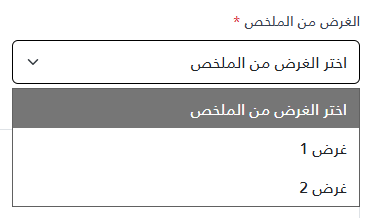

import Tabs from '@theme/Tabs';
import TabItem from '@theme/TabItem';
import Playground from '@site/src/components/Playground';

<Tabs>
<TabItem value="playground" label="Playground" default>

<Playground componentName="SelectInput" />

</TabItem>
<TabItem value="guide" label="Guide">

# _SelectInput



```html
@model (string Label, bool Required, string Id, string DefaultOptionText, List<(string Value, string Text)> Options)

	<div class="my-3">
		<label class="form-label text-gray-700" for="@Model.Id">
			@if (Model.Required)
			{
			<span class="text-danger">*</span>
			}
			@Model.Label
		</label>
		<select class="form-select" name="@Model.Id" id="@Model.Id" @(Model.Required ? "required" : "" )>
			<option value="">@Model.DefaultOptionText</option>
			@if (Model.Options != null)
			{
			foreach (var option in Model.Options)
			{
			<option value="@option.Value">@option.Text</option>
			}
			}
		</select>
	</div>
```

### How to use

```cshtml
var selectFieldOptions = new List<(string Value, string Text)>
{
	("1", "غرض 1"),
	("2", "غرض 2"),
	("3", "غرض 3"),
};

<partial name="_SelectInput" model='("عنصر مطلوب", true, "my-custom-id-1", "عنصر مطلوب", selectFieldOptions)' />
<partial name="_SelectInput" model='("عنصر غير مطلوب", false, "my-custom-id-2", "عنصر غير مطلوب", selectFieldOptions)' />

```

| Parameter | Type | Description | Default Value |
| --- | --- | --- | --- |
| Label | string | The label of the input field | "" |
| Required | bool | Whether the input field is required or not | false |
| Id | string | The ID of the input field | "" |
| DefaultOptionText | string | The default option text of the select field | "" |
| Options | List&lt;(string Value, string Text)> | The options of the select field | [] |


</TabItem>
<TabItem value="_SelectInput.cshtml" label="_SelectInput.cshtml">

```cshtml
@model (string Label, bool Required, string Id, string DefaultOptionText, List<(string Value, string Text)> Options)

	<div class="@(string.IsNullOrWhiteSpace(Model.Label) ? "mt-3" : "")">
		<label class="form-label text-gray-700" for="@Model.Id">
			@if (Model.Required)
			{
			<span class="text-danger">*</span>
			}
			@Model.Label
		</label>
		<select class="form-select" name="@Model.Id" id="@Model.Id" @(Model.Required ? "required" : "" )>
			<option value="">@Model.DefaultOptionText</option>
			@if (Model.Options != null)
			{
			foreach (var option in Model.Options)
			{
			<option value="@option.Value">@option.Text</option>
			}
			}
		</select>
	</div>
```

</TabItem>
</Tabs>
