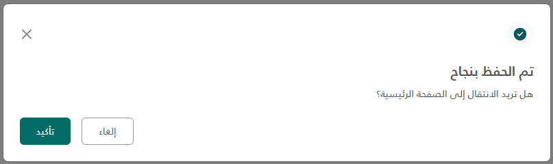
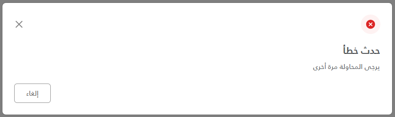

import Tabs from '@theme/Tabs';
import TabItem from '@theme/TabItem';

<Tabs>
<TabItem value="guide" label="Guide" default>

# Status Modal - Usage Guide





## How to Use

### 1. Include the Partial in Your View

Add this line anywhere in your view (typically at the bottom before closing tags):

```cshtml
@await Html.PartialAsync("_StatusModal")
```

Or using the shorter syntax:

```cshtml
<partial name="_StatusModal" />
```

### 2. Call the Modal from JavaScript

Use the `showStatusModal()` function with your desired options:

#### With Action Button

```javascript
showStatusModal({
  type: "success",
  title: "تم الحفظ بنجاح",
  titleColor: '#212529bf',
  message: "هل تريد الانتقال إلى الصفحة الرئيسية؟",
  messageStyle: {},
  showActionButton: true,
  actionButtonText: "تأكيد",
  onConfirm: function () {
    // Handle action logic
  },
  onCancel: function () {
    // Handle cancel action if needed
  },
});
```

## Available Options

| Option             | Type     | Default   | Description                                     |
| ------------------ | -------- | --------- | ----------------------------------------------- |
| `type`             | string   | 'success' | Modal type: 'success', 'info', 'error'|
| `title`            | string   | 'empty string'| Main title text [bold text]|
| `titleColor`       | string   | '#212529bf'| Title color|
| `message`          | string   | 'empty string'| Optional message below title|
| `messageStyle`     | object   | &#123;&#125;        | Optional message style|
| `showActionButton` | boolean  | false     | Show/hide the action button|
| `actionButtonText` | string   | 'تأكيد'   | Text for action button|
| `onConfirm`        | function | null      | Callback when confirm button is clicked|
| `onCancel`         | function | null      | Callback when [cancel, close] button is clicked|

## Complete Example in a View

```cshtml

<div class="container">
    <h1>My Page Content</h1>

    <button onclick="handleStatusModal()"
    class="btn btn-primary">Test Success</button>
</div>

@* Include the modal partial *@
<partial name="_GenericStatusModal" />

@section Scripts {

    <script>
        function handleStatusModal() {
            showStatusModal({
                type: "info",
                title: "تم الحفظ بنجاح",
                titleColor: '#212529bf',
                message: "هل تريد الانتقال إلى الصفحة الرئيسية؟",
                messageStyle: {},
                showActionButton: true,
                actionButtonText: "تأكيد",
                onConfirm: function () {
                    console.log('onConfirm triggered!');
                },
                onCancel: function () {
                    console.log('onCancel triggered!');
                },
            });
        }
    </script>

}
```

| Parameter | Type | Description | Default Value |
| --- | --- | --- | --- |
| type | string | The type of the modal | 'success' |
| title | string | The title of the modal | 'empty string' |
| message | string | The message of the modal | 'empty string' |
| showActionButton | boolean | Whether to show the action button or not | false |
| actionButtonText | string | The text of the action button | 'تأكيد' |
| onConfirm | function | The callback function when the confirm button is clicked | null |
| onCancel | function | The callback function when the cancel button is clicked | null |

## Screenshots


</TabItem>
<TabItem value="_StatusModal.cshtml" label="_StatusModal.cshtml">

```cshtml
<!-- Generic Status Modal -->
<div class="modal fade" id="statusModal" tabindex="-1" aria-labelledby="statusModalLabel" aria-hidden="true">
	<div class="modal-dialog modal-lg modal-dialog-centered">
		<div class="modal-content">
			<div class="modal-body p-4 bg-white rounded-4">
				<div class="d-flex justify-content-between align-items-center mb-4">
					<div class="d-flex align-items-center justify-content-center" id="iconContainer">
						<!-- Icon will be injected here dynamically -->
					</div>
					<button type="button" class="btn-close modalCancelBtn" data-bs-dismiss="modal" aria-label="Close"></button>
				</div>

				<!-- Dynamic Title -->
				<h5 class="fw-bold" style="color: #161616;" id="modalTitle"></h5>

				<!-- Dynamic Message (optional) -->
				<p class="mb-3" id="modalMessage" style="display: none;"></p>

				<!-- Action Buttons -->
				<div class="d-flex gap-3 mt-4" id="actionsContainer">
					<button type="button" class="btn btn-outline-secondary px-4 py-2 modalCancelBtn" data-bs-dismiss="modal">
						إلغاء
					</button>
					<button type="button" class="btn px-4 py-2 btn-primary" id="modalActionBtn"
						style="display: none; border: none">
						تأكيد
					</button>
				</div>
			</div>
		</div>
	</div>
</div>

<script>
	if (!window._statusModalInitialized) {
	window._statusModalInitialized = true;

	const icons = {
		success: `
			<svg width="40" height="40" viewBox="0 0 40 40" fill="none" xmlns="http://www.w3.org/2000/svg">
				<path d="M0 20C0 8.95431 8.95431 0 20 0C31.0457 0 40 8.95431 40 20C40 31.0457 31.0457 40 20 40C8.95431 40 0 31.0457 0 20Z" fill="#F9FAFB"/>
				<path fill-rule="evenodd" clip-rule="evenodd" d="M19.9987 29.1663C25.0613 29.1663 29.1654 25.0623 29.1654 19.9997C29.1654 14.9371 25.0613 10.833 19.9987 10.833C14.9361 10.833 10.832 14.9371 10.832 19.9997C10.832 25.0623 14.9361 29.1663 19.9987 29.1663Z" fill="white"/>
				<path fill-rule="evenodd" clip-rule="evenodd" d="M19.9987 29.1663C25.0613 29.1663 29.1654 25.0623 29.1654 19.9997C29.1654 14.9371 25.0613 10.833 19.9987 10.833C14.9361 10.833 10.832 14.9371 10.832 19.9997C10.832 25.0623 14.9361 29.1663 19.9987 29.1663ZM15.8739 19.2674C15.5484 19.5929 15.5484 20.1205 15.8739 20.446L18.2309 22.803C18.5563 23.1284 19.084 23.1284 19.4094 22.803L24.1235 18.0889C24.4489 17.7635 24.4489 17.2359 24.1235 16.9104C23.798 16.585 23.2704 16.585 22.9449 16.9104L18.8202 21.0352L17.0524 19.2674C16.727 18.942 16.1993 18.942 15.8739 19.2674Z" fill="#045859"/>
			</svg>
    `,
		error: `
			<svg width="40" height="40" viewBox="0 0 40 40" fill="none" xmlns="http://www.w3.org/2000/svg">
				<path d="M0 20C0 8.95431 8.95431 0 20 0C31.0457 0 40 8.95431 40 20C40 31.0457 31.0457 40 20 40C8.95431 40 0 31.0457 0 20Z" fill="#FEF2F2"/>
				<path fill-rule="evenodd" clip-rule="evenodd" d="M19.9987 29.1663C25.0613 29.1663 29.1654 25.0623 29.1654 19.9997C29.1654 14.9371 25.0613 10.833 19.9987 10.833C14.9361 10.833 10.832 14.9371 10.832 19.9997C10.832 25.0623 14.9361 29.1663 19.9987 29.1663Z" fill="white"/>
				<path fill-rule="evenodd" clip-rule="evenodd" d="M19.9987 29.1663C25.0613 29.1663 29.1654 25.0623 29.1654 19.9997C29.1654 14.9371 25.0613 10.833 19.9987 10.833C14.9361 10.833 10.832 14.9371 10.832 19.9997C10.832 25.0623 14.9361 29.1663 19.9987 29.1663ZM16.4654 16.4664C16.7908 16.141 17.3185 16.141 17.6439 16.4664L19.9987 18.8212L22.3535 16.4664C22.6789 16.141 23.2066 16.141 23.532 16.4664C23.8575 16.7919 23.8575 17.3195 23.532 17.645L21.1772 19.9997L23.532 22.3545C23.8575 22.68 23.8575 23.2076 23.532 23.5331C23.2066 23.8585 22.6789 23.8585 22.3535 23.5331L19.9987 21.1783L17.6439 23.5331C17.3185 23.8585 16.7908 23.8585 16.4654 23.5331C16.1399 23.2076 16.1399 22.68 16.4654 22.3545L18.8202 19.9997L16.4654 17.645C16.1399 17.3195 16.1399 16.7919 16.4654 16.4664Z" fill="#DC2626"/>
			</sv g>
    `,
		info: `
			<svg width="40" height="40" viewBox="0 0 40 40" fill="none" xmlns="http://www.w3.org/2000/svg">
				<path d="M0 20C0 8.95431 8.95431 0 20 0C31.0457 0 40 8.95431 40 20C40 31.0457 31.0457 40 20 40C8.95431 40 0 31.0457 0 20Z" fill="#F9FAFB"/>
				<path d="M19.1615 22.5003C19.1615 22.0401 19.5346 21.667 19.9948 21.667H20.0023C20.4625 21.667 20.8356 22.0401 20.8356 22.5003C20.8356 22.9606 20.4625 23.3337 20.0023 23.3337H19.9948C19.5346 23.3337 19.1615 22.9606 19.1615 22.5003Z" fill="#161616"/>
				<path d="M19.3763 20.0003C19.3763 20.3455 19.6561 20.6253 20.0013 20.6253C20.3465 20.6253 20.6263 20.3455 20.6263 20.0003V16.667C20.6263 16.3218 20.3465 16.042 20.0013 16.042C19.6561 16.042 19.3763 16.3218 19.3763 16.667V20.0003Z" fill="#161616"/>
				<path fill-rule="evenodd" clip-rule="evenodd" d="M11.043 20.0003C11.043 15.0528 15.0538 11.042 20.0013 11.042C24.9489 11.042 28.9596 15.0528 28.9596 20.0003C28.9596 24.9479 24.9489 28.9587 20.0013 28.9587C15.0538 28.9587 11.043 24.9479 11.043 20.0003ZM20.0013 12.292C15.7441 12.292 12.293 15.7431 12.293 20.0003C12.293 24.2575 15.7441 27.7087 20.0013 27.7087C24.2585 27.7087 27.7096 24.2575 27.7096 20.0003C27.7096 15.7431 24.2585 12.292 20.0013 12.292Z" fill="#161616"/>
			</svg>
    `,
		return: `
			<svg width="40" height="40" viewBox="0 0 40 40" fill="none" xmlns="http://www.w3.org/2000/svg">
				<path d="M0 20C0 8.95431 8.95431 0 20 0C31.0457 0 40 8.95431 40 20C40 31.0457 31.0457 40 20 40C8.95431 40 0 31.0457 0 20Z" fill="#F9FAFB"/>
				<path d="M21.457 15C21.457 14.6548 21.1772 14.375 20.832 14.375H17.082C14.6658 14.375 12.707 16.3338 12.707 18.75C12.707 21.1662 14.6658 23.125 17.082 23.125H25.4464C25.3091 23.2564 25.1594 23.3916 25.0056 23.5251C24.704 23.787 24.4006 24.0305 24.1715 24.2093C24.0572 24.2985 23.9622 24.3709 23.8961 24.4209C23.8631 24.4458 23.7972 24.4951 23.7799 24.508C23.502 24.7127 23.4574 25.0927 23.6621 25.3706C23.8668 25.6486 24.2582 25.7079 24.5361 25.5032C24.5554 25.4888 24.6142 25.445 24.6495 25.4183C24.7201 25.365 24.8204 25.2885 24.9405 25.1947C25.1801 25.0077 25.5017 24.7498 25.8251 24.469C26.1454 24.1909 26.4819 23.8781 26.7431 23.5824C26.8731 23.4353 26.9977 23.2777 27.0932 23.1192C27.1784 22.978 27.2904 22.7564 27.2904 22.5C27.2904 22.2436 27.1784 22.022 27.0932 21.8808C26.9977 21.7223 26.8731 21.5647 26.7431 21.4176C26.4818 21.1219 26.1454 20.8091 25.8251 20.531C25.5017 20.2502 25.1801 19.9923 24.9405 19.8053C24.8204 19.7115 24.7201 19.635 24.6495 19.5817C24.6148 19.5555 24.5576 19.5128 24.5372 19.4977L24.5361 19.4968C24.2582 19.2921 23.8668 19.3514 23.6621 19.6294C23.4625 19.9004 23.514 20.2793 23.7745 20.4877C23.7918 20.5006 23.863 20.5542 23.8961 20.5791C23.9622 20.6291 24.0572 20.7015 24.1715 20.7907C24.4006 20.9695 24.704 21.213 25.0056 21.4749C25.1594 21.6084 25.3091 21.7436 25.4464 21.875H17.082C15.3561 21.875 13.957 20.4759 13.957 18.75C13.957 17.0241 15.3561 15.625 17.082 15.625H20.832C21.1772 15.625 21.457 15.3452 21.457 15Z" fill="black"/>
			</svg>
		`,
		warning: `
			<svg width="40" height="40" viewBox="0 0 40 40" fill="none" xmlns="http://www.w3.org/2000/svg">
				<path d="M0 20C0 8.95431 8.95431 0 20 0C31.0457 0 40 8.95431 40 20C40 31.0457 31.0457 40 20 40C8.95431 40 0 31.0457 0 20Z" fill="#F9FAFB"/>
				<path fill-rule="evenodd" clip-rule="evenodd" d="M18.6363 11.6798C19.5233 11.3854 20.4793 11.3854 21.3663 11.6798C22.2497 11.973 22.9433 12.6685 23.6401 13.6456C24.3346 14.6195 25.102 15.9774 26.0912 17.7277L26.13 17.7965C27.1194 19.5471 27.8867 20.9049 28.3649 22.006C28.8455 23.1126 29.0848 24.0679 28.8938 24.9858C28.7016 25.9099 28.2275 26.7502 27.537 27.3854C26.8482 28.019 25.9103 28.2863 24.7293 28.4147C23.555 28.5423 22.019 28.5423 20.0419 28.5423H19.9607C17.9837 28.5423 16.4476 28.5423 15.2733 28.4147C14.0924 28.2863 13.1545 28.019 12.4656 27.3854C11.7752 26.7502 11.301 25.9099 11.1088 24.9858C10.9178 24.0679 11.1571 23.1126 11.6377 22.006C12.1159 20.9049 12.8833 19.5471 13.8726 17.7964L13.9115 17.7277C14.9006 15.9774 15.668 14.6195 16.3625 13.6456C17.0593 12.6685 17.7529 11.973 18.6363 11.6798ZM19.7362 19.19C19.9421 19.2177 20.2269 19.2918 20.4685 19.5335C20.7102 19.7751 20.7843 20.0599 20.8119 20.2658C20.8349 20.4363 20.8348 20.6346 20.8347 20.8012L20.8346 24.1673C20.8346 24.6276 20.4615 25.0007 20.0013 25.0007C19.5411 25.0007 19.168 24.6276 19.168 24.1673V20.834C18.7077 20.834 18.3346 20.4609 18.3346 20.0007C18.3346 19.5404 18.7077 19.1673 19.168 19.1673L19.2008 19.1673C19.3674 19.1672 19.5657 19.1671 19.7362 19.19ZM19.9975 15.834C19.5393 15.834 19.1679 16.2071 19.1679 16.6673C19.1679 17.1276 19.5393 17.5007 19.9975 17.5007H20.005C20.4631 17.5007 20.8346 17.1276 20.8346 16.6673C20.8346 16.2071 20.4631 15.834 20.005 15.834H19.9975Z" fill="#C05728"/>
			</svg>
		`,
		delete: `
			<svg width="40" height="40" viewBox="0 0 40 40" fill="none" xmlns="http://www.w3.org/2000/svg">
				<path d="M0 20C0 8.95431 8.95431 0 20 0C31.0457 0 40 8.95431 40 20C40 31.0457 31.0457 40 20 40C8.95431 40 0 31.0457 0 20Z" fill="#F9FAFB"/>
				<path d="M17.9167 24.3743C17.5715 24.3743 17.2917 24.0945 17.2917 23.7493L17.2917 18.7493C17.2917 18.4042 17.5715 18.1243 17.9167 18.1243C18.2618 18.1243 18.5417 18.4042 18.5417 18.7493L18.5417 23.7493C18.5417 24.0945 18.2618 24.3743 17.9167 24.3743Z" fill="black"/>
				<path d="M22.7083 18.7493C22.7083 18.4042 22.4285 18.1243 22.0833 18.1243C21.7382 18.1243 21.4583 18.4042 21.4583 18.7493V23.7493C21.4583 24.0945 21.7382 24.3743 22.0833 24.3743C22.4285 24.3743 22.7083 24.0945 22.7083 23.7493V18.7493Z" fill="black"/>
				<path fill-rule="evenodd" clip-rule="evenodd" d="M20.0552 11.041H20.0018C19.5807 11.041 19.2236 11.041 18.9272 11.068C18.6126 11.0966 18.3196 11.1586 18.0363 11.3093C17.9245 11.3687 17.8178 11.4374 17.7173 11.5144C17.4627 11.7098 17.2848 11.9506 17.1283 12.225C16.9808 12.4835 16.8326 12.8085 16.658 13.1916L16.3088 13.9577H12.5C12.1548 13.9577 11.875 14.2375 11.875 14.5827C11.875 14.9279 12.1548 15.2077 12.5 15.2077H13.1616L13.6319 22.9986C13.6948 24.04 13.7447 24.8663 13.8485 25.5264C13.9549 26.2034 14.126 26.7672 14.4693 27.2604C14.7833 27.7116 15.1878 28.0925 15.6571 28.3787C16.1701 28.6916 16.7432 28.8285 17.4253 28.8939C18.0905 28.9577 18.9183 28.9577 19.9615 28.9577H20.0263C21.0681 28.9577 21.895 28.9577 22.5593 28.894C23.2407 28.8287 23.8131 28.6921 24.3258 28.3798C24.7948 28.0941 25.1992 27.7139 25.5133 27.2634C25.8567 26.771 26.0283 26.2081 26.1355 25.532C26.2401 24.8729 26.2911 24.0477 26.3554 23.0078L26.8376 15.2077H27.5C27.8452 15.2077 28.125 14.9279 28.125 14.5827C28.125 14.2375 27.8452 13.9577 27.5 13.9577H23.7714L23.3618 13.1128C23.1826 12.7432 23.0306 12.4295 22.8809 12.1801C22.722 11.9153 22.5433 11.6833 22.2918 11.4957C22.1924 11.4215 22.0871 11.3556 21.977 11.2985C21.6985 11.154 21.4117 11.0944 21.1042 11.0669C20.8145 11.041 20.4658 11.041 20.0552 11.041ZM25.5852 15.2077H23.3935C23.3847 15.2079 23.3758 15.2079 23.3669 15.2077H16.7242C16.715 15.2079 16.7058 15.2079 16.6966 15.2077H14.4139L14.8777 22.891C14.943 23.9719 14.9899 24.7384 15.0833 25.3323C15.1751 25.9162 15.3037 26.2711 15.4953 26.5464C15.7101 26.8551 15.9869 27.1157 16.308 27.3116C16.5944 27.4862 16.9563 27.5932 17.5447 27.6496C18.1432 27.707 18.9111 27.7077 19.994 27.7077C21.0754 27.7077 21.8423 27.707 22.44 27.6497C23.0277 27.5934 23.3893 27.4866 23.6754 27.3123C23.9963 27.1168 24.2731 26.8567 24.488 26.5484C24.6796 26.2736 24.8085 25.9193 24.901 25.3362C24.9951 24.7431 25.043 23.9777 25.1098 22.8984L25.5852 15.2077ZM22.3822 13.9577H17.6825L17.7842 13.7346C17.973 13.3204 18.098 13.0477 18.214 12.8444C18.3241 12.6515 18.403 12.5638 18.4782 12.5062C18.5238 12.4712 18.5723 12.44 18.6232 12.413C18.7068 12.3685 18.8193 12.333 19.0405 12.3128C19.2735 12.2916 19.5735 12.291 20.0288 12.291C20.4729 12.291 20.7654 12.2916 20.9928 12.3119C21.2087 12.3312 21.319 12.3653 21.4014 12.408C21.4514 12.434 21.4992 12.464 21.5444 12.4977C21.6188 12.5532 21.6976 12.6376 21.8091 12.8234C21.9267 13.0192 22.0547 13.2821 22.2485 13.6818L22.3822 13.9577Z" fill="black"/>
			</svg>
		`,
		transfer: `
			<svg width="40" height="40" viewBox="0 0 40 40" fill="none" xmlns="http://www.w3.org/2000/svg">
				<path d="M0 20C0 8.95431 8.95431 0 20 0C31.0457 0 40 8.95431 40 20C40 31.0457 31.0457 40 20 40C8.95431 40 0 31.0457 0 20Z" fill="#F9FAFB"/>
				<path fill-rule="evenodd" clip-rule="evenodd" d="M15.4182 11.042C14.0316 11.042 12.9182 12.1757 12.9182 13.5609C12.9182 14.9462 14.0316 16.0799 15.4182 16.0799C16.8048 16.0799 17.9182 14.9462 17.9182 13.5609C17.9182 12.1757 16.8048 11.042 15.4182 11.042ZM14.1682 13.5609C14.1682 12.8542 14.7338 12.292 15.4182 12.292C16.1027 12.292 16.6682 12.8542 16.6682 13.5609C16.6682 14.2677 16.1027 14.8299 15.4182 14.8299C14.7338 14.8299 14.1682 14.2677 14.1682 13.5609Z" fill="#161616"/>
				<path fill-rule="evenodd" clip-rule="evenodd" d="M17.9751 16.9816C16.4071 16.1328 14.4293 16.1328 12.8613 16.9816C12.8221 17.0028 12.7703 17.0293 12.7093 17.0605C12.4174 17.2096 11.915 17.4664 11.5725 17.7712C11.3625 17.958 11.1002 18.2557 11.0511 18.6644C10.9961 19.1221 11.2266 19.5044 11.556 19.7896C12.078 20.2418 12.7305 20.6253 13.5811 20.6253H17.2553C18.1059 20.6253 18.7584 20.2418 19.2804 19.7896C19.6098 19.5044 19.8403 19.1221 19.7853 18.6644C19.7362 18.2557 19.4739 17.958 19.264 17.7712C18.9214 17.4664 18.4192 17.2097 18.1273 17.0606C18.0662 17.0293 18.0143 17.0028 17.9751 16.9816ZM13.4564 18.0809C14.6531 17.4331 16.1833 17.4331 17.38 18.0809C17.4628 18.1257 17.5486 18.17 17.635 18.2147C17.9266 18.3654 18.2242 18.5193 18.433 18.705C18.474 18.7415 18.5009 18.7704 18.5182 18.7914C18.5049 18.8057 18.4867 18.8235 18.4621 18.8448C18.0644 19.1892 17.6926 19.3753 17.2553 19.3753H13.5811C13.1438 19.3753 12.772 19.1892 12.3743 18.8448C12.3497 18.8235 12.3315 18.8057 12.3182 18.7914C12.3356 18.7704 12.3624 18.7415 12.4034 18.705C12.6122 18.5193 12.9098 18.3654 13.2014 18.2147C13.2877 18.1701 13.3736 18.1257 13.4564 18.0809ZM18.5519 18.7467C18.5522 18.7467 18.5514 18.7489 18.5486 18.7535C18.5502 18.749 18.5516 18.7467 18.5519 18.7467ZM12.2845 18.7467C12.2848 18.7467 12.2862 18.749 12.2878 18.7535C12.285 18.7489 12.2842 18.7467 12.2845 18.7467Z" fill="#161616"/>
				<path d="M13.9596 22.5003C13.9596 22.1551 13.6798 21.8753 13.3346 21.8753C12.9895 21.8753 12.7096 22.1551 12.7096 22.5003C12.7096 25.6098 15.2252 28.1253 18.3346 28.1253C18.5512 28.1253 18.7524 28.0132 18.8663 27.8289C18.9802 27.6446 18.9905 27.4146 18.8937 27.2208L18.1794 25.7922C18.025 25.4835 17.6496 25.3584 17.3408 25.5127C17.0321 25.6671 16.907 26.0425 17.0613 26.3513L17.2567 26.7419C15.3601 26.2627 13.9596 24.5473 13.9596 22.5003Z" fill="#161616"/>
				 <path d="M21.1363 12.1717C21.2502 11.9875 21.4514 11.8753 21.668 11.8753C24.7774 11.8753 27.293 14.3909 27.293 17.5003C27.293 17.8455 27.0131 18.1253 26.668 18.1253C26.3228 18.1253 26.043 17.8455 26.043 17.5003C26.043 15.4533 24.6425 13.738 22.7459 13.2587L22.9413 13.6494C23.0956 13.9581 22.9705 14.3335 22.6618 14.4879C22.353 14.6423 21.9776 14.5171 21.8232 14.2084L21.109 12.7798C21.0121 12.5861 21.0224 12.356 21.1363 12.1717Z" fill="#161616"/>
				<path fill-rule="evenodd" clip-rule="evenodd" d="M24.5849 19.3753C23.1983 19.3753 22.0849 20.509 22.0849 21.8943C22.0849 23.2795 23.1983 24.4132 24.5849 24.4132C25.9715 24.4132 27.0849 23.2795 27.0849 21.8943C27.0849 20.509 25.9715 19.3753 24.5849 19.3753ZM23.3349 21.8943C23.3349 21.1875 23.9004 20.6253 24.5849 20.6253C25.2693 20.6253 25.8349 21.1875 25.8349 21.8943C25.8349 22.601 25.2693 23.1632 24.5849 23.1632C23.9004 23.1632 23.3349 22.601 23.3349 21.8943Z" fill="#161616"/>
				<path fill-rule="evenodd" clip-rule="evenodd" d="M27.1417 25.3149C25.5738 24.4662 23.596 24.4662 22.028 25.3149C21.9887 25.3362 21.9369 25.3627 21.8758 25.3939C21.5839 25.5431 21.0817 25.7997 20.7391 26.1046C20.5292 26.2914 20.2669 26.589 20.2178 26.9978C20.1627 27.4554 20.3933 27.8377 20.7226 28.123C21.2447 28.5751 21.8972 28.9587 22.7477 28.9587H26.422C27.2726 28.9587 27.9251 28.5751 28.4471 28.123C28.7765 27.8377 29.007 27.4554 28.952 26.9978C28.9028 26.589 28.6406 26.2914 28.4306 26.1046C28.088 25.7997 27.5858 25.5431 27.2939 25.3939C27.2329 25.3627 27.181 25.3362 27.1417 25.3149ZM22.3683 26.5479C22.4546 26.5033 22.5403 26.459 22.6231 26.4142C23.8198 25.7664 25.35 25.7664 26.5467 26.4142C26.6295 26.459 26.7153 26.5034 26.8016 26.548C27.0933 26.6987 27.3909 26.8526 27.5997 27.0384C27.6407 27.0749 27.6675 27.1037 27.6848 27.1248C27.6715 27.139 27.6534 27.1568 27.6288 27.1781C27.2311 27.5225 26.8593 27.7087 26.422 27.7087H22.7477C22.3105 27.7087 21.9387 27.5225 21.541 27.1781C21.5164 27.1568 21.4982 27.139 21.4849 27.1248C21.5022 27.1037 21.529 27.0749 21.5701 27.0384C21.7788 26.8526 22.0767 26.6987 22.3683 26.5479ZM27.7185 27.08C27.7188 27.08 27.718 27.0823 27.7152 27.0868C27.7168 27.0823 27.7182 27.08 27.7185 27.08ZM21.4512 27.08C21.4515 27.08 21.4529 27.0823 21.4545 27.0868C21.4517 27.0823 21.4509 27.08 21.4512 27.08Z" fill="#161616"/>
			</svg>
		`,
		send: `<svg width="40" height="40" viewBox="0 0 40 40" fill="none" xmlns="http://www.w3.org/2000/svg">
				<path d="M0 20C0 8.95431 8.95431 0 20 0C31.0457 0 40 8.95431 40 20C40 31.0457 31.0457 40 20 40C8.95431 40 0 31.0457 0 20Z" fill="#F9FAFB"/>
				<path fill-rule="evenodd" clip-rule="evenodd" d="M24.6565 13.2146C23.5852 13.4096 22.1465 13.8983 20.1367 14.5834L17.4273 15.507C15.8837 16.0333 14.779 16.4109 14.039 16.7599C13.6704 16.9338 13.4343 17.0818 13.2911 17.2093C13.1555 17.33 13.1384 17.3999 13.1343 17.4275C13.1146 17.561 13.1259 17.7035 13.1708 17.8435C13.186 17.8909 13.2324 17.9793 13.4047 18.1056C13.5816 18.2351 13.8523 18.3758 14.2515 18.533C15.0534 18.8489 16.2232 19.1758 17.8487 19.6289C17.8848 19.6389 17.9204 19.6488 17.9556 19.6586C18.5647 19.8277 19.047 19.9616 19.4251 20.2758C19.5338 20.3661 19.634 20.4664 19.7244 20.5751C20.0386 20.9532 20.1725 21.4355 20.3416 22.0445C20.3513 22.0798 20.3612 22.1154 20.3713 22.1515C20.8244 23.777 21.1513 24.9467 21.4672 25.7486C21.6244 26.1478 21.7651 26.4186 21.8946 26.5954C22.0208 26.7678 22.1093 26.8141 22.1567 26.8293C22.2966 26.8743 22.4391 26.8855 22.5726 26.8659C22.6002 26.8618 22.6702 26.8447 22.7909 26.7091C22.9184 26.5658 23.0664 26.3298 23.2403 25.9611C23.5893 25.2211 23.9669 24.1165 24.4931 22.5728L25.4167 19.8635C26.1019 17.8537 26.5906 16.4149 26.7855 15.3436C26.9807 14.2711 26.8406 13.779 26.5309 13.4693C26.2212 13.1595 25.7291 13.0195 24.6565 13.2146ZM24.4327 11.9848C25.617 11.7693 26.6545 11.8252 27.4148 12.5854C28.175 13.3456 28.2308 14.3832 28.0153 15.5674C27.8016 16.7417 27.281 18.269 26.6188 20.2114L25.6615 23.0194C25.1532 24.5107 24.7536 25.6828 24.3708 26.4943C24.177 26.9054 23.9687 27.2659 23.7245 27.5402C23.4736 27.8221 23.1565 28.0434 22.7548 28.1025C22.4267 28.1508 22.0913 28.1212 21.7746 28.0195C21.3972 27.8984 21.1111 27.6411 20.8862 27.334C20.6645 27.0315 20.4776 26.647 20.3041 26.2067C19.9616 25.337 19.6179 24.1042 19.1784 22.5273L19.1672 22.4871C18.9528 21.7178 18.8842 21.5198 18.763 21.374C18.7217 21.3243 18.6759 21.2785 18.6262 21.2372C18.4803 21.116 18.2823 21.0474 17.5131 20.833L17.4728 20.8218C15.896 20.3822 14.6631 20.0386 13.7934 19.696C13.3531 19.5226 12.9687 19.3356 12.6661 19.114C12.3591 18.8891 12.1018 18.6029 11.9807 18.2256C11.879 17.9089 11.8493 17.5735 11.8976 17.2454C11.9568 16.8437 12.178 16.5266 12.4599 16.2756C12.7342 16.0315 13.0948 15.8232 13.5058 15.6293C14.3174 15.2466 15.4895 14.847 16.9808 14.3386L19.7888 13.3814C21.7311 12.7192 23.2584 12.1985 24.4327 11.9848Z" fill="black"/>
			</svg>
			`
	};

	// Generic function to show status modal
	function showStatusModal(options) {
		const settings = {
			type: 'success',
			title: '',
			titleColor: '#212529bf',
			messageStyle: {},
			message: '',
			size: 'lg', // Default size
			showActionButton: false,
			actionButtonText: 'تأكيد',
			showCancelButton: true,
			cancelButtonText: 'إلغاء',
			onConfirm: null,
			onCancel: null,
			...options
		};

		settings.messageStyle = { color: '#212529bf', ...settings.messageStyle };

		const $modal = $('#statusModal');
		const $dialog = $modal.find('.modal-dialog');
		const $iconContainer = $('#iconContainer');
		const $title = $('#modalTitle');
		const $message = $('#modalMessage');
		const $actionBtn = $('#modalActionBtn');
		const $cancelBtn = $modal.find('.modalCancelBtn');
		const $footerCancelBtn = $modal.find('button.modalCancelBtn:not(.btn-close)');
		const $buttonContainer = $('#actionsContainer');

		// Set modal size
		$dialog.removeClass('modal-sm modal-lg modal-xl');
		if (settings.size && settings.size !== 'md') {
			$dialog.addClass(`modal-${settings.size}`);
		}

		// Set icon and title
		$iconContainer.html(icons[settings.type] || icons.success);
		$title.text(settings.title).css('color', settings.titleColor);

		// Set button container justify-content based on type
		$buttonContainer.removeClass('justify-content-end justify-content-between');
		$buttonContainer.addClass(!['success', 'error'].includes(settings.type) ? 'justify-content-between' : 'justify-content-end');

		// Toggle message visibility
		$message.toggle(!!settings.message).text(settings.message).css(settings.messageStyle);

		// Configure action button
		if (settings.showActionButton) {
			$actionBtn.text(settings.actionButtonText)
				.off('click')
				.on('click', () => {
					$modal.modal('hide');
					if (typeof settings.onConfirm === 'function') {
						settings.onConfirm();
					}
				})
				.show();
		} else {
			$actionBtn.hide();
		}

		// Configure cancel button visibility and text
		if (settings.showCancelButton) {
			$footerCancelBtn.text(settings.cancelButtonText).show();
		} else {
			$footerCancelBtn.hide();
		}

		// Configure cancel button events
		$cancelBtn.off('click').on('click', () => {
			if (typeof settings.onCancel === 'function') {
				settings.onCancel();
			}
			$modal.modal('hide');
		});

		$modal.modal('show');
	}

	} // end _statusModalInitialized guard
</script>
```

</TabItem>
</Tabs>
