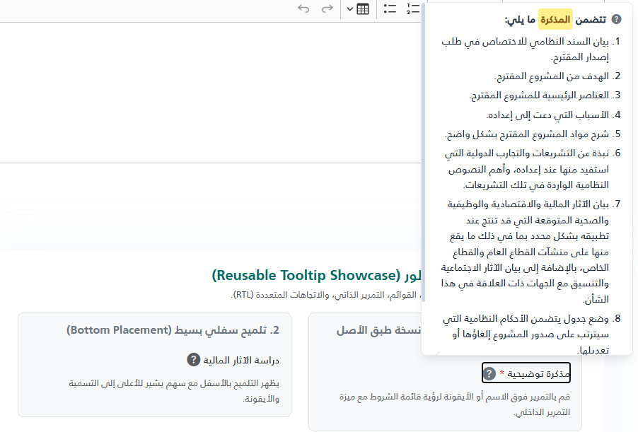
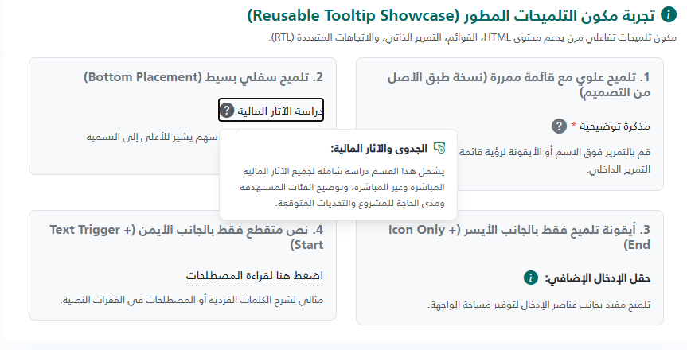

import Tabs from '@theme/Tabs';
import TabItem from '@theme/TabItem';
import Playground from '@site/src/components/Playground';

<Tabs>
<TabItem value="playground" label="Playground" default>

<Playground componentName="Tooltip" />

</TabItem>
<TabItem value="guide" label="Guide">

# `_Tooltip.cshtml` — Reusable Tooltip Partial

> **Location:** `Views/Shared/UI/_Tooltip.cshtml`

A self-contained hover tooltip for ASP.NET Core Razor views.
Supports rich HTML content, multiple placements, RTL/LTR layouts, and auto viewport-aware flipping.

---

## Visual Preview




---

## How It Works

- **Trigger** — an inline element (`<span>`) containing an optional text label and/or an icon.
- **Bubble** — appears on `:hover` or `:focus-within` of the trigger.
- **Smart positioning** — on hover the JS measures viewport space and automatically **flips** the bubble to the opposite side if there is not enough room.
- **Horizontal shift** — if the bubble would overflow the left/right viewport edge it is shifted in-place.
- **Shared assets** — the `&lt;style>` and `&lt;script>` blocks are injected **only once per page** regardless of how many tooltips are on the page (tracked via `ViewData`).

---

## Props

| Prop | Type | Default | Description |
|---|---|---|---|
| `label` | `string` | *(empty)* | Trigger label text. HTML is allowed (e.g. `<span class='text-danger'>*</span>`). Omit for icon-only triggers. |
| `content` | `string` | *(empty)* | Tooltip body. Accepts any HTML — plain text, `<ul>`, `<ol>`, `<strong>`, links, etc. **Required.** |
| `icon` | `string` | *(empty)* | Full HTML for the trigger icon, e.g. `<i class="bi bi-info-circle"></i>`. At least one of `label` or `icon` must be provided. |
| `placement` | `string` | `"top"` | Preferred bubble direction: `"top"` · `"bottom"` · `"start"` · `"end"`. The JS may flip this at runtime based on available space. |
| `maxHeight` | `string` | `"500px"` | Maximum height of the bubble before it becomes scrollable. Any valid CSS length (`px`, `rem`, `vh`). |
| `cssClass` | `string` | *(empty)* | Extra CSS class(es) appended to the outer wrapper `<span>`. |
| `id` | `string` | *(auto)* | Stable id suffix used to build `tip-&#123;id&#125;`. Auto-generated (`Guid`) when omitted. Provide a value when you need a predictable DOM id (e.g. for testing or ARIA). |

> [!NOTE]
> The partial renders **nothing** if `content` is empty, or if both `label` and `icon` are empty.

---

## Basic Usage

```cshtml
@await Html.PartialAsync("~/Views/Shared/UI/_Tooltip.cshtml", new {
    label   = "اقرأ المزيد",
    icon    = "<i class=\"bi bi-question-circle-fill\"></i>",
    content = "هذا نص تلميح بسيط يشرح العنصر."
})
```

---

## Examples

### 1 — Label + Icon, top placement (default)

```cshtml
@await Html.PartialAsync("~/Views/Shared/UI/_Tooltip.cshtml", new {
    label   = "مذكرة توضيحية <span class='text-danger'>*</span>",
    icon    = "<i class=\"bi bi-question-circle-fill text-secondary\"></i>",
    content = @"<ol>
                  <li>بيان السند النظامي للاختصاص.</li>
                  <li>الهدف من المشروع المقترح.</li>
                  <li>العناصر الرئيسية للمشروع.</li>
               </ol>"
})
```

---

### 2 — Icon-only trigger

```cshtml
@await Html.PartialAsync("~/Views/Shared/UI/_Tooltip.cshtml", new {
    icon    = "<i class=\"bi bi-info-circle text-primary fs-5\"></i>",
    content = "يمكنك رفع ملفات PDF أو Word فقط."
})
```

---

### 3 — Bottom placement with plain text

```cshtml
@await Html.PartialAsync("~/Views/Shared/UI/_Tooltip.cshtml", new {
    label     = "رسوم الخدمة",
    icon      = "<i class=\"bi bi-currency-dollar\"></i>",
    placement = "bottom",
    content   = "الرسوم غير قابلة للاسترداد بعد تقديم الطلب."
})
```

---

### 4 — Side placement (start / end) with custom height

```cshtml
@await Html.PartialAsync("~/Views/Shared/UI/_Tooltip.cshtml", new {
    label     = "متطلبات المستند",
    icon      = "<i class=\"bi bi-paperclip\"></i>",
    placement = "start",
    maxHeight = "200px",
    content   = @"<ul>
                    <li>الهوية الوطنية سارية المفعول</li>
                    <li>عقد العمل موثق</li>
                    <li>كشف الراتب لآخر 3 أشهر</li>
                  </ul>"
})
```

---

### 5 — Stable id (for testing / ARIA references)

```cshtml
@await Html.PartialAsync("~/Views/Shared/UI/_Tooltip.cshtml", new {
    id      = "docs-tip",
    label   = "وثائق مطلوبة",
    content = "الوثيقة الرسمية مطلوبة للمراجعة."
})
```

Rendered DOM id will be `tip-docs-tip`.

---

## CSS Helper Classes

These classes are available inside tooltip content and on the wrapper:

| Class | Where to use | Effect |
|---|---|---|
| `tt-highlight` | Inside `content` HTML | Yellow highlight badge — `<span class="tt-highlight">keyword</span>` |
| `tt-label-dashed` | Add to wrapper via `cssClass` | Adds a dashed underline to the label text |

**Highlight example:**

```cshtml
content = "يجب أن تكون <span class='tt-highlight'>الهوية الوطنية</span> سارية المفعول."
```

---

## Placement Reference

```
        [top]          ← default
          ↑
[end] ←  TRIGGER  → [start]
          ↓
       [bottom]
```

> [!IMPORTANT]
> `start` and `end` are **logical** (RTL-aware), not physical:
> - In **RTL** pages: `start` = right side, `end` = left side.
> - In **LTR** pages: `start` = left side, `end` = right side.

The JS will automatically flip `top ↔ bottom` or `start ↔ end` when the preferred side lacks viewport space.

---

## Scrollable Content

When the content height exceeds `maxHeight`, the bubble becomes vertically scrollable automatically.
A thin, styled scrollbar appears on overflow. Set `maxHeight` to control the threshold:

```cshtml
maxHeight = "300px"   @* default is 500px *@
```

---

## Accessibility

- The wrapper renders with `tabindex="0"` and `role="button"` — keyboard users can focus it with **Tab**.
- The bubble carries `role="tooltip"` and is linked via `aria-describedby` to the trigger.
- `dir="auto"` on the bubble ensures correct bidirectional text rendering inside mixed-language content.

---

## Notes & Gotchas

> [!WARNING]
> The partial renders **nothing silently** if `content` is blank. Always pass a non-empty `content` value.

> [!TIP]
> If multiple tooltips appear on the same page, you do **not** need to worry about duplicate `&lt;style>` or `&lt;script>` tags — the partial injects them only once via `ViewData`.

> [!NOTE]
> The outer wrapper uses `position: relative` and `z-index: 10` at rest, rising to `99999` on hover. Make sure parent containers do **not** have `overflow: hidden` or a lower `z-index` that clips the bubble.


</TabItem>
<TabItem value="_Tooltip.cshtml" label="_Tooltip.cshtml">

```cshtml
@* ─────────────────────────────────────────────────────────────────
_Tooltip.cshtml – Reusable hover-tooltip partial

PARAMETERS (pass as anonymous object)
─────────────────────────────────────
label string Trigger text (HTML allowed). Omit for icon-only.
content string Tooltip body – plain text or any HTML (ul, ol …).
icon string HTML for the trigger icon, e.g. <i class="bi bi-info-circle"></i>
placement string "top" | "bottom" | "start" | "end" (default: "top")
maxHeight string Max scrollable height of the bubble (default: "500px")
cssClass string Extra CSS class(es) added to the wrapper.
id string Stable id suffix; auto-generated when omitted.

USAGE
─────
@await Html.PartialAsync("~/Views/Shared/UI/_Tooltip.cshtml", new {
label = "متطلبات المستند",
icon = "<i class=\"bi bi-question-circle-fill\"></i>",
content = "<ol>
	<li>الهوية الوطنية</li>
	<li>عقد العمل</li>
</ol>",
placement = "bottom"
})
───────────────────────────────────────────────────────────────── *@

@model dynamic
@using Microsoft.AspNetCore.Routing
@{
// ── Read parameters ────────────────────────────────────────────
string Prop(string key) {
var d = new RouteValueDictionary(Model ?? new { });
return d.TryGetValue(key, out var v) ? v?.ToString() ?? "" : "";
}

string label = Prop("label");
string content = Prop("content");
string icon = Prop("icon");
string placement = Prop("placement") is { Length: > 0 } p ? p : "top";
string maxHeight = Prop("maxHeight") is { Length: > 0 } m ? m : "500px";
string cssClass = Prop("cssClass");
string idSuffix = Prop("id") is { Length: > 0 } i ? i : Guid.NewGuid().ToString("N")[..8];

string tooltipId = $"tip-{idSuffix}";
bool hasLabel = !string.IsNullOrWhiteSpace(label);
bool hasIcon = !string.IsNullOrWhiteSpace(icon);
bool hasContent = !string.IsNullOrWhiteSpace(content);
bool canRender = hasContent && (hasLabel || hasIcon);

// ── Inject shared CSS + JS once per page ───────────────────────
const string OnceKey = "_tooltip_assets_written";
bool alreadyWritten = ViewData[OnceKey] as bool? ?? false;
if (!alreadyWritten) ViewData[OnceKey] = true;
}

@* ── Shared assets (injected once per page) ──────────────────────── *@
@if (!alreadyWritten)
{
<style>
	/* ── Wrapper ──────────────────────────────────────────────────────── */
	.tt-wrapper {
		position: relative;
		display: inline-flex;
		align-items: center;
		gap: .35em;
		cursor: pointer;
		color: inherit;
		z-index: 10;
	}

	.tt-wrapper:hover,
	.tt-wrapper:focus-within {
		z-index: 99999;
	}

	/* ── Trigger parts ────────────────────────────────────────────────── */
	.tt-label {
		line-height: 1.4;
	}

	.tt-label-dashed {
		border-bottom: 1px dashed currentColor;
	}

	.tt-icon {
		display: inline-flex;
		align-items: center;
		flex-shrink: 0;
		font-size: 1.3em;
		color: #9ca3af;
		transition: color .2s;
	}

	.tt-wrapper:hover .tt-icon,
	.tt-wrapper:focus-within .tt-icon {
		color: #4b5563;
	}

	/* ── Bubble ───────────────────────────────────────────────────────── */
	.tt-bubble {
		/* hidden by default */
		visibility: hidden;
		opacity: 0;
		pointer-events: none;

		position: absolute;
		z-index: 100000;

		min-width: 180px;
		max-width: min(300px, 90vw);
		width: max-content;
		padding: .85em 1.1em;
		border-radius: .5rem;
		border: 1px solid #e5e7eb;
		box-shadow: 0 10px 15px -3px rgba(0, 0, 0, .08), 0 4px 6px -4px rgba(0, 0, 0, .08);

		background: #fff;
		color: #1f2937;
		font-size: .875rem;
		line-height: 1.6;

		/* word wrapping – no horizontal scroll */
		white-space: normal;
		overflow-wrap: break-word;
		word-break: break-word;

		/* max-height is set via the --tt-max-h CSS variable (injected inline per-instance) */
		max-height: var(--tt-max-h, 500px);
		overflow-y: auto;
		overflow-x: hidden;
		overscroll-behavior: contain;
	}

	/* scrollbar */
	.tt-bubble::-webkit-scrollbar {
		width: 5px;
	}

	.tt-bubble::-webkit-scrollbar-track {
		background: transparent;
	}

	.tt-bubble::-webkit-scrollbar-thumb {
		background: #cbd5e1;
		border-radius: 4px;
	}

	.tt-bubble::-webkit-scrollbar-thumb:hover {
		background: #94a3b8;
	}

	/* ── Arrow (rotated square) ───────────────────────────────────────── */
	.tt-bubble::after {
		content: "";
		position: absolute;
		width: 8px;
		height: 8px;
		background: #fff;
		border: 1px solid #e5e7eb;
		transform: rotate(45deg);
		z-index: 2;
	}

	/* ── Hover bridge (keeps bubble open while cursor travels to it) ──── */
	.tt-bubble::before {
		content: "";
		position: absolute;
		z-index: 1;
	}

	/* ── Placements ───────────────────────────────────────────────────── */
	.tt-bubble[data-placement="top"] {
		bottom: calc(100% + 10px);
		inset-inline-end: 0;
	}

	.tt-bubble[data-placement="bottom"] {
		top: calc(100% + 10px);
		inset-inline-end: 0;
	}

	.tt-bubble[data-placement="end"] {
		top: 50%;
		inset-inline-end: calc(100% + 10px);
		transform: translateY(-50%);
	}

	.tt-bubble[data-placement="start"] {
		top: 50%;
		inset-inline-start: calc(100% + 10px);
		transform: translateY(-50%);
	}

	/* Arrows per placement */
	.tt-bubble[data-placement="top"]::after {
		bottom: -5px;
		inset-inline-end: 16px;
		border-top: none;
		border-inline-start: none;
	}

	.tt-bubble[data-placement="bottom"]::after {
		top: -5px;
		inset-inline-end: 16px;
		border-bottom: none;
		border-inline-end: none;
	}

	.tt-bubble[data-placement="end"]::after {
		top: calc(50% - 4px);
		inset-inline-start: -5px;
		border-top: none;
		border-inline-end: none;
	}

	.tt-bubble[data-placement="start"]::after {
		top: calc(50% - 4px);
		inset-inline-end: -5px;
		border-bottom: none;
		border-inline-start: none;
	}

	/* Hover bridge per placement */
	.tt-bubble[data-placement="top"]::before {
		bottom: -15px;
		left: 0;
		right: 0;
		height: 15px;
	}

	.tt-bubble[data-placement="bottom"]::before {
		top: -15px;
		left: 0;
		right: 0;
		height: 15px;
	}

	.tt-bubble[data-placement="end"]::before {
		inset-inline-start: -15px;
		top: 0;
		bottom: 0;
		width: 15px;
	}

	.tt-bubble[data-placement="start"]::before {
		inset-inline-end: -15px;
		top: 0;
		bottom: 0;
		width: 15px;
	}

	/* RTL arrow corrections for side placements */
	[dir="rtl"] .tt-bubble[data-placement="end"]::after {
		inset-inline-start: auto;
		inset-inline-end: -5px;
		border-top: 1px solid #e5e7eb;
		border-inline-end: 1px solid #e5e7eb;
		border-bottom: none;
		border-inline-start: none;
	}

	[dir="rtl"] .tt-bubble[data-placement="start"]::after {
		inset-inline-end: auto;
		inset-inline-start: -5px;
		border-bottom: 1px solid #e5e7eb;
		border-inline-start: 1px solid #e5e7eb;
		border-top: none;
		border-inline-end: none;
	}

	/* ── Visible state ────────────────────────────────────────────────── */
	.tt-wrapper:hover .tt-bubble,
	.tt-wrapper:focus-within .tt-bubble {
		visibility: visible;
		opacity: 1;
		pointer-events: auto;
	}

	/* ── Content helpers ──────────────────────────────────────────────── */
	.tt-bubble ul,
	.tt-bubble ol {
		margin: .5em 0 0;
		padding-inline-start: 1.25em;
	}

	.tt-bubble li {
		margin-bottom: .35em;
	}

	.tt-bubble li:last-child {
		margin-bottom: 0;
	}

	.tt-bubble a {
		color: #2563eb;
		text-decoration: underline;
	}

	.tt-bubble a:hover {
		color: #1d4ed8;
	}

	.tt-highlight {
		background: #fef08a;
		color: #854d0e;
		padding: .1em .3em;
		border-radius: 4px;
		font-weight: 600;
	}
</style>

<script>
	(function () {
		'use strict';

		// ── Constants ──────────────────────────────────────────────────
		const MARGIN = 8;   // px gap from viewport edges
		const ARROW = 12;  // px clearance for the arrow

		// ── Pure helpers ───────────────────────────────────────────────

		/** Returns the space available around the trigger element. */
		function getAvailableSpace(triggerRect) {
			return {
				top: triggerRect.top,
				bottom: window.innerHeight - triggerRect.bottom,
				left: triggerRect.left,
				right: window.innerWidth - triggerRect.right,
			};
		}

		/** Resolves whether the page is RTL. */
		function isRTL() {
			return document.documentElement.dir === 'rtl' || document.body.dir === 'rtl';
		}

		/**
		 * Returns the best placement for the bubble, flipping when the preferred
		 * side does not have enough room and the opposite side has more space.
		 */
		function resolvePlacement(preferred, bubbleRect, space) {
			const { width: bw, height: bh } = bubbleRect;
			const rtl = isRTL();

			switch (preferred) {
				case 'top':
					return (bh + ARROW > space.top && space.bottom > space.top) ? 'bottom' : 'top';
				case 'bottom':
					return (bh + ARROW > space.bottom && space.top > space.bottom) ? 'top' : 'bottom';
				case 'start': {
					const mySpace = rtl ? space.right : space.left;
					const altSpace = rtl ? space.left : space.right;
					return (bw + ARROW > mySpace && altSpace > mySpace) ? 'end' : 'start';
				}
				case 'end': {
					const mySpace = rtl ? space.left : space.right;
					const altSpace = rtl ? space.right : space.left;
					return (bw + ARROW > mySpace && altSpace > mySpace) ? 'start' : 'end';
				}
				default:
					return preferred;
			}
		}

		/**
		 * Returns the horizontal pixel offset needed to keep the bubble
		 * inside the viewport, or 0 if no shift is needed.
		 */
		function calcHorizontalShift(bubbleRect) {
			if (bubbleRect.left < MARGIN) return MARGIN - bubbleRect.left;
			if (bubbleRect.right > window.innerWidth - MARGIN) return (window.innerWidth - MARGIN) - bubbleRect.right;
			return 0;
		}

		/** Returns the CSS base-transform for side placements. */
		function baseTransformFor(placement) {
			return (placement === 'start' || placement === 'end') ? 'translateY(-50%)' : 'translateY(0)';
		}

		// ── Core actions ───────────────────────────────────────────────

		function adjustTooltip(wrapper) {
			const bubble = wrapper.querySelector('.tt-bubble');
			if (!bubble) return;

			// 1. Persist the user-specified placement so we can always restore it
			if (!bubble.dataset.originalPlacement) {
				bubble.dataset.originalPlacement = bubble.dataset.placement;
			}

			// 2. Reset to original before measuring
			bubble.dataset.placement = bubble.dataset.originalPlacement;
			bubble.style.transform = '';

			// 3. Determine best placement based on available space
			const space = getAvailableSpace(wrapper.getBoundingClientRect());
			const bubbleRect = bubble.getBoundingClientRect();
			const best = resolvePlacement(bubble.dataset.originalPlacement, bubbleRect, space);

			if (best !== bubble.dataset.placement) {
				bubble.dataset.placement = best;
			}

			// 4. Shift horizontally if the bubble overflows the viewport sides
			const shiftX = calcHorizontalShift(bubble.getBoundingClientRect());
			if (shiftX !== 0) {
				bubble.style.transform = `${baseTransformFor(best)} translateX(${shiftX}px)`;
			}
		}

		function resetTooltip(e, wrapper) {
			// Stay open when cursor is still inside the same wrapper
			if (e.relatedTarget?.closest('.tt-wrapper') === wrapper) return;
			if (wrapper.matches(':hover')) return;
			if (wrapper.matches(':focus-within')) return;
			if (wrapper.contains(document.activeElement)) return;

			const bubble = wrapper.querySelector('.tt-bubble');
			if (!bubble) return;
			bubble.style.transform = '';
			if (bubble.dataset.originalPlacement) {
				bubble.dataset.placement = bubble.dataset.originalPlacement;
			}
		}

		// ── Event delegation (one listener per event type) ─────────────

		function init() {
			if (window._tooltipReady) return;
			window._tooltipReady = true;

			document.addEventListener('mouseover', e => {
				const w = e.target.closest('.tt-wrapper');
				if (w) adjustTooltip(w);
			});
			document.addEventListener('mouseout', e => {
				const w = e.target.closest('.tt-wrapper');
				if (w) resetTooltip(e, w);
			});
			document.addEventListener('focusin', e => {
				const w = e.target.closest('.tt-wrapper');
				if (w) adjustTooltip(w);
			});
			document.addEventListener('focusout', e => {
				const w = e.target.closest('.tt-wrapper');
				if (w) resetTooltip(e, w);
			});
		}

		document.readyState === 'loading'
			? document.addEventListener('DOMContentLoaded', init)
			: init();
	})();
</script>
}

@* ── Markup ───────────────────────────────────────────────────────── *@
@if (canRender)
{
<span class="tt-wrapper @cssClass" tabindex="0" role="button" aria-describedby="@tooltipId">

	@if (hasLabel)
	{
	<span class="tt-label">@Html.Raw(label)</span>
	}

	@if (hasIcon)
	{
	<span class="tt-icon @(!hasLabel ? " tt-icon-only" : "" )">@Html.Raw(icon)</span>
	}

	<span id="@tooltipId" class="tt-bubble" data-placement="@placement" style="--tt-max-h: @maxHeight" role="tooltip"
		dir="auto">
		@Html.Raw(content)
	</span>

</span>
}
```

</TabItem>
</Tabs>
