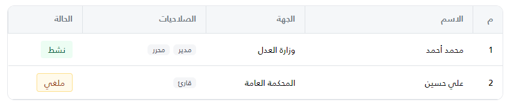
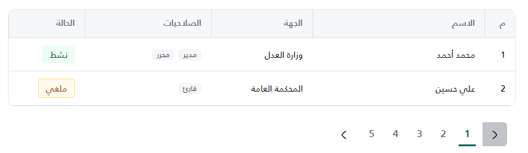

import Tabs from '@theme/Tabs';
import TabItem from '@theme/TabItem';

<Tabs>
<TabItem value="guide" label="Guide" default>

# MomahTable.js - Simple Table Component

A lightweight, dependency-free JavaScript component for rendering dynamic HTML tables with pagination, search, and filtering.

---




## Quick Start (3 Steps)

### 1. Include Files

```html
<link rel="stylesheet" href="~/assets/css/momahTable.css"/>
<script src="/assets/js/momahTable.js"></script>

<!-- incase need pagination include style -->
<link rel="stylesheet" href="/assets/css/pagination.css" />
```

### 2. Create HTML Containers

```html
<div id="tableActions"></div>   <!-- Search/Filter container (optional) -->
<div id="tableContainer"></div> <!-- Table container -->
<div id="pagination"></div>     <!-- Pagination container (optional) -->
```

### 3. Render the Table

```javascript
const data = [
    { id: 1, name: 'John Doe', email: 'john@example.com' },
    { id: 2, name: 'Jane Smith', email: 'jane@example.com' }
];

const columns = [
    { header: 'ID', field: 'id' },
    { header: 'Name', field: 'name' },
    { header: 'Email', field: 'email' }
];

MomahTable.render('#tableContainer', columns, data);
```

---

## Basic Usage

### Simple Table (No Options)

```javascript
MomahTable.render('#tableContainer', columns, data);
```

### Table with Pagination

```javascript
MomahTable.render('#tableContainer', columns, data, {
    pagination: {
        containerSelector: '#pagination',
        currentPage: 1,
        totalPages: 5,
        onPageChange: (page) => loadData(page)
    }
});
```

### Table with Search

```javascript
MomahTable.render('#tableContainer', columns, data, {
    search: {
        containerSelector: '#tableActions',
        inputId: 'searchInput',
        placeholder: 'Search...'
    }
});
```

### Table with Filter Button

```javascript
MomahTable.render('#tableContainer', columns, data, {
    filter: {
        containerSelector: '#tableActions',
        label: 'Filter',
        targetModalId: 'filterModal'
    }
});
```

### Table with Column Picker

```javascript
MomahTable.render('#tableContainer', columns, data, {
    columnPicker: {
        containerSelector: '#tableActions'
    }
});
```

---

## Column Configuration

| Property | Type | Description |
|----------|------|-------------|
| `header` | String | Column header text |
| `field` | String | Data property to display |
| `render` | Function | Custom cell content (returns HTML) |
| `width` | String | Column width (e.g., `'100px'`, `'20%'`) |
| `className` | String | CSS class for header |
| `tdClassName` | String | CSS class for cells |
| `hide` | Boolean | Set `true` to hide column (won't show in picker) |

### Using `render` for Custom Content

```javascript
{
    header: 'Actions',
    render: (record) => `
        <button onclick="edit(${record.id})">Edit</button>
        <button onclick="delete(${record.id})">Delete</button>
    `
}
```

---

## Advanced Options

### Full Example with All Features

```javascript
const options = {
    search: {
        containerSelector: '#tableActions',
        inputId: 'searchInput',
        placeholder: 'Search by name...'
    },
    filter: {
        containerSelector: '#tableActions',
        label: 'Filter',
        targetModalId: 'filterModal',
        isIcon: false  // Set true for icon-only button
    },
    columnPicker: {
        containerSelector: '#tableActions'
    },
    pagination: {
        containerSelector: '#pagination',
        currentPage: 1,
        totalPages: 10,
        onPageChange: (page) => loadData(page)
    }
};

MomahTable.render('#tableContainer', columns, data, options);
```

### Search Options

| Property | Required | Default | Description |
|----------|----------|---------|-------------|
| `containerSelector` | Yes | - | Container element selector |
| `inputId` | No | `txtFullName` | Input element ID |
| `placeholder` | No | - | Input placeholder text |

### Filter Options

| Property | Required | Default | Description |
|----------|----------|---------|-------------|
| `containerSelector` | Yes | - | Container element selector |
| `label` | No | `تصفية البحث` | Button text |
| `targetModalId` | No | - | Bootstrap modal ID to open |
| `onClick` | No | - | Custom click handler |
| `isIcon` | No | `false` | Show icon-only button |
| `icon` | No | - | Custom SVG HTML |

### Column Picker Options

| Property | Required | Default | Description |
|----------|----------|---------|-------------|
| `containerSelector` | Yes | - | Container element selector |

### Pagination Options

| Property | Required | Default | Description |
|----------|----------|---------|-------------|
| `containerSelector` | Yes | - | Container element selector |
| `currentPage` | Yes | - | Current page number |
| `totalPages` | Yes | - | Total number of pages |
| `onPageChange` | Yes | - | Function called when page changes |

---

## Handling Search/Filter Events

When the user searches or filters, `MomahTable` will call one of these functions (in order):

1. `window.performSearch()`
2. `window.LoadData()`
3. `filterOptions.onFilter`

Define one of these in your page:

```javascript
function performSearch() {
    const value = document.getElementById('searchInput').value;
    console.log('Search value:', value);
    // Fetch new data and re-render table
}

function LoadData() {
    // Your data loading logic
}
```

---

## Common Patterns

### Pattern 1: Table Only

```javascript
MomahTable.render('#tableContainer', columns, data);
```

### Pattern 2: Table with Search

```javascript
MomahTable.render('#tableContainer', columns, data, {
    search: { containerSelector: '#tableActions' }
});
```

### Pattern 3: Table with Pagination

```javascript
MomahTable.render('#tableContainer', columns, data, {
    pagination: {
        containerSelector: '#pagination',
        currentPage: 1,
        totalPages: 5,
        onPageChange: (page) => loadData(page)
    }
});
```

### Pattern 4: Table with Search + Filter + Pagination

```javascript
MomahTable.render('#tableContainer', columns, data, {
    search: { containerSelector: '#tableActions' },
    filter: {
        containerSelector: '#tableActions',
        label: 'Filter',
        targetModalId: 'filterModal'
    },
    columnPicker: { containerSelector: '#tableActions' },
    pagination: {
        containerSelector: '#pagination',
        currentPage: 1,
        totalPages: 5,
        onPageChange: (page) => loadData(page)
    }
});
```

---

## Hiding Columns

Columns can be hidden in two ways:

### Method 1: Using `hide` property

```javascript
const columns = [
    { header: 'ID', field: 'id' },
    { header: 'Secret', field: 'secret', hide: true }, // Hidden
    { header: 'Name', field: 'name' }
];
```

### Method 2: Using `show` property

```javascript
const columns = [
    { header: 'ID', field: 'id' },
    { header: 'Secret', field: 'secret', show: false }, // Hidden
    { header: 'Name', field: 'name' }
];
```

---

## Notes

- The `render` function returns HTML content for cells
- Hidden columns (with `hide: true`) won't appear in the Column Picker
- Search input automatically triggers `Enter` key to search
- Clear button (X) in search input clears and triggers search
- Pagination shows ellipsis (...) for large page counts


</TabItem>
<TabItem value="momah-table.css" label="momah-table.css">

```css
/* this file contains data table styles and action button with dropdown */

/* Table look */
.momah-table-host .table-wrapper,
.momah-table-host .jtable-main-container {
	border: 1px solid #e5e7eb;
	border-radius: 12px;
	overflow: visible;
	background: #fff;
}

/* Round top corners directly on the first header cells (since overflow is now visible) */
.momah-table-host .table thead tr:first-child th:first-child {
	border-top-right-radius: 11px;
}

.momah-table-host .table thead tr:first-child th:last-child {
	border-top-left-radius: 11px;
}

/* Allow Bootstrap dropdowns to overflow the responsive container freely */
.momah-table-host .table-responsive {
	overflow: visible !important;
}

table thead th {
	border-left: var(--bs-border-width) var(--bs-border-style) var(--bs-border-color) !important;
}

/* Header background */
.momah-table-host .table thead,
.momah-table-host .table thead tr,
.momah-table-host .table thead th,
.momah-table-host .jtable thead,
.momah-table-host .jtable thead tr,
.momah-table-host .jtable thead th {
	background-color: #f5f7f9 !important;
}

/* Bootstrap table var */
.momah-table-host .table thead {
	--bs-table-bg: #f5f7f9 !important;
}

/* Header cells */
.momah-table-host .table thead th,
.momah-table-host .jtable thead th {
	color: #6c757d !important;
	font-weight: 500;
	padding: 12px 16px !important;
}

/* Body cells */
.momah-table-host .table tbody td,
.momah-table-host .jtable tbody td {
	vertical-align: middle;
	padding: 12px 16px !important;
}

.momah-table-host .wrappingText {
	white-space: nowrap;
	overflow: hidden;
	text-overflow: ellipsis;
	max-width: 520px;
}

/* Status pill styles */
.status-pill {
	display: flex;
	justify-content: center;
	align-items: center;
	padding: 4px 12px;
	border-radius: 4px;
	font-weight: 400;
}

.status-published {
	background: var(--Tag-tag-background-success-light, rgba(236, 253, 243, 1));
	color: var(--Tag-tag-text-success, rgba(8, 93, 58, 1));
}

.status-draft {
	background: #f8f9fa;
	color: #212529;
}

.status-unpublished {
	background: #fff3cd;
	color: #7a4b00;
}

.status-inprogress,
.status-completed {
	background: var(--Tag-tag-background-neutral-light, rgba(249, 250, 251, 1));
	color: var(--Tag-tag-text-neutral, rgba(31, 42, 55, 1));
}

.status-rejected {
	background: var(--Tag-tag-background-warning-light, rgba(255, 250, 235, 1));
	border: 1px solid var(--Tag-tag-border-warning-light, rgba(254, 223, 137, 1));
	color: var(--Tag-tag-text-warning, rgba(147, 55, 13, 1));
}

.duration-pill {
	display: inline-flex;
	align-items: center;
	justify-content: center;
	padding: 2px 10px;
	border-radius: 4px;
	background: #e8f7f7;
	color: #016b68;
	font-weight: 500;
	width: 91.14283752441406px;
	border: 1px solid rgba(179, 233, 233, 1);
}

/*Table action button and dropdown */
.action-btn {
	width: 24px;
	height: 24px;
	border-radius: 50%;
	border: none;
	background: #fff;
	color: #6c757d;
	display: inline-flex;
	align-items: center;
	justify-content: center;
}

.dropdown-menu {
	min-width: 180px;
	position: absolute;
}

/* Role chips inside roles column */
.momah-table-host .roles-cell {
	display: flex;
	flex-wrap: wrap;
	gap: 6px;
}

.momah-table-host .role-chip {
	display: inline-flex;
	align-items: center;
	padding: 2px 8px;
	border-radius: 6px;
	background: #f3f4f6e4;
	color: #374151;
	font-size: 12px;
	line-height: 1.2;
}

/* MomahTable Host Containers */
.momah-actions-host {
	margin-bottom: 1rem;
}

/* MomahTable Search Bar */
.momah-search-input {
	border: 1px solid #d1d5db;
	border-radius: 8px;
	padding: 12px 50px 12px 50px;
	background: #ffffff;
	box-shadow: 0 1px 3px rgba(0, 0, 0, 0.1);
}

.momah-btn-clear {
	left: 12px;
	top: 50%;
	transform: translateY(-50%);
	background: none;
	border: none;
	color: #6b7280;
	font-size: 16px;
	display: none;
	width: 20px;
	height: 20px;
}

.momah-search-icon {
	right: 12px;
	top: 50%;
	transform: translateY(-50%);
	color: #6b7280;
	cursor: pointer;
}

/* MomahTable Filter Button */
.momah-filter-btn {
	background-color: #f9fafb;
	color: #374151;
	border: 1px solid #d1d5db;
	border-radius: 8px;
	padding: 9px 16px;
	font-weight: 500;
	min-width: 140px;
}

.momah-filter-btn-icon {
	font-size: 12px;
	color: #6b7280;
	margin-left: 4px;
}

.search-container {
	position: relative;
}

.search-input {
	transition: all 0.2s ease;
}

.search-input:focus {
	border-color: #016b68 !important;
	box-shadow: 0 0 0 0.2rem rgba(1, 107, 104, 0.25) !important;
	outline: none;
}

.btn-clear {
	transition: color 0.2s ease;
	display: flex !important;
	align-items: center !important;
	justify-content: center !important;
}

.btn-clear:hover,
.search-icon-text:hover {
	color: #374151 !important;
}

.filter-btn,
.search-icon-text {
	transition: color 0.2s ease;
}

.filter-btn:hover {
	background-color: #f3f4f6 !important;
	border-color: #9ca3af !important;
}

/* Ensure icons are properly displayed */
.btn-clear i,
.filter-btn i {
	display: inline-block !important;
	font-style: normal !important;
	font-variant: normal !important;
	text-rendering: auto !important;
	line-height: 1 !important;
}

/* Columns Dropdown */
.momah-cols-dropdown {
	position: relative;
	display: inline-block;
}

.momah-cols-menu {
	display: none;
	position: absolute;
	left: 0;
	/* Default to left alignment (LTR) - user can override or we can detect RTL */
	top: 100%;
	z-index: 1000;
	min-width: 200px;
	background: #fff;
	border: 1px solid #e5e7eb;
	border-radius: 8px;
	box-shadow: 0 4px 6px -1px rgba(0, 0, 0, 0.1), 0 2px 4px -1px rgba(0, 0, 0, 0.06);
	padding: 8px;
	margin-top: 4px;
	max-height: 300px;
	overflow-y: auto;
}

/* RTL Support for dropdown alignment if needed, usually driven by HTML dir="rtl" */
[dir="rtl"] .momah-cols-menu {
	left: auto;
	right: 0;
}

.momah-cols-menu.show {
	display: block;
}

.momah-col-item {
	display: flex;
	align-items: center;
	padding: 8px 12px;
	cursor: pointer;
	border-radius: 6px;
	transition: background-color 0.2s;
	margin-bottom: 2px;
}

.momah-col-item:hover {
	background-color: #f3f4f6;
}

.momah-col-checkbox {
	margin-inline-end: 10px;
	width: 16px;
	height: 16px;
	cursor: pointer;
	accent-color: #016b68;
}

.momah-col-label {
	font-size: 14px;
	color: #374151;
	user-select: none;
	flex-grow: 1;
}

.momah-cols-btn {
	background-color: #fff;
	color: #374151;
	border: 1px solid #d1d5db;
	border-radius: 8px;
	padding: 9px 12px;
	display: flex;
	align-items: center;
	justify-content: center;
	transition: all 0.2s;
}

.momah-cols-btn:hover {
	background-color: #f9fafb;
	border-color: #9ca3af;
}

/* Rotate arrow when dropdown is open */
.momah-cols-btn[aria-expanded="true"] .momah-arrow-icon {
	transform: rotate(180deg);
}

.momah-arrow-icon {
	transition: transform 0.3s ease-in-out;
}
```

</TabItem>
<TabItem value="momahTable.js" label="momahTable.js">

```javascript
(function (global) {
	"use strict";

	function createElement(tagName, className, html) {
		var el = document.createElement(tagName);
		if (className) el.className = className;
		if (html !== undefined) el.innerHTML = html;
		return el;
	}

	function renderPagination(currentPage, totalPages, onPageChange) {
		let container = createElement("div", {});
		let html =
			'<ul class="pagination justify-content-start custom-pagination">';

		// Previous
		html += `
      <li class="page-item${currentPage === 1 ? " disabled" : ""}">
          <a class="page-link" href="#" aria-label="Previous"></a>
        </li>`;

		if (totalPages <= 5) {
			for (var i = 1; i <= totalPages; i++) {
				html += `
          <li class="page-item${i === currentPage ? " active" : ""}">
            <a class="page-link" href="#">${i}</a>
          </li>`;
			}
		} else {
			// First page
			html += `
        <li class="page-item${currentPage === 1 ? " active" : ""}">
            <a class="page-link" href="#">1</a>
          </li>`;

			// Left ellipsis
			if (currentPage > 3) {
				html += `
          <li class="page-item disabled"><a class="page-link" href="#">...</a></li>`;
			}

			// Middle pages
			for (
				var m = Math.max(2, currentPage - 1);
				m <= Math.min(totalPages - 1, currentPage + 1);
				m++
			) {
				html += `
          <li class="page-item${m === currentPage ? " active" : ""}">
            <a class="page-link" href="#">${m}</a>
          </li>`;
			}

			// Right ellipsis
			if (currentPage < totalPages - 2) {
				html += `
          <li class="page-item disabled"><a class="page-link" href="#">...</a></li>`;
			}

			// Last page
			html += `
        <li class="page-item${currentPage === totalPages ? " active" : ""}">
          <a class="page-link" href="#">${totalPages}</a>
        </li>`;
		}

		// Next
		html += `
      <li class="page-item${currentPage === totalPages ? " disabled" : ""}">
        <a class="page-link" href="#" aria-label="Next"></a>
      </li>`;

		html += "</ul>";
		container.innerHTML = html;

		container.addEventListener("click", function (e) {
			let a = e.target.closest(".page-link");
			if (!a) return;
			e.preventDefault();
			let li = a.parentElement;
			if (li.classList.contains("disabled")) return;

			var newPage = currentPage;
			var label = a.getAttribute("aria-label");
			if (label === "Previous") {
				if (currentPage > 1) newPage = currentPage - 1;
			} else if (label === "Next") {
				if (currentPage < totalPages) newPage = currentPage + 1;
			} else {
				var num = parseInt(a.textContent, 10);
				if (!isNaN(num)) newPage = num;
			}

			if (newPage !== currentPage && typeof onPageChange === "function")
				onPageChange(newPage);
		});

		return container;
	}

	function renderTableActions(searchOptions, filterOptions, columnOptions) {
		// Only return if all are missing
		if (!searchOptions && !filterOptions && !columnOptions) return;

		// Use the correct containerSelector
		var hostSelector =
			(searchOptions && searchOptions.containerSelector) ||
			(filterOptions && filterOptions.containerSelector) ||
			(columnOptions && columnOptions.containerSelector);
		if (!hostSelector) return;
		var host =
			typeof hostSelector === "string"
				? document.querySelector(hostSelector)
				: hostSelector;
		if (!host) return;

		// Add generic class for styling
		host.classList.add("momah-actions-host");

		var wrapper = createElement("div", "d-flex align-items-center gap-2");

		var inputId, placeholder;
		if (searchOptions && searchOptions.inputId) inputId = searchOptions.inputId;
		else inputId = "txtFullName";
		if (searchOptions && searchOptions.placeholder)
			placeholder = searchOptions.placeholder;
		else placeholder = "";

		// Render search input if searchOptions is present
		if (searchOptions?.containerSelector) {
			// Prevent duplicate rendering if the search input already exists
			if (document.getElementById(inputId)) return;

			let container = createElement(
				"div",
				"search-container position-relative flex-grow-1"
			);

			let searchHtml = `
        <input type="text" id="${inputId}" class="form-control search-input momah-search-input" placeholder="${placeholder || ""
				}"/>
        <button type="button" class="btn-clear momah-btn-clear position-absolute" aria-label="Clear search input">
          <svg width="13" height="13" viewBox="0 0 13 13" fill="none" xmlns="http://www.w3.org/2000/svg">
						<path fill-rule="evenodd" clip-rule="evenodd" d="M0.183058 0.183058C0.427136 -0.0610194 0.822864 -0.0610194 1.06694 0.183058L6.45833 5.57445L11.8497 0.183058C12.0938 -0.0610194 12.4895 -0.0610194 12.7336 0.183058C12.9777 0.427136 12.9777 0.822864 12.7336 1.06694L7.34222 6.45833L12.7336 11.8497C12.9777 12.0938 12.9777 12.4895 12.7336 12.7336C12.4895 12.9777 12.0938 12.9777 11.8497 12.7336L6.45833 7.34222L1.06694 12.7336C0.822864 12.9777 0.427136 12.9777 0.183058 12.7336C-0.0610194 12.4895 -0.0610194 12.0938 0.183058 11.8497L5.57445 6.45833L0.183058 1.06694C-0.0610194 0.822864 -0.0610194 0.427136 0.183058 0.183058Z" fill="#161616"/>
					</svg>
        </button>
        <div class="search-icon-text momah-search-icon position-absolute d-flex align-items-center" role="button" tabindex="0" aria-label="Search">
          <svg width="16" height="16" viewBox="0 0 24 24" fill="none" xmlns="http://www.w3.org/2000/svg" class="momah-search-icon-svg">
            <path
              d="M21 21L16.514 16.506L21 21ZM19 10.5C19 15.194 15.194 19 10.5 19C5.806 19 2 15.194 2 10.5C2 5.806 5.806 2 10.5 2C15.194 2 19 5.806 19 10.5Z"
              stroke="currentColor" stroke-width="2" stroke-linecap="round" stroke-linejoin="round"/>
          </svg>
        </div>
      `;

			container.innerHTML = searchHtml.trim();
			wrapper.appendChild(container);
		}

		// Render filter button if filterOptions is present
		if (filterOptions) {
			let fb = filterOptions || {};

			// 1. Determine classes based on whether it's Icon Only or a Styled Button
			let btnClasses = "d-flex align-items-center justify-content-center ms-auto";

			if (fb.isIcon) {
				// Strip all button styles: no border, no background, no padding
				btnClasses += " p-0 border-0 bg-transparent momah-icon-trigger";
			} else {
				// Standard button styling
				btnClasses += " btn filter-btn momah-filter-btn gap-2";
			}

			let btn = createElement("button", btnClasses);
			btn.type = "button";

			// Default SVG if none provided
			const defaultIcon = `<svg width="20" height="20" viewBox="0 0 20 20" fill="none" xmlns="http://www.w3.org/2000/svg">
							<path fill-rule="evenodd" clip-rule="evenodd" d="M3.93213 1.58e-06C3.94946 2.35486e-06 3.96686 3.12972e-06 3.98431 3.12972e-06L15.5678 1.58e-06C16.3384 -3.38252e-05 16.9926 -6.38664e-05 17.5087 0.0703036C18.0549 0.144785 18.5773 0.312914 18.9772 0.753097C19.3806 1.19714 19.491 1.73226 19.4994 2.27927C19.5073 2.79013 19.4257 3.42472 19.3305 4.16461L19.3235 4.2185C19.2899 4.48033 19.2393 4.73356 19.134 4.98711C19.0271 5.24453 18.8798 5.46377 18.6964 5.68165C17.7167 6.84554 15.8954 8.9489 13.3314 10.8644C13.29 10.8954 13.2376 10.9688 13.2276 11.079C12.9785 13.8319 12.7594 15.2885 12.6013 16.1323C12.4303 17.0448 11.7343 17.6764 11.1341 18.1112C10.8201 18.3388 10.4867 18.5437 10.1898 18.7244C10.166 18.7389 10.1425 18.7532 10.1193 18.7673C9.84191 18.936 9.6061 19.0794 9.409 19.2187C8.86849 19.6009 8.24491 19.5741 7.76827 19.2964C7.31847 19.0344 7.00196 18.5565 6.93796 18.016C6.7975 16.8296 6.54286 14.5069 6.26176 11.0726C6.25274 10.9624 6.23553 10.9305 6.2341 10.9278C6.23311 10.9259 6.23058 10.9213 6.22219 10.9121C6.2128 10.9017 6.19403 10.8835 6.15835 10.8568C3.59952 8.94368 1.78182 6.844 0.803507 5.68162C0.620802 5.46453 0.46921 5.25051 0.361123 4.99022C0.255311 4.73541 0.210192 4.48089 0.17644 4.21849C0.174121 4.20047 0.171809 4.18251 0.169505 4.1646C0.0742886 3.42472 -0.00737744 2.79013 0.000530313 2.27927C0.00899769 1.73226 0.119419 1.19714 0.522804 0.753097C0.922685 0.312914 1.44502 0.144785 1.9913 0.0703036C2.50741 -6.38664e-05 3.16157 -3.38252e-05 3.93213 1.58e-06ZM2.19394 1.55655C1.80984 1.60892 1.69414 1.69449 1.63307 1.76171C1.57551 1.82507 1.50601 1.93665 1.50035 2.30249C1.49432 2.69212 1.56012 3.21812 1.66418 4.02712C1.693 4.25193 1.71843 4.34754 1.74643 4.41496C1.77215 4.47691 1.81773 4.55722 1.95114 4.71572C2.90942 5.85431 4.63846 7.84756 7.05654 9.65542C7.25081 9.80066 7.42905 9.98047 7.558 10.2226C7.68505 10.4612 7.73704 10.7094 7.75676 10.9502C8.03632 14.3658 8.28914 16.6704 8.42756 17.8396C8.43178 17.8753 8.44476 17.9104 8.46474 17.9411C8.48518 17.9724 8.50789 17.9913 8.52333 18.0003C8.5253 18.0015 8.52703 18.0024 8.52851 18.0031C8.53207 18.0012 8.53688 17.9983 8.54298 17.994C8.78509 17.8228 9.0661 17.652 9.33133 17.4909C9.35774 17.4748 9.38398 17.4589 9.41002 17.443C9.70883 17.2612 9.99461 17.0845 10.254 16.8966C10.8008 16.5003 11.069 16.1651 11.1269 15.8561C11.2734 15.0743 11.4872 13.6681 11.7337 10.9438C11.7789 10.4447 12.024 9.9688 12.4337 9.66271C14.8567 7.85253 16.5892 5.85571 17.5488 4.7157C17.6652 4.57745 17.7169 4.48831 17.7488 4.4116C17.7823 4.33102 17.8104 4.2244 17.8358 4.02712C17.9399 3.21812 18.0057 2.69212 17.9996 2.30249C17.994 1.93665 17.9245 1.82507 17.8669 1.76171C17.8058 1.69449 17.6901 1.60892 17.306 1.55655C16.9034 1.50165 16.3527 1.5 15.5157 1.5H3.98431C3.14726 1.5 2.5966 1.50165 2.19394 1.55655ZM8.52065 18.0066C8.52069 18.0066 8.52118 18.0064 8.52211 18.0062L8.52065 18.0066Z" fill="#161616"/>
					</svg>`;

			const onlyFilterIcon = `<svg width="40" height="40" viewBox="0 0 40 40" fill="none" xmlns="http://www.w3.org/2000/svg">
							<path d="M4 0.5H36C37.933 0.5 39.5 2.067 39.5 4V36C39.5 37.933 37.933 39.5 36 39.5H4C2.067 39.5 0.5 37.933 0.5 36V4C0.500001 2.067 2.067 0.5 4 0.5Z" stroke="#D2D6DB"/>
							<path fill-rule="evenodd" clip-rule="evenodd" d="M25.75 13.2545V11C25.75 10.5858 25.4142 10.25 25 10.25C24.5858 10.25 24.25 10.5858 24.25 11V13.2545C24.1074 13.2575 23.9758 13.2625 23.8546 13.2708C23.5375 13.2924 23.238 13.339 22.9476 13.4593C22.2738 13.7384 21.7384 14.2738 21.4593 14.9476C21.339 15.238 21.2924 15.5375 21.2708 15.8546C21.25 16.1592 21.25 16.5302 21.25 16.9747V17.0253C21.25 17.4697 21.25 17.8408 21.2708 18.1454C21.2924 18.4625 21.339 18.762 21.4593 19.0524C21.7384 19.7262 22.2738 20.2616 22.9476 20.5407C23.238 20.661 23.5375 20.7076 23.8546 20.7292C24.1592 20.75 24.5303 20.75 24.9747 20.75H25.0253C25.4697 20.75 25.8408 20.75 26.1454 20.7292C26.4625 20.7076 26.762 20.661 27.0524 20.5407C27.7262 20.2616 28.2616 19.7262 28.5407 19.0524C28.661 18.762 28.7076 18.4625 28.7292 18.1454C28.75 17.8408 28.75 17.4698 28.75 17.0253V16.9747C28.75 16.5303 28.75 16.1592 28.7292 15.8546C28.7076 15.5375 28.661 15.238 28.5407 14.9476C28.2616 14.2738 27.7262 13.7384 27.0524 13.4593C26.762 13.339 26.4625 13.2924 26.1454 13.2708C26.0242 13.2625 25.8926 13.2575 25.75 13.2545ZM23.5216 14.8452C23.5988 14.8132 23.716 14.7837 23.9567 14.7673C24.2042 14.7504 24.5238 14.75 25 14.75C25.4762 14.75 25.7958 14.7504 26.0433 14.7673C26.284 14.7837 26.4012 14.8132 26.4784 14.8452C26.7846 14.972 27.028 15.2154 27.1549 15.5216C27.1868 15.5988 27.2163 15.716 27.2327 15.9567C27.2496 16.2042 27.25 16.5238 27.25 17C27.25 17.4762 27.2496 17.7958 27.2327 18.0433C27.2163 18.284 27.1868 18.4012 27.1549 18.4784C27.028 18.7846 26.7846 19.028 26.4784 19.1549C26.4012 19.1868 26.284 19.2163 26.0433 19.2327C25.7958 19.2496 25.4762 19.25 25 19.25C24.5238 19.25 24.2042 19.2496 23.9567 19.2327C23.716 19.2163 23.5988 19.1868 23.5216 19.1549C23.2154 19.028 22.972 18.7846 22.8452 18.4784C22.8132 18.4012 22.7837 18.284 22.7673 18.0433C22.7504 17.7958 22.75 17.4762 22.75 17C22.75 16.5238 22.7504 16.2042 22.7673 15.9567C22.7837 15.716 22.8132 15.5988 22.8452 15.5216C22.972 15.2154 23.2154 14.972 23.5216 14.8452Z" fill="#161616"/>
							<path d="M24.25 29C24.25 29.4142 24.5858 29.75 25 29.75C25.4142 29.75 25.75 29.4142 25.75 29V23C25.75 22.5858 25.4142 22.25 25 22.25C24.5858 22.25 24.25 22.5858 24.25 23V29Z" fill="#161616"/>
							<path fill-rule="evenodd" clip-rule="evenodd" d="M14.25 29C14.25 29.4142 14.5858 29.75 15 29.75C15.4142 29.75 15.75 29.4142 15.75 29V26.7455C15.8926 26.7425 16.0242 26.7375 16.1454 26.7292C16.4625 26.7076 16.762 26.661 17.0524 26.5407C17.7262 26.2616 18.2616 25.7262 18.5407 25.0524C18.661 24.762 18.7076 24.4625 18.7292 24.1454C18.75 23.8408 18.75 23.4697 18.75 23.0253V22.9747C18.75 22.5303 18.75 22.1592 18.7292 21.8546C18.7076 21.5375 18.661 21.238 18.5407 20.9476C18.2616 20.2738 17.7262 19.7384 17.0524 19.4593C16.762 19.339 16.4625 19.2924 16.1454 19.2708C15.8408 19.25 15.4698 19.25 15.0253 19.25H14.9748C14.5303 19.25 14.1592 19.25 13.8546 19.2708C13.5375 19.2924 13.238 19.339 12.9476 19.4593C12.2738 19.7384 11.7384 20.2738 11.4593 20.9476C11.339 21.238 11.2924 21.5375 11.2708 21.8546C11.25 22.1592 11.25 22.5303 11.25 22.9747V23.0253C11.25 23.4697 11.25 23.8408 11.2708 24.1454C11.2924 24.4625 11.339 24.762 11.4593 25.0524C11.7384 25.7262 12.2738 26.2616 12.9476 26.5407C13.238 26.661 13.5375 26.7076 13.8546 26.7292C13.9758 26.7375 14.1074 26.7425 14.25 26.7455L14.25 29ZM13.9567 20.7673C13.716 20.7837 13.5988 20.8132 13.5216 20.8452C13.2154 20.972 12.972 21.2154 12.8452 21.5216C12.8132 21.5988 12.7837 21.716 12.7673 21.9567C12.7504 22.2042 12.75 22.5238 12.75 23C12.75 23.4762 12.7504 23.7958 12.7673 24.0433C12.7837 24.284 12.8132 24.4012 12.8452 24.4784C12.972 24.7846 13.2154 25.028 13.5216 25.1549C13.5988 25.1868 13.716 25.2163 13.9567 25.2327C14.2042 25.2496 14.5238 25.25 15 25.25C15.4762 25.25 15.7958 25.2496 16.0433 25.2327C16.284 25.2163 16.4012 25.1868 16.4784 25.1549C16.7846 25.028 17.028 24.7846 17.1549 24.4784C17.1868 24.4012 17.2163 24.284 17.2327 24.0433C17.2496 23.7958 17.25 23.4762 17.25 23C17.25 22.5238 17.2496 22.2042 17.2327 21.9567C17.2163 21.716 17.1868 21.5988 17.1549 21.5216C17.028 21.2154 16.7846 20.972 16.4784 20.8452C16.4012 20.8132 16.284 20.7837 16.0433 20.7673C15.7958 20.7504 15.4762 20.75 15 20.75C14.5238 20.75 14.2042 20.7504 13.9567 20.7673Z" fill="#161616"/>
							<path d="M14.25 17C14.25 17.4142 14.5858 17.75 15 17.75C15.4142 17.75 15.75 17.4142 15.75 17L15.75 11C15.75 10.5858 15.4142 10.25 15 10.25C14.5858 10.25 14.25 10.5858 14.25 11L14.25 17Z" fill="#161616"/>
						</svg>
					`

			let iconHtml = fb.icon ? fb.icon : defaultIcon;

			// 2. Render Content
			if (fb.isIcon) {
				btn.innerHTML = !fb.icon ? onlyFilterIcon : iconHtml;

				// For accessibility, if there's no visible label, add aria-label
				if (fb.label) btn.setAttribute("aria-label", fb.label);
			} else {
				btn.innerHTML = `
					<span>${fb.label || ""}</span>
					${iconHtml}
				`;
			}

			// 3. Handle Bootstrap Modal & Events
			if (fb.targetModalId) {
				btn.dataset.bsToggle = "modal";
				btn.dataset.bsTarget = `#${fb.targetModalId}`;
			}

			if (typeof fb.onClick === "function") {
				btn.addEventListener("click", fb.onClick);
			}

			wrapper.appendChild(btn);
		}

		// Render Columns Dropdown if columnOptions is present
		if (columnOptions && columnOptions.columns) {
			let colContainer = createElement("div", "momah-cols-dropdown ms-2");

			// Button
			let btn = createElement("button", "momah-cols-btn");
			btn.type = "button";
			btn.setAttribute("data-bs-toggle", "dropdown");
			btn.setAttribute("aria-expanded", "false");

			// Icon
			const colsIcon = `<svg width="18" height="18" viewBox="0 0 24 24" fill="none" stroke="currentColor" stroke-width="2" class="me-2">
				<path d="M9 3H5a2 2 0 0 0-2 2v14a2 2 0 0 0 2 2h4V3zm9 0h-4v18h4a2 2 0 0 0 2-2V5a2 2 0 0 0-2-2z"></path>
			</svg>`;

			const arrowIcon = `<svg class="momah-arrow-icon" width="10" height="7" viewBox="0 0 12 7" fill="none" xmlns="http://www.w3.org/2000/svg">
				<path d="M1.1281 0.254404C1.22967 0.388883 1.53293 0.790336 1.71353 1.02176C2.07526 1.48527 2.56952 2.10118 3.10269 2.71526C3.63856 3.33244 4.20148 3.93352 4.70158 4.37539C4.95234 4.59695 5.17262 4.76531 5.35439 4.87489C5.52535 4.97796 5.62634 4.99939 5.62634 4.99939C5.62634 4.99939 5.72436 4.97795 5.89531 4.8749C6.07709 4.76532 6.29737 4.59696 6.54813 4.37539C7.04822 3.93352 7.61115 3.33244 8.14701 2.71525C8.68018 2.10116 9.17444 1.48525 9.53617 1.02173C9.71678 0.790305 10.0196 0.38942 10.1212 0.25494C10.3259 -0.0229959 10.7175 -0.0829425 10.9955 0.121751C11.2734 0.326445 11.3328 0.717694 11.1281 0.99563L11.1265 0.997727C11.02 1.13876 10.7059 1.55463 10.5216 1.79077C10.1517 2.26475 9.64302 2.89884 9.09089 3.53476C8.54146 4.16757 7.93673 4.81649 7.3758 5.31212C7.09605 5.5593 6.81247 5.78156 6.54067 5.94542C6.28602 6.09893 5.96361 6.25 5.62485 6.25C5.28609 6.25 4.96368 6.09893 4.70904 5.94541C4.43723 5.78156 4.15366 5.5593 3.87391 5.31212C3.31298 4.81649 2.70825 4.16758 2.15882 3.53477C1.60669 2.89886 1.098 2.26478 0.728099 1.7908C0.543709 1.55453 0.22964 1.13871 0.1233 0.997924L0.1219 0.996069C-0.082796 0.718135 -0.0237165 0.326489 0.254218 0.121793C0.532143 -0.0828953 0.923396 -0.0235072 1.1281 0.254404Z" fill="#54565B"/>
				</svg>`;

			btn.innerHTML = `${colsIcon} <span class="me-2">الأعمدة</span> ${arrowIcon}`;
			colContainer.appendChild(btn);

			// Menu
			let menu = createElement("div", "momah-cols-menu dropdown-menu");

			// Stop click from closing dropdown
			menu.addEventListener("click", function (e) {
				e.stopPropagation();
			});

			columnOptions.columns.forEach((col, index) => {
				// Check if column is hidden
				let isHidden = col.hide === true || col.hide === "true" || col.hide === 1;

				// Request: columns with hide prop shouldn't appear in dropdown menu
				if (isHidden) return;

				// Create item
				let item = createElement("label", "momah-col-item");

				let checkbox = createElement("input", "momah-col-checkbox");
				checkbox.type = "checkbox";
				checkbox.checked = !isHidden;

				checkbox.addEventListener("change", function () {
					// Toggle hide property
					col.hide = !this.checked;
					// Trigger callback
					if (typeof columnOptions.onColumnChange === "function") {
						columnOptions.onColumnChange();
					}
				});

				let label = createElement("span", "momah-col-label");
				label.textContent = col.header || "Column " + (index + 1);

				item.appendChild(checkbox);
				item.appendChild(label);
				menu.appendChild(item);
			});

			colContainer.appendChild(menu);
			wrapper.appendChild(colContainer);
		}

		host.innerHTML = "";
		host.appendChild(wrapper);

		// Reinitialize page-level search bindings if provided by host page
		if (typeof window.initializeSearchInput === "function") {
			try {
				window.initializeSearchInput();
			} catch (e) { }
		}

		// Attach Enter key and X button for search or filter
		let inputEl = document.getElementById(inputId);
		if (!inputEl) return;

		// --- Helper function to safely trigger available search logic ---
		let triggerSearch = () => {
			try {
				if (typeof window.performSearch === "function") {
					window.performSearch();
				} else if (typeof window.LoadData === "function") {
					window.LoadData();
				} else if (
					filterOptions?.onFilter &&
					typeof filterOptions.onFilter === "function"
				) {
					filterOptions.onFilter();
				}
			} catch (err) {
				console.error("Error performing search:", err);
			}
		};

		// --- Handle Enter key ---
		inputEl.addEventListener("keydown", (e) => {
			if (e.key === "Enter" || e.keyCode === 13) {
				e.preventDefault();
				triggerSearch();
			}
		});

		// --- Handle Search Glass Icon Click ---
		let searchIcon = host.querySelector(".momah-search-icon");
		if (searchIcon) {
			searchIcon.addEventListener("click", triggerSearch);
		}

		// --- Handle clear button click (filter-only mode) ---
		let clearBtn = host.querySelector(".btn-clear");
		if (clearBtn) {
			clearBtn.addEventListener("click", () => {
				inputEl.value = "";
				triggerSearch();
			});
		}
	}

	/**
	 * Renders a dynamic table into target container.
	 * @param {string|HTMLElement} containerSelector - CSS selector or element to host the table.
	 * @param {Array} columns - [{ header, width, className, render(rec, index) | field }]
	 * @param {Array} records - array of row objects
	 * @param {Object} options - { striped, hover, bordered, pagination: { currentPage, totalPages, onPageChange } }
	 */
	function render(containerSelector, columns, records = [], options = {}) {
		var container =
			typeof containerSelector === "string"
				? document.querySelector(containerSelector)
				: containerSelector;
		if (!container) return;

		// Add generic class for styling
		container.classList.add("momah-table-host");

		// Filter columns based on show/hide properties
		var visibleColumns = columns.filter(function (col) {
			if (col.hide === true || col.hide === "true" || col.hide === 1) return false;
			if (col.show === false || col.show === "false" || col.show === 0) return false;
			return true;
		});


		try {
			let { search, filter, columnPicker } = options;

			// Check if we should render actions
			if (!options.skipActions) {
				// Prepare column options
				let columnOptions = null;

				// Only enable if columnPicker preference is provided
				if (columnPicker) {
					let pickerDefaults = (typeof columnPicker === 'object') ? columnPicker : {};
					// Use provided container or fall back to search/filter container
					let actionsContainer = pickerDefaults.containerSelector || (search && search.containerSelector) || (filter && filter.containerSelector);

					if (actionsContainer) {
						columnOptions = {
							...pickerDefaults,
							containerSelector: actionsContainer,
							columns: columns,
							onColumnChange: () => {
								// Re-render table only, keeping actions intact
								render(containerSelector, columns, records, { ...options, skipActions: true });
							}
						};
					}
				}

				if (search || filter || columnOptions) {
					renderTableActions(search || null, filter || null, columnOptions);
				}
			}
		} catch (e) {
			console.error("Error rendering table actions:", e);
		}

		// Clear target container
		container.innerHTML = "";

		// Clear pagination container if it exists
		if (options.pagination && options.pagination.containerSelector) {
			let paginationContainer = document.querySelector(
				options.pagination.containerSelector
			);
			if (paginationContainer) {
				paginationContainer.innerHTML = "";
			}
		}

		// From this point on, we know `records` has data.
		let wrapper = createElement("div", "table-wrapper");
		let responsive = createElement("div", "table-responsive");
		let table = createElement("table", "table align-middle mb-0");

		// ======== Table Head =======
		let thead = createElement("thead");
		let headRow = createElement("tr");

		visibleColumns.forEach(function (col) {
			let th = createElement("th");
			if (col.width) th.style.width = col.width;
			if (col.className) th.className = col.className;
			th.innerHTML = col.header || "";
			headRow.appendChild(th);
		});
		thead.appendChild(headRow);

		// ======== Table Body =======
		let tbody = createElement("tbody");

		if (!records || records.length === 0) {
			let tr = createElement("tr");
			let td = createElement("td", "text-center text-muted p-3");
			td.setAttribute("colspan", visibleColumns.length);
			td.textContent = "لا توجد بيانات";
			tr.appendChild(td);
			tbody.appendChild(tr);
		} else {
			records.forEach(function (rec, index) {
				let tr = createElement("tr");

				visibleColumns.forEach(function (col) {
					let td = createElement("td");
					if (col.width) td.style.width = col.width;
					if (col.tdClassName) td.className = col.tdClassName;

					let value = "";
					if (typeof col.render === "function") {
						value = col.render(rec, index);
					} else if (col.field) {
						value = rec[col.field];
					}

					if (value === null || value === undefined) value = "";

					if (typeof value === "string" && value.indexOf("<") >= 0) {
						td.innerHTML = value;
					} else {
						td.textContent = String(value);
					}
					tr.appendChild(td);
				});
				tbody.appendChild(tr);
			});
		}

		// ======== Assemble Table =======
		table.appendChild(thead);
		table.appendChild(tbody);
		responsive.appendChild(table);
		wrapper.appendChild(responsive);
		container.appendChild(wrapper);

		// ======== Pagination =======
		var pagination = options.pagination;
		if (pagination && pagination.totalPages > 1) {
			var currentPage = pagination.currentPage || 1;
			var totalPages = Math.max(1, pagination.totalPages || 1);
			var paginationEl = renderPagination(
				currentPage,
				totalPages,
				pagination.onPageChange
			);

			var host =
				typeof pagination.containerSelector === "string"
					? document.querySelector(pagination.containerSelector)
					: pagination.containerSelector;

			if (host) {
				host.classList.add("momah-pagination-host");
				host.innerHTML = "";
				host.appendChild(paginationEl);
			} else {
				container.appendChild(paginationEl);
			}
		}


	}

	global.MomahTable = {
		render: render,
	};
})(window);

```

</TabItem>
<TabItem value="pagination.css" label="pagination.css">

```css
#pagination {
    display: flex;
    width: 100%;
}

.custom-pagination {
    background: #ffffff;
    border-radius: 12px;
    padding: 10px 14px 14px 14px;
    gap: 12px;
    width: fit-content;
    margin-top: 1rem;
    margin-bottom: 0;
}

.custom-pagination .page-item {
    margin: 0;
}

.custom-pagination .page-item .page-link {
    color: #495057;
    border: none;
    background: transparent;
    padding: 6px 8px;
    min-width: 28px;
    text-align: center;
    position: relative;
}

.custom-pagination .page-item:not(.active) .page-link:hover {
    color: #016b68;
    background: transparent;
}

.custom-pagination .page-item.active .page-link {
    color: #016b68 !important;
    position: relative;
    font-weight: 600;
    background-color: transparent !important;
    border-color: transparent !important;
    border-bottom: 3px solid #026B66 !important;
}

.custom-pagination .page-item.disabled .page-link {
    background: #c0c4c8 !important;
    border-color: transparent !important;
    border-bottom: none !important;
}
```

</TabItem>
</Tabs>
