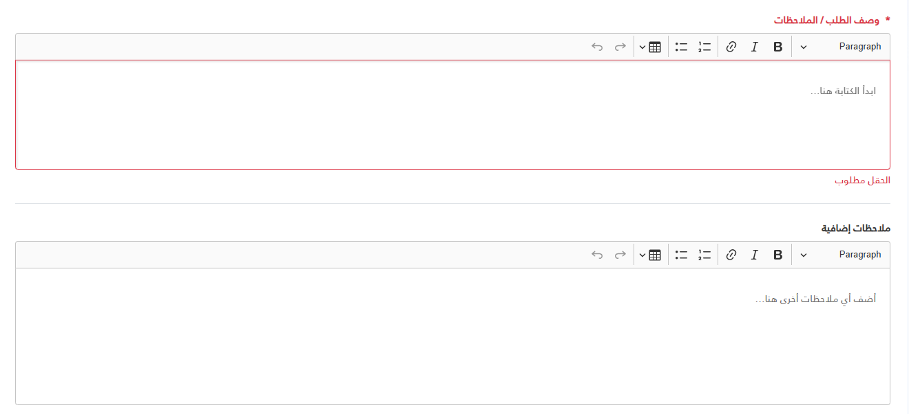

import Tabs from '@theme/Tabs';
import TabItem from '@theme/TabItem';

<Tabs>
<TabItem value="guide" label="Guide" default>
The `_CKEditor.cshtml` is a reusable partial view that integrates CKEditor 5 (Classic Build) into any Razor page with built-in validation, dynamic sizing, and automatic data synchronization.

## UI Preview

| State   | Preview                    |
| ------- | -------------------------- |
| Default |  |

---

## Basic Usage

You can use the partial by passing an anonymous object as the model:

```razor
<partial name="UI/_CKEditor"
         model='new { Id = "description", Label = "Description", Required = true }' />

  @await Html.PartialAsync("UI/_CKEditor", new {
      id = "editor1",
      label = "وصف الحالة",
      required = true,
      height = "200px"
  })

<!-- readonly version -->
  @await Html.PartialAsync("UI/_CKEditor", new { 
      id = "editor2", 
      label = "ملخص القضية (للعرض فقط)", 
      value = readonlyContent, 
      @readonly = true, 
      height = "320px" 
  })
```

## Available Properties

| Property | Type | Default | Description |
| :--- | :--- | :--- | :--- |
| `Id` | `string` | **Required** | The unique ID for the textarea and editor instance. |
| `Label` | `string` | `""` | The label text displayed above the editor. |
| `Required` | `bool` | `false` | If true, adds a red asterisk and enables built-in validation. |
| `Placeholder`| `string` | `Label` value | The placeholder text inside the editor. |
| `Height` | `string` | `160px` | The fixed height of the editor (e.g., "300px", "50vh"). |
| `Value` | `string` | `""` | The initial HTML content of the editor. |

## Advanced JavaScript API

The partial exposes a global `CKEditorManager` object to interact with editors programmatically.

### 1. Programmatic Validation
The partial automatically intercepts form submissions and "Save" buttons, but you can manually trigger validation:

```javascript
// Validate all CKEditors on the page
const allValid = window.CKEditorManager.validateAll();

// Validate a specific instance
const specificEditor = document.getElementById('myEditorId');
if (specificEditor.validate) {
    const isValid = specificEditor.validate(true); // pass true to focus if invalid
}
```

### 2. Accessing the CKEditor Instance
If you need to use the [CKEditor 5 API](https://ckeditor.com/docs/ckeditor5/latest/api/index.html) (e.g., to set/get data or listen to events):

```javascript
const editorElement = document.getElementById('myEditorId');
const editorInstance = editorElement.ckeditorInstance;

// Example: Manual Get Data
console.log(editorInstance.getData());

// Example: Manual Set Data
editorInstance.setData('<p>Hello World</p>');
```

### 3. Data Syncing
The `textarea` value is automatically kept in sync with the editor content on every change. This ensures that standard form posts and `jQuery.serialize()` work as expected.

## Customization Example

```razor
<div class="col-md-12">
    <partial name="UI/_CKEditor"
             model='new {
                 Id = "notes",
                 Label = "Additional Notes",
                 Placeholder = "Type your notes here...",
                 Height = "400px",
                 Required = true,
                 Value = "<p>Default content</p>"
             }' />
</div>
```

## Styling
The partial uses a CSS variable `--editor-height` to ensure the editor height remains persistent even during focus or state changes. You can override this globally or per container if needed.

```css
.my-custom-container {
    --editor-height: 600px;
}
```

</TabItem>


<TabItem value="_CkEditor.cshtml" label="_CkEditor.cshtml">

```cshtml
@model dynamic
@{
// Global assets check - ensure scripts and styles are loaded only once per page
const string AssetsKey = "CKEditor_Assets_Loaded";
bool assetsLoaded = Context.Items.ContainsKey(AssetsKey);
if (!assetsLoaded) Context.Items[AssetsKey] = true;

// Default values
string id = "";
string label = "";
bool required = false;
bool readOnly = false;
string placeholder = "";
string height = "160px";
string value = "";

// Robust extraction from dynamic model
if (Model != null)
{
if (Model is string modelId)
{
id = modelId;
}
else
{
var properties = Model.GetType().GetProperties();
foreach (var prop in properties)
{
var val = prop.GetValue(Model, null);
if (val == null) continue;

switch (prop.Name.ToLower())
{
case "id": id = val.ToString(); break;
case "label": label = val.ToString(); break;
case "required":
if (val is bool b) required = b;
else if (bool.TryParse(val.ToString(), out bool b2)) required = b2;
break;
case "readonly":
if (val is bool rb) readOnly = rb;
else if (bool.TryParse(val.ToString(), out bool rb2)) readOnly = rb2;
break;
case "height": height = val.ToString(); break;
case "value": value = val.ToString(); break;
case "placeholder": placeholder = val.ToString(); break;
}
}
}
}

if (string.IsNullOrEmpty(placeholder)) placeholder = label;
}

@if (!assetsLoaded)
{
<script src="~/ckeditor5-build-classic/ckeditor.js"></script>
<style>
	:root {
		--ck-error-color: #dc3545;
		--ck-border-radius: 4px;
	}

	.ckeditor-component-wrapper .ck-editor {
		width: 100%;
	}

	/* Content Styling */
	.ck-content.ck-editor__editable {
		font: inherit;
		color: inherit;
		line-height: inherit;
		padding: 1rem !important;
		min-height: 160px;
		max-height: 480px;
	}

	/* Lists */
	.ck-content.ck-editor__editable ul,
	.ck-content.ck-editor__editable ol {
		padding-left: 2.5rem !important;
		margin: 1rem 0;
		list-style-position: outside !important;
	}

	[dir="rtl"] .ck-content.ck-editor__editable ul,
	[dir="rtl"] .ck-content.ck-editor__editable ol {
		padding-right: 2.5rem !important;
		padding-left: 0 !important;
	}

	/* Tables */
	.ck-content.ck-editor__editable table {
		width: 100%;
		border-collapse: collapse;
		border: 1px solid #dee2e6;
		margin: 1rem 0;
	}

	.ck-content.ck-editor__editable td,
	.ck-content.ck-editor__editable th {
		padding: 0.75rem;
		border: 1px solid #dee2e6;
		min-width: 2em;
	}

	/* Validation States */
	.ckeditor-component-wrapper.is-invalid .ck-editor__editable {
		border-color: var(--ck-error-color) !important;
	}

	.ckeditor-component-wrapper.is-invalid .form-label {
		color: var(--ck-error-color) !important;
	}

	.ckeditor-error-message {
		display: none;
		color: var(--ck-error-color);
		font-size: 0.875rem;
		margin-top: 0.25rem;
	}

	.ckeditor-component-wrapper.is-invalid .ckeditor-error-message {
		display: block;
	}

	/* Readonly State */
	.ckeditor-component-wrapper.is-readonly .ck-editor__editable {
		background-color: #f8f9fa !important;
		color: #6c757d !important;
	}

	.ckeditor-component-wrapper.is-readonly .ck-toolbar {
		pointer-events: none;
		opacity: 0.5;
	}

	.ckeditor-component-wrapper.is-readonly .ck-editor__editable * {
		user-select: text;
	}

	/* UI Overlays */
	.ck.ck-balloon-panel {
		z-index: 10001 !important;
	}

	.ck.ck-body_wrapper {
		z-index: 10002 !important;
	}
</style>

<script>
	/**
	 * Core CKEditor Initialization Logic
	 */
	window.CKEditorManager = {
		defaultConfig: {
			removePlugins: ['CKFinderUploadAdapter', 'CKFinder', 'EasyImage', 'Image', 'ImageCaption', 'ImageStyle', 'ImageToolbar', 'ImageUpload', 'MediaEmbed'],
			toolbar: ['heading', '|', 'bold', 'italic', 'link', '|', 'numberedList', 'bulletedList', '|', 'insertTable', '|', 'undo', 'redo'],
			language: 'ar',
			htmlSupport: { allow: [{ name: /.*/, attributes: true, classes: true, styles: true }] }
		},

		init(elementId, options = {}) {
			const element = typeof elementId === 'string' ? document.getElementById(elementId) : elementId;
			if (!element) return Promise.resolve(null);

			const { readonly, height, ...editorOptions } = options;
			const config = { ...this.defaultConfig, ...editorOptions };

			return ClassicEditor.create(element, config)
				.then(editor => {
					element.ckeditorInstance = editor;
					this.applyCustomStyles(editor, height);
					if (readonly) {
						editor.enableReadOnlyMode('readonly-lock');
						const wrapper = element.closest('.ckeditor-component-wrapper');
						if (wrapper) wrapper.classList.add('is-readonly');
					} else {
						this.setupValidation(element, editor);
						this.setupDataSync(element, editor);
					}
					return editor;
				})
				.catch(err => {
					console.error('CKEditor Init Error:', err);
					return null;
				});
		},

		applyCustomStyles(editor, height = '160px') {
			const editable = editor.ui.getEditableElement();
			if (!editable) return;
			editable.style.minHeight = height;
			if (height && height !== 'auto') editable.style.height = height;
		},

		setupValidation(element, editor) {
			element.validate = (focus = false) => {
				if (!element.hasAttribute('required')) return true;

				const content = editor.getData().replace(/<[^>]*>/g, '').replace(/&nbsp;/g, ' ').trim();
				const isValid = content.length > 0;

				const wrapper = element.closest('.ckeditor-component-wrapper');
				if (wrapper) wrapper.classList.toggle('is-invalid', !isValid);

				if (!isValid && focus) editor.editing.view.focus();
				return isValid;
			};

			editor.ui.focusTracker.on('change:isFocused', (evt, name, isFocused) => {
				if (!isFocused) element.validate();
			});
		},

		setupDataSync(element, editor) {
			editor.model.document.on('change:data', () => {
				element.value = editor.getData();

				const wrapper = element.closest('.ckeditor-component-wrapper');
				if (wrapper && wrapper.classList.contains('is-invalid')) element.validate();

				if (window.jQuery) {
					const $el = jQuery(element);
					const $form = $el.closest('form');
					if ($form.data('validator')) $form.validate().element(element);
				}
			});
		},

		validateAll(container = document) {
			const editors = container.querySelectorAll('.ckeditor-component-wrapper textarea');
			let firstInvalid = null;

			editors.forEach(el => {
				if (typeof el.validate === 'function' && !el.validate()) {
					if (!firstInvalid) firstInvalid = el;
				}
			});

			if (firstInvalid) firstInvalid.validate(true);
			return !firstInvalid;
		}
	};

	// Legacy support helpers
	window.initSharedCKEditor = (id, options) => window.CKEditorManager && window.CKEditorManager.init(id, options);
	window.validateAllCKEditors = (container) => window.CKEditorManager && window.CKEditorManager.validateAll(container);

	// Global Interceptor for Save/Submit buttons
	document.addEventListener('click', (e) => {
		const btn = e.target.closest('button[type="submit"], .btn-save, #btnSaveEdits, .btn-primary');
		if (btn && window.CKEditorManager && typeof window.CKEditorManager.validateAll === 'function') {
			if (!window.CKEditorManager.validateAll()) {
				e.preventDefault();
				e.stopImmediatePropagation();
			}
		}
	}, true);
</script>
}

@if (!string.IsNullOrEmpty(id))
{
<div class="mb-4 ckeditor-component-wrapper" data-editor-id="@id">
	@if (!string.IsNullOrEmpty(label))
	{
	<label class="form-label fw-bold text-dark mb-2" for="@id">
		@if (required) { <span class="text-danger me-1">*</span> }
		@label
	</label>
	}

	<textarea id="@id" name="@id" class="form-control" placeholder="@placeholder" @(required ? "required" : ""
		)>@Html.Raw(value)</textarea>

	<div class="ckeditor-error-message" id="@id-error">@label مطلوب</div>

	<script>
		(function () {
			const init = () => {
				if (window.CKEditorManager) {
					window.CKEditorManager.init('@id', { height: '@height', readonly: @(readOnly ? "true" : "false") });
				}
			};
			if (document.readyState === 'loading') {
				document.addEventListener('DOMContentLoaded', init);
			} else {
				init();
			}
		})();
	</script>
</div>
}

```

</TabItem>
</Tabs>
