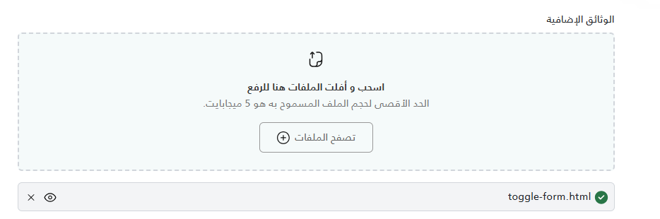

import Tabs from '@theme/Tabs';
import TabItem from '@theme/TabItem';
import Playground from '@site/src/components/Playground';

<Tabs>
<TabItem value="guide" label="Guide" default>

A reusable file upload component that supports drag-and-drop, client-side validation (file size, type, max count), and managing a list of uploaded files.

## UI Preview

| State     | Preview                         |
| --------- | ------------------------------- |
| Default   |  |
| File List |         |

---

## Usage

### 1. Render the Component
Use the `partial` tag to include the component in your Razor view.

```cshtml
<!-- Minimal usage -->
<partial name="UI/_FileUpload/_FileUpload"
         model='("Document Label", true, "my-uploader-id")' />

<!-- Full usage with constraints -->
<partial name="UI/_FileUpload/_FileUpload"
         model='("Profile Picture", true, "avatar-uploader", 1, new string[] { "image/png", "image/jpeg" })' />

<!-- Full usage with all parameters -->
<partial name="UI/_FileUpload/_FileUpload" model='(@Label, @Required, @Id, @MaxFiles, @AllowedFileTypes, @MaxFileSize)' />

```

### 2. Handle Files via JavaScript
The component registers itself in a global object `window.fileUploads`. You can access the specific instance using the **Id** you provided.

```javascript
document.getElementById('myForm').addEventListener('submit', function(e) {
    e.preventDefault();

    // Access the uploader instance by ID
    var uploader = window.fileUploads["my-uploader-id"];

    // Get the array of native File objects
    var files = uploader ? uploader.getFiles() : [];

    // process files (e.g., add to FormData)
    var formData = new FormData();
    files.forEach(file => {
        formData.append("Documents", file);
    });

    // submit formData...
});
```

## Properties

The model is a `ValueTuple` requiring specific order.

| Position | Name | Type | Description | Example / Note |
| :---: | :--- | :--- | :--- | :--- |
| **1** | `Label` | `string` | The text label displayed above the upload area. | `"Personal Photo"` |
| **2** | `Required` | `bool` | Toggles the required asterisk (*) and hidden input validation. | `true` or `false` |
| **3** | `Id` | `string` | **Unique** identifier for this uploader instance. Used for JS access. | `"user-docs-1"` |
| **4** | `MaxFiles` | `int?` | (Optional) Maximum number of files allowed. | `1` (single mode) or `5` (limit) |
| **5** | `AllowedFileTypes` | `string[]` | (Optional) Array of allowed MIME types. Null allows all. | `new[] &#123; "application/pdf" &#125;` |
| **6** | `MaxFileSize` | `double` | (Optional) Maximum file size in MB. Default is 5 MB. | `10` or `2.5` |


</TabItem>
<TabItem value="playground" label="Playground">

<Playground componentName="FileUpload" />

</TabItem>
<TabItem value="_FileUpload.cshtml" label="_FileUpload.cshtml">

```cshtml
@using System.Runtime.CompilerServices
@model ITuple
@{
// ── Parameter extraction ──────────────────────────────────────────────
var label = (string)Model[0];
var required = (bool)Model[1];
var id = (string)Model[2];
int? maxFiles = Model.Length > 3 ? (int)Model[3] : null;
string[] allowedFileTypes = Model.Length > 4 ? (string[])Model[4] : null;

double maxFileSizeDouble = 5.0;
if (Model.Length > 5)
{
try { maxFileSizeDouble = System.Convert.ToDouble(Model[5]); }
catch { maxFileSizeDouble = 5.0; }
}
int maxFileSize = (int)Math.Ceiling(maxFileSizeDouble);

string renderMode = Model.Length > 6 ? (string)Model[6] : "full";

// ── Friendly MIME-type label ──────────────────────────────────────────
string GetFriendlyName(string mimeType)
{
var map = new System.Collections.Generic.Dictionary<string, string>(System.StringComparer.OrdinalIgnoreCase)
	{
	{ "application/pdf", "PDF" },
	{ "application/msword", "Word" },
	{ "application/vnd.openxmlformats-officedocument.wordprocessingml.document", "Word" },
	{ "application/vnd.ms-excel", "Excel" },
	{ "application/vnd.openxmlformats-officedocument.spreadsheetml.sheet", "Excel" },
	{ "image/png", "PNG" },
	{ "image/jpeg", "JPEG" },
	{ "image/jpg", "JPG" },
	{ "application/zip", "ZIP" },
	{ "application/x-zip-compressed", "ZIP" },
	{ "application/zip-compressed", "ZIP" },
	{ "application/x-zip", "ZIP" },
	{ "application/x-rar-compressed", "RAR" },
	{ "application/vnd.rar", "RAR" }
	};

	if (map.TryGetValue(mimeType, out var name)) return name;

	try { return mimeType.Split('/')[1].ToUpper().Replace("X-", "").Replace("-COMPRESSED", ""); }
	catch { return mimeType; }
	}

	var friendlyTypes = allowedFileTypes != null && allowedFileTypes.Any()
	? "، وصيغ الملفات المدعومة تشمل " + string.Join(" , ", allowedFileTypes.Select(t => GetFriendlyName(t)).Distinct())
	: "";
	}

	<!-- ════════════════════════  HTML  ════════════════════════ -->

@if (renderMode == "short")
{
	<!-- ── Short render: icon + link trigger ─────────────────────────── -->
	<div id="@id" class="file-upload-container">
		<div class="d-flex align-items-center gap-2 file-upload-short-trigger" style="cursor:pointer; margin:0.5rem 0">
			<!-- Paperclip icon -->
			<svg xmlns="http://www.w3.org/2000/svg" width="17" height="20" fill="none" viewBox="0 0 17 20"><path fill="#000" fill-rule="evenodd" d="M5.75 1.5A4.25 4.25 0 0 0 1.5 5.75v5.5a6.75 6.75 0 0 0 13.5 0v-1.5a.75.75 0 0 1 1.5 0v1.5a8.25 8.25 0 0 1-16.5 0v-5.5a5.75 5.75 0 1 1 11.5 0v5.5a3.25 3.25 0 0 1-6.5 0v-4a.75.75 0 0 1 1.5 0v4a1.75 1.75 0 1 0 3.5 0v-5.5A4.25 4.25 0 0 0 5.75 1.5" clip-rule="evenodd"/></svg>

			<!-- Trigger text acts as the browse button -->
			<button type="button" class="file-input-button btn p-0 py-2 border-0 bg-transparent"
				style="font-weight:500;text-decoration:none;">
				إضافة مرفق
			</button>
		</div>

		<!-- Hidden inputs (same as full mode) -->
		<div class="drag-area" style="display:none!important;">
			<span class="drag-file"></span>
			<input type="file" class="file-input" name="@id" hidden />
			<input type="text" class="file-validation-input" name="@(id)_validation"
				style="opacity:0;width:1px;height:1px;position:absolute;z-index:-1;" @(required ? "required" : "") />
		</div>

		<!-- Error messages -->
		<p class="text-sm hidden text-danger mt-1 mb-0 filesize-error">حجم الملف يجب أن يكون أقل من @maxFileSize ميجا بايت</p>
		<p class="text-sm hidden text-danger mt-1 mb-0 filetype-error">الملف يجب أن يكون بإحدى الصيغ المدعومة</p>
		<p class="text-sm hidden text-danger mt-1 mb-0 required-error">هذا الحقل مطلوب</p>
		<p class="text-sm hidden text-danger mt-1 mb-0 maxfiles-error">لقد تجاوزت الحد الأقصى لعدد الملفات المسموح به (@maxFiles)</p>

		<ul class="w-100 px-0 document-images mt-1"></ul>
	</div>
}
else
{
	<!-- ── Full render (default) ──────────────────────────────────────── -->
	<div id="@id" class="col-12 mt-3 file-upload-container">
		<label class="form-label">
			@if (required) { <span style="color:#B42318;">*</span> }
			@label
		</label>

		<div class="d-flex flex-column align-items-center w-100">
			<!-- Drop zone -->
			<section class="w-100">
				<div class="d-flex flex-column align-items-center p-4 drag-area border-dotted rounded mb-3"
					style="background:#00A79D0D;">

					<!-- Upload icon -->
					<svg class="upload-icon" width="24" height="24" viewBox="0 0 24 24" fill="none"
						xmlns="http://www.w3.org/2000/svg">
						<path fill-rule="evenodd" clip-rule="evenodd"
							d="M12.9998 1.25C16.1608 1.25 17.903 1.25 19.23 2.185C19.611 2.453 19.95 2.773 20.24 3.136C21.251 4.407 21.251 6.034 21.251 9.273V11.818C21.251 14.873 21.251 16.406 20.729 17.722C19.895 19.827 18.139 21.484 15.911 22.266C14.7097 22.6868 13.3248 22.741 10.8533 22.748C10.841 22.749 10.8287 22.75 10.8163 22.751C10.8019 22.7521 10.7878 22.751 10.7741 22.7482C10.4315 22.749 10.0683 22.749 9.68208 22.749C7.80016 22.749 6.85498 22.749 6.01699 22.455C4.65599 21.977 3.582 20.963 3.071 19.674C2.75 18.865 2.75 17.968 2.75 16.1821V11.6694C2.75 11.2554 3.086 10.9194 3.5 10.9194C3.914 10.9194 4.25 11.2554 4.25 11.6694V16.182C4.25 17.7779 4.25 18.579 4.46499 19.122C4.81599 20.007 5.56301 20.707 6.51301 21.041C7.11001 21.251 7.96899 21.251 9.68096 21.251C10.0634 21.251 10.4221 21.251 10.7591 21.2502C12.0619 21.1198 13.083 20.0167 13.083 18.6801C13.083 18.5202 13.075 18.3479 13.0666 18.1657L13.0647 18.1252C13.0398 17.5806 13.0115 16.964 13.165 16.3881C13.388 15.5561 14.043 14.9011 14.875 14.6781C15.4506 14.5248 16.0659 14.5529 16.6112 14.5778L16.6511 14.5797C16.8339 14.5881 17.0067 14.5961 17.167 14.5961C18.5666 14.5961 19.7102 13.4765 19.749 12.086C19.749 11.9985 19.749 11.9095 19.749 11.8192V9.274C19.749 6.383 19.749 4.932 19.064 4.071C18.864 3.82 18.629 3.598 18.364 3.413C17.465 2.78 15.9868 2.752 12.9978 2.752C12.5838 2.752 12.2478 2.416 12.2478 2.002C12.2478 1.588 12.5838 1.252 12.9978 1.252L12.9998 1.25ZM19.6944 15.2175C18.9986 15.7675 18.1204 16.0961 17.167 16.0961C16.9762 16.0961 16.7811 16.0875 16.5905 16.079C16.5763 16.0784 16.5621 16.0777 16.548 16.0771L16.5321 16.0764C16.0781 16.0556 15.6109 16.0342 15.263 16.1281C14.948 16.2121 14.699 16.4611 14.615 16.7761C14.5212 17.1283 14.5429 17.6009 14.5638 18.0578L14.564 18.0611C14.574 18.2651 14.583 18.4751 14.583 18.6801C14.583 19.6161 14.2663 20.4796 13.7344 21.1691C14.4126 21.1122 14.9462 21.0157 15.413 20.852C17.23 20.214 18.659 18.872 19.333 17.171C19.5375 16.6548 19.6415 16.0447 19.6944 15.2175Z"
							fill="#161616" />
						<path
							d="M5.58933 4.35931C5.39711 4.60404 5.19487 4.86115 5.03781 5.02274C4.74911 5.31977 4.27428 5.32651 3.97726 5.03781C3.68023 4.74911 3.67349 4.27428 3.96219 3.97726C4.05089 3.886 4.19651 3.70419 4.40971 3.43276L4.45675 3.37284C4.64683 3.13069 4.8698 2.84663 5.09954 2.57551C5.34574 2.28495 5.62131 1.98316 5.89679 1.74854C6.03484 1.63096 6.19043 1.51499 6.35782 1.42541C6.51926 1.33902 6.74172 1.25 7 1.25C7.25829 1.25 7.48074 1.33902 7.64218 1.42541C7.80957 1.51499 7.96517 1.63096 8.10321 1.74854C8.37869 1.98316 8.65426 2.28495 8.90047 2.57551C9.1302 2.84663 9.35317 3.13068 9.54324 3.37282L9.59029 3.43276C9.80349 3.70419 9.94911 3.886 10.0378 3.97726C10.3265 4.27428 10.3198 4.74911 10.0227 5.03781C9.72572 5.32651 9.25089 5.31977 8.96219 5.02274C8.80513 4.86115 8.6029 4.60404 8.41067 4.3593L8.36595 4.30235C8.17304 4.05663 7.96675 3.79386 7.75606 3.54522L7.75 3.53807V10C7.75 10.4142 7.41421 10.75 7 10.75C6.58579 10.75 6.25 10.4142 6.25 10V3.53807L6.24394 3.54522C6.03326 3.79385 5.82698 4.05661 5.63408 4.30232L5.58933 4.35931Z"
							fill="#161616" />
					</svg>

					<header class="mt-3">
						<span class="drag-file font-weight-bold">اسحب و أفلت الملفات هنا للرفع</span>
					</header>

					<p class="text-center text-dark-grey mb-0">
						الحد الأقصى لحجم الملف المسموح به هو @maxFileSize ميجابايت@(friendlyTypes).
					</p>

					<button type="button" class="btn btn-outline-secondary file-input-button mt-3">
						تصفح الملفات
						<svg class="ms-1" width="18" height="18" viewBox="0 0 18 18" fill="none" xmlns="http://www.w3.org/2000/svg">
							<path
								d="M9.58333 5.625C9.58333 5.27982 9.30351 5 8.95833 5C8.61316 5 8.33333 5.27982 8.33333 5.625V8.33333H5.625C5.27982 8.33333 5 8.61316 5 8.95833C5 9.30351 5.27982 9.58333 5.625 9.58333H8.33333V12.2917C8.33333 12.6368 8.61316 12.9167 8.95833 12.9167C9.30351 12.9167 9.58333 12.6368 9.58333 12.2917V9.58333H12.2917C12.6368 9.58333 12.9167 9.30351 12.9167 8.95833C12.9167 8.61316 12.6368 8.33333 12.2917 8.33333H9.58333V5.625Z"
								fill="#161616" />
							<path fill-rule="evenodd" clip-rule="evenodd"
								d="M8.95833 17.9167C4.01078 17.9167 0 13.9059 0 8.95833C0 4.01078 4.01078 0 8.95833 0C13.9059 0 17.9167 4.01078 17.9167 8.95833C17.9167 13.9059 13.9059 17.9167 8.95833 17.9167ZM1.25 8.95833C1.25 13.2155 4.70114 16.6667 8.95833 16.6667C13.2155 16.6667 16.6667 13.2155 16.6667 8.95833C16.6667 4.70114 13.2155 1.25 8.95833 1.25C4.70114 1.25 1.25 4.70114 1.25 8.95833Z"
								fill="#161616" />
						</svg>
					</button>

					<input type="file" class="file-input" name="@id" hidden />
					<input type="text" class="file-validation-input" name="@(id)_validation"
						style="opacity:0;width:1px;height:1px;position:absolute;z-index:-1;" @(required ? "required" : "" ) />

					<!-- Error messages -->
					<p class="text-center text-sm hidden text-danger mt-3 mb-0 filesize-error">
						حجم الملف يجب أن يكون أقل من @maxFileSize ميجا بايت
					</p>
					<p class="text-center text-sm hidden text-danger mt-3 mb-0 filetype-error">
						الملف يجب أن يكون بإحدى الصيغ المدعومة
					</p>
					<p class="text-center text-sm hidden text-danger mt-3 mb-0 required-error">
						هذا الحقل مطلوب
					</p>
					<p class="text-center text-sm hidden text-danger mt-3 mb-0 maxfiles-error">
						لقد تجاوزت الحد الأقصى لعدد الملفات المسموح به (@maxFiles)
					</p>
				</div>
			</section>

			<p class="hidden text-sm text-red-600 text-center bg-pink-200 mt-6 p-3 rounded-lg input-empty-error"></p>
			<ul class="w-100 px-0 document-images"></ul>
		</div>

	</div>
}
	@await Html.PartialAsync("UI/_FilePreview")

	<!-- ════════════════════════  JavaScript  ════════════════════════ -->

	<script>
		if (typeof window.initDragDropUpload === 'undefined') {
			window.initDragDropUpload = function (containerId, maxFiles, allowedFileTypes, maxFileSize) {
				const container = document.getElementById(containerId);
				if (!container) return null;

				// ── SVG icon constants ────────────────────────────────────────
				const ICONS = {
					checkCircle: '<svg width="20" height="21" viewBox="0 0 20 21" fill="none" xmlns="http://www.w3.org/2000/svg"><path fill-rule="evenodd" clip-rule="evenodd" d="M10.0002 19.6668C15.0628 19.6668 19.1668 15.5628 19.1668 10.5002C19.1668 5.43755 15.0628 1.3335 10.0002 1.3335C4.93755 1.3335 0.833496 5.43755 0.833496 10.5002C0.833496 15.5628 4.93755 19.6668 10.0002 19.6668Z" fill="white"/><path fill-rule="evenodd" clip-rule="evenodd" d="M10.0002 19.6668C15.0628 19.6668 19.1668 15.5628 19.1668 10.5002C19.1668 5.43755 15.0628 1.3335 10.0002 1.3335C4.93755 1.3335 0.833496 5.43755 0.833496 10.5002C0.833496 15.5628 4.93755 19.6668 10.0002 19.6668ZM5.87534 9.76793C5.54991 10.0934 5.54991 10.621 5.87534 10.9464L8.23237 13.3035C8.5578 13.6289 9.08544 13.6289 9.41088 13.3035L14.1249 8.58942C14.4504 8.26398 14.4504 7.73634 14.1249 7.41091C13.7995 7.08547 13.2718 7.08547 12.9464 7.41091L8.82162 11.5357L7.05385 9.76793C6.72842 9.44249 6.20078 9.44249 5.87534 9.76793Z" fill="#067647"/></svg>',

					eye: '<svg width="18" height="17" viewBox="0 0 15 15" fill="none" xmlns="http://www.w3.org/2000/svg"><path d="M0.5 7.5L0.0357612 7.31431C-0.0119204 7.43351-0.0119204 7.56649 0.0357612 7.68569L0.5 7.5ZM14.5 7.5L14.9642 7.6857C15.0119 7.56649 15.0119 7.43351 14.9642 7.3143L14.5 7.5ZM7.49998 12C5.18597 12 3.56111 10.8483 2.49664 9.66552C1.96405 9.07375 1.57811 8.48029 1.32563 8.03474C1.19968 7.81247 1.10772 7.62838 1.04797 7.50164C1.01811 7.4383 0.996349 7.3894 0.98246 7.35735C0.975517 7.34133 0.970545 7.32953 0.967517 7.32225C0.966003 7.31861 0.964975 7.3161 0.96443 7.31477C0.964157 7.3141 0.964005 7.31372 0.963973 7.31364C0.963958 7.3136 0.963972 7.31364 0.964016 7.31375C0.964038 7.31381 0.964094 7.31394 0.964105 7.31397C0.964168 7.31413 0.964239 7.31431 0.5 7.5C0.0357612 7.68569 0.0358471 7.68591 0.0359408 7.68614C0.0359823 7.68625 0.036084 7.6865 0.0361671 7.68671C0.0363335 7.68712 0.0365311 7.68761 0.0367599 7.68818C0.0372175 7.68931 0.0377999 7.69075 0.0385076 7.69248C0.0399231 7.69595 0.0418401 7.70062 0.0442628 7.70644C0.0491078 7.71808 0.0559773 7.73436 0.0649031 7.75495C0.0827516 7.79614 0.108844 7.85467 0.143439 7.92805C0.212592 8.07474 0.315944 8.28128 0.455611 8.52776C0.734381 9.01971 1.16093 9.67625 1.75334 10.3345C2.93886 11.6517 4.814 13 7.49998 13V12ZM0.5 7.5C0.964239 7.68569 0.964168 7.68587 0.964105 7.68603C0.964094 7.68606 0.964038 7.68619 0.964016 7.68625C0.963972 7.68636 0.963958 7.6864 0.963973 7.68636C0.964005 7.68628 0.964157 7.6859 0.96443 7.68523C0.964975 7.6839 0.966003 7.68139 0.967517 7.67775C0.970545 7.67047 0.975517 7.65867 0.98246 7.64265C0.996349 7.6106 1.01811 7.5617 1.04797 7.49836C1.10772 7.37162 1.19968 7.18753 1.32563 6.96526C1.57811 6.51971 1.96405 5.92625 2.49664 5.33448C3.56111 4.15173 5.18597 3 7.49998 3V2C4.814 2 2.93886 3.34827 1.75334 4.66552C1.16093 5.32375 0.734381 5.98029 0.455611 6.47224C0.315944 6.71872 0.212592 6.92526 0.143439 7.07195C0.108844 7.14533 0.0827516 7.20386 0.0649031 7.24505C0.0559773 7.26564 0.0491078 7.28192 0.0442628 7.29356C0.0418401 7.29938 0.0399231 7.30405 0.0385076 7.30752C0.0377999 7.30925 0.0372175 7.31069 0.0367599 7.31182C0.0365311 7.31239 0.0363335 7.31288 0.0361671 7.31329C0.036084 7.3135 0.0359823 7.31375 0.0359408 7.31386C0.0358471 7.31409 0.0357612 7.31431 0.5 7.5ZM7.49998 3C9.814 3 11.4389 4.15173 12.5033 5.33448C13.0359 5.92625 13.4219 6.51971 13.6744 6.96526C13.8003 7.18754 13.8923 7.37162 13.952 7.49837C13.9819 7.5617 14.0037 7.6106 14.0175 7.64265C14.0245 7.65868 14.0295 7.67048 14.0325 7.67775C14.034 7.68139 14.035 7.6839 14.0356 7.68524C14.0358 7.6859 14.036 7.68628 14.036 7.68636C14.036 7.6864 14.036 7.68636 14.036 7.68625C14.036 7.6862 14.0359 7.68606 14.0359 7.68603C14.0358 7.68587 14.0358 7.6857 14.5 7.5C14.9642 7.3143 14.9642 7.31409 14.9641 7.31385C14.964 7.31375 14.9639 7.3135 14.9638 7.31329C14.9637 7.31288 14.9635 7.31239 14.9632 7.31182C14.9628 7.31069 14.9622 7.30925 14.9615 7.30752C14.9601 7.30405 14.9582 7.29938 14.9557 7.29356C14.9509 7.28192 14.944 7.26564 14.9351 7.24504C14.9172 7.20385 14.8912 7.14533 14.8566 7.07195C14.7874 6.92526 14.6841 6.71871 14.5444 6.47224C14.2656 5.98029 13.8391 5.32375 13.2466 4.66552C12.0611 3.34827 10.186 2 7.49998 2V3ZM14.5 7.5C14.0358 7.3143 14.0358 7.31413 14.0359 7.31397C14.0359 7.31394 14.036 7.3138 14.036 7.31375C14.036 7.31364 14.036 7.3136 14.036 7.31364C14.036 7.31372 14.0358 7.3141 14.0356 7.31476C14.035 7.3161 14.034 7.31861 14.0325 7.32225C14.0295 7.32952 14.0245 7.34132 14.0175 7.35735C14.0037 7.3894 13.9819 7.4383 13.952 7.50163C13.8923 7.62838 13.8003 7.81246 13.6744 8.03474C13.4219 8.48029 13.0359 9.07375 12.5033 9.66552C11.4389 10.8483 9.814 12 7.49998 12V13C10.186 13 12.0611 11.6517 13.2466 10.3345C13.8391 9.67625 14.2656 9.01971 14.5444 8.52776C14.6841 8.28129 14.7874 8.07474 14.8566 7.92805C14.8912 7.85467 14.9172 7.79615 14.9351 7.75496C14.944 7.73436 14.9509 7.71808 14.9557 7.70644C14.9582 7.70062 14.9601 7.69595 14.9615 7.69248C14.9622 7.69075 14.9628 7.68931 14.9632 7.68818C14.9635 7.68761 14.9637 7.68712 14.9638 7.68671C14.9639 7.6865 14.964 7.68625 14.9641 7.68615C14.9642 7.68591 14.9642 7.6857 14.5 7.5ZM7.5 9C6.67157 9 6 8.32843 6 7.5H5C5 8.88071 6.11929 10 7.5 10V9ZM9 7.5C9 8.32843 8.32843 9 7.5 9V10C8.88071 10 10 8.88071 10 7.5H9ZM7.5 6C8.32843 6 9 6.67157 9 7.5H10C10 6.11929 8.88071 5 7.5 5V6ZM7.5 5C6.11929 5 5 6.11929 5 7.5H6C6 6.67157 6.67157 6 7.5 6V5Z" fill="#000000"/></svg>',

					close: '<svg width="20" height="21" viewBox="0 0 20 21" fill="none" xmlns="http://www.w3.org/2000/svg"><path fill-rule="evenodd" clip-rule="evenodd" d="M5.64645 6.14645C5.84171 5.95118 6.15829 5.95118 6.35355 6.14645L10 9.79289L13.6464 6.14645C13.8417 5.95118 14.1583 5.95118 14.3536 6.14645C14.5488 6.34171 14.5488 6.65829 14.3536 6.85355L10.7071 10.5L14.3536 14.1464C14.5488 14.3417 14.5488 14.6583 14.3536 14.8536C14.1583 15.0488 13.8417 15.0488 13.6464 14.8536L10 11.2071L6.35355 14.8536C6.15829 15.0488 5.84171 15.0488 5.64645 14.8536C5.45118 14.6583 5.45118 14.3417 5.64645 14.1464L9.29289 10.5L5.64645 6.85355C5.45118 6.65829 5.45118 6.34171 5.64645 6.14645Z" fill="#161616" /></svg>',

					fileFallback: '<svg width="48" height="48" viewBox="0 0 24 24" fill="none" xmlns="http://www.w3.org/2000/svg" style="margin-bottom:16px;"><path d="M14 2H6a2 2 0 0 0-2 2v16a2 2 0 0 0 2 2h12a2 2 0 0 0 2-2V8l-6-6z" fill="#E5E7EB" stroke="#9CA3AF" stroke-width="1"/><path d="M14 2v6h6" fill="none" stroke="#9CA3AF" stroke-width="1"/></svg>'
				};

				// ── Configuration ─────────────────────────────────────────────
				maxFileSize = maxFileSize || 5;

				const DRAG_TEXT_DEFAULT = 'اسحب و أفلت الملفات هنا للرفع';
				const DRAG_TEXT_ACTIVE = 'أفلت الملف هنا للرفع';

				// ── DOM references (cached once) ──────────────────────────────
				const dropArea = container.querySelector('.drag-area');
				const dragFile = dropArea.querySelector('.drag-file');
				const browseButton = container.querySelector('.file-input-button');
				const fileInput = dropArea.querySelector('.file-input');
				const documentImages = container.querySelector('.document-images');
				const validationInput = container.querySelector('.file-validation-input');

				// Error message elements
				const errors = {
					filesize: container.querySelector('.filesize-error'),
					filetype: container.querySelector('.filetype-error'),
					required: container.querySelector('.required-error'),
					maxfiles: container.querySelector('.maxfiles-error'),
				};

				// ── State ─────────────────────────────────────────────────────
				let uploadedFiles = [];

				// ── Event system ──────────────────────────────────────────────
				const listeners = {};

				function emit(event, data) {
					(listeners[event] || []).forEach(cb => cb(data));
				}

				// ── Error helpers ─────────────────────────────────────────────
				function showError(key) { if (errors[key]) errors[key].classList.remove('hidden'); }
				function hideError(key) { if (errors[key]) errors[key].classList.add('hidden'); }
				function hideAllErrors() { Object.keys(errors).forEach(hideError); }

				// ── Multiple attribute ────────────────────────────────────────
				if (!maxFiles || maxFiles > 1) {
					fileInput.setAttribute('multiple', 'multiple');
				} else {
					fileInput.removeAttribute('multiple');
				}

				// ── Validation input sync ─────────────────────────────────────
				function updateValidationInput() {
					if (!validationInput) return;
					const hasFiles = uploadedFiles.length > 0;
					validationInput.value = hasFiles ? 'valid' : '';
					if (hasFiles) hideError('required');
				}

				// ── File list item builder ────────────────────────────────────
				function createFileListItem(fileName) {
					const li = document.createElement('li');
					li.className = 'pb-3 flex justify-between items-center md:items-end text-xs md:text-sm text-slate-700 border-b-2 border-slate-100 gap-1 document-file';
					li.innerHTML = `
				<div style="background-color:#F3F4F6;border:1px solid #D2D6DB;" class="w-100 p-2 d-flex align-items-center justify-content-between rounded">
					<div class="d-flex align-items-center">
						<p class="whitespace-nowrap overflow-hidden text-ellipsis w-40 mb-0">
							${ICONS.checkCircle}
							<span class="mb-0 fileName">${fileName}</span>
						</p>
					</div>
					<div class="d-flex align-items-start gap-2">
						<button type="button" class="preview-document btn p-0 bg-transparent border-0" title="معاينة">${ICONS.eye}</button>
						<button type="button" class="delete-document btn-btn-link p-0 bg-transparent border-0">${ICONS.close}</button>
					</div>
				</div>`;
					return li;
				}

				// ── File validation helpers ───────────────────────────────────
				function isFileSizeValid(file) {
					return (file.size / (1024 * 1024)) <= maxFileSize;
				}

				function isFileTypeValid(file) {
					return !allowedFileTypes || allowedFileTypes.length === 0 || allowedFileTypes.includes(file.type);
				}

				// ── Add single file to the list ───────────────────────────────
				function addFile(file) {
					if (!isFileSizeValid(file)) {
						showError('filesize');
						hideError('filetype');
						return;
					}

					hideError('filesize');

					if (!isFileTypeValid(file)) {
						showError('filetype');
						return;
					}

					hideError('filetype');

					documentImages.append(createFileListItem(file.name));
					uploadedFiles.push(file);
					updateValidationInput();
					emit('file-added', file);
					emit('change', uploadedFiles);
				}

				// ── Handle incoming files ─────────────────────────────────────
				function handleFiles(files) {
					if (!files || files.length === 0) {
						showError('required');
						return;
					}

					Array.from(files).forEach(file => {
						if (maxFiles && uploadedFiles.length >= maxFiles) {
							showError('maxfiles');
							return;
						}
						hideError('maxfiles');
						addFile(file);
					});
				}

				// ── Browse button ─────────────────────────────────────────────
				browseButton.onclick = () => fileInput.click();

				fileInput.addEventListener('change', (e) => {
					handleFiles(e.target.files);
					e.target.value = '';
				});

				// ── Validation input required ─────────────────────────────────
				if (validationInput) {
					validationInput.addEventListener('invalid', () => showError('required'));
				}

				// ── File list click delegation (preview & delete) ─────────────
				documentImages.addEventListener('click', (e) => {
					const target = e.target;

					// Preview
					const previewBtn = target.closest('.preview-document');
					if (previewBtn) {
						const docItem = previewBtn.closest('.document-file');
						if (docItem) {
							const docName = docItem.querySelector('span.fileName').innerText;
							const file = uploadedFiles.find(f => f.name === docName);
							if (file && typeof showFilePreview === 'function') {
								showFilePreview(file);
							}
						}
						return;
					}

					// Delete
					const deleteBtn = target.closest('.delete-document');
					const docItem = target.closest('.document-file');
					if (!deleteBtn || !docItem) return;

					const docName = docItem.querySelector('span.fileName').innerText;
					const index = uploadedFiles.findIndex(f => f.name === docName);

					if (index !== -1) {
						const removed = uploadedFiles.splice(index, 1)[0];
						updateValidationInput();
						if (!maxFiles || uploadedFiles.length < maxFiles) hideError('maxfiles');
						emit('file-removed', removed);
						emit('change', uploadedFiles);
					}
					docItem.remove();
				});

				// ── Drag & drop ───────────────────────────────────────────────
				dropArea.addEventListener('dragover', (e) => {
					e.preventDefault();
					dropArea.classList.add('active');
					dragFile.textContent = DRAG_TEXT_ACTIVE;
				});

				dropArea.addEventListener('dragleave', () => {
					dropArea.classList.remove('active');
					dragFile.textContent = DRAG_TEXT_DEFAULT;
				});

				dropArea.addEventListener('drop', (e) => {
					e.preventDefault();
					dropArea.classList.remove('active');
					dragFile.textContent = DRAG_TEXT_DEFAULT;
					handleFiles(e.dataTransfer.files);
				});

				// ── File type detection helpers handled via _FilePreview ──────

				// ── Public API ────────────────────────────────────────────────
				return {
					getFiles: () => uploadedFiles,
				};
			}
		}
	</script>
	<script>
		(function () {
			window.fileUploads = window.fileUploads || {};
			window.fileUploads["@id"] = initDragDropUpload(
				"@id",
				@(maxFiles.HasValue ? maxFiles.Value : "null"),
				@(allowedFileTypes != null ? Html.Raw(Json.Serialize(allowedFileTypes)) : "null"),
				@maxFileSizeDouble.ToString("0.0", System.Globalization.CultureInfo.InvariantCulture)
			);
		})();
	</script>

```

</TabItem>
</Tabs>
