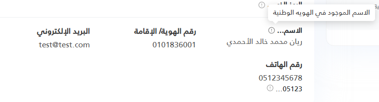

import Tabs from '@theme/Tabs';
import TabItem from '@theme/TabItem';

<Tabs>
<TabItem value="guide" label="Guide" default>
Displays a label with an optional help tooltip icon. Supports two modes:

## UI Preview

| State   | Preview               |
| ------- | --------------------- |
| Default |  |

---

1. **Explicit Mode:** Pass `Label` and `Tooltip` explicitly.
2. **Auto-Truncate Mode:** Pass `content` and optional `digits`. It will automatically truncate words (or chars if a single word) and put the full string in the tooltip.

## Props

| Prop    | Type   | Default | Description |
|---------|--------|---------|-------------|
| `Label`   | `string` | `""`      | Explicit label text. (Mode 1) |
| `Tooltip` | `string` | `""`      | Explicit tooltip text, shown when hovering the icon. (Mode 1) |
| `content` | `string` | `""`      | The full text content. (Mode 2) |
| `digits`  | `int`    | `null`    | How many words (or chars if no spaces) to keep from `content`. If omitted, full `content` is shown with no tooltip. (Mode 2) |
| `Class`   | `string` | `""`      | Additional CSS classes appended to the wrapper element. |

## Examples

### Mode 1 (Explicit Label & Tooltip)
```html
@await Html.PartialAsync("UI/_LabelTip", new {
    Label = "Name",
    Tooltip = "Full name as in National ID"
})
```

### Mode 2 (Content only - No Truncation)
```html
@await Html.PartialAsync("UI/_LabelTip", new {
    content = "Very long content that shouldn't be truncated"
})
```

### Mode 2 (Content + Digits - Truncation with Tooltip)
```html
@await Html.PartialAsync("UI/_LabelTip", new {
    content = "Very long content that should be truncated",
    digits = 2
})
```

</TabItem>


<TabItem value="_LabelTip.cshtml" label="_LabelTip.cshtml">

```cshtml
@model dynamic
@using Microsoft.AspNetCore.Routing
@{
    string label    = "";
    string tooltip  = "";
    string cssClass = "";

    if (Model != null)
    {
        var props = new RouteValueDictionary(Model);

        // ── Mode 1: explicit Label / Tooltip ──────────────────────────────
        if (props.TryGetValue("Label",   out var lProp)) label   = lProp?.ToString() ?? "";
        if (props.TryGetValue("Tooltip", out var tProp)) tooltip = tProp?.ToString() ?? "";

        // ── Mode 2: content + digits shorthand ────────────────────────────
        // Pass `content` (the full text) and `digits` (how many characters
        // to show in the label). Everything beyond that count goes to the
        // tooltip as the full content.
        if (props.TryGetValue("content", out var contentProp))
        {
            string content = contentProp?.ToString() ?? "";

            // Only truncate when 'digits' is explicitly provided by the caller.
            // If omitted, show the full content with no truncation.
            bool hasDigits = props.TryGetValue("digits", out var digitsProp);

            if (hasDigits && int.TryParse(digitsProp?.ToString(), out int digits) && digits > 0)
            {
                var words = content.Split(' ', StringSplitOptions.RemoveEmptyEntries);

                if (words.Length > 1)
                {
                    // ── Multi-word content → truncate by word count ───────
                    if (words.Length > digits)
                    {
                        label   = string.Join(" ", words[..digits]) + "…";
                        tooltip = content;
                    }
                    else
                    {
                        label = content;        // all words fit — no tooltip
                    }
                }
                else
                {
                    // ── Single word / no spaces (e.g. phone, code) → truncate by char count ──
                    if (content.Length > digits)
                    {
                        label   = content[..digits] + "…";
                        tooltip = content;
                    }
                    else
                    {
                        label = content;        // short enough — no tooltip
                    }
                }
            }
            else
            {
                // No digits passed → show full content as-is, no tooltip
                label = content;
            }
        }

        if (props.TryGetValue("Class", out var cProp)) cssClass = cProp?.ToString() ?? "";
    }

    // ── Derived helpers ──────────────────────────────────────────────────
    bool   hasTooltip   = !string.IsNullOrWhiteSpace(tooltip);
    string wrapperClass = string.IsNullOrWhiteSpace(cssClass)
                              ? "lbt-wrapper d-inline-flex align-items-center gap-1 fw-bold"
                              : $"lbt-wrapper {cssClass}";

    // ── Inject shared CSS exactly once per page ──
    bool cssAlreadyWritten = ViewData["_lbt_css_written"] as bool? ?? false;
    if (!cssAlreadyWritten) { ViewData["_lbt_css_written"] = true; }
}

@if (!cssAlreadyWritten)
{
<style>
    /* ── LabelTip: wrapper  */
    .lbt-wrapper {
        position: relative;
        cursor: default;
    }

    /* ── LabelTip: info icon  */
    .lbt-icon {
        display: inline-flex;
        flex-shrink: 0;
        width: 1em;
        height: 1em;
        color: #a8a8a8;
        cursor: help;
        transition: color .15s ease;
        margin-top: 2px;
    }

    .lbt-icon svg {
        width: 100%;
        height: 100%;
    }

    .lbt-wrapper:hover .lbt-icon,
    .lbt-icon:focus {
        color: #888;
    }

    /* ── LabelTip: tooltip bubble  */
    .lbt-tip {
        visibility: hidden;
        opacity: 0;
        pointer-events: none;

        position: absolute;
        bottom: calc(100% + 8px);
        inset-inline-end: 0;

        width: max-content;
        max-width: min(280px, 90vw);
        padding: .45em .75em;
        border-radius: .4em;
        box-shadow: 0 4px 14px rgba(0, 0, 0, .18);

        background: #fff;
        color: #333;
        font-size: .87rem;
        font-weight: 400;
        line-height: 1.5;
        white-space: normal;

        z-index: 9999;
        transform: translateY(4px);
        transition: opacity .2s ease, transform .2s ease;
    }

    /* Arrow pointing down toward the trigger */
    .lbt-tip::after {
        content: "";
        position: absolute;
        top: 100%;
        inset-inline-end: .65em;
        border: 6px solid transparent;
        border-top-color: #fff;

    }

    /* Reveal on hover or keyboard focus anywhere inside the wrapper */
    .lbt-wrapper:hover .lbt-tip,
    .lbt-wrapper:focus-within .lbt-tip {
        visibility: visible;
        opacity: 1;
        transform: translateY(0);
    }
</style>
}

@if (!string.IsNullOrWhiteSpace(label))
{
    <span class="@wrapperClass">

        <span class="lbt-label">@label</span>

        @if (hasTooltip)
        {
            <span class="lbt-icon" tabindex="0" role="button" aria-label="@tooltip">
                <svg xmlns="http://www.w3.org/2000/svg" viewBox="0 0 24 24"
                     fill="none" stroke="currentColor" stroke-width="2"
                     stroke-linecap="round" stroke-linejoin="round"
                     aria-hidden="true" focusable="false">
                    <circle cx="12" cy="12" r="10" />
                    <line x1="12" x2="12" y1="8" y2="12" />
                    <line x1="12" x2="12.01" y1="16" y2="16" />
                </svg>
            </span>
            <span class="lbt-tip" role="tooltip" dir="auto">@tooltip</span>
        }

    </span>
}

```

</TabItem>
</Tabs>
